# AI Services Setup

{: .no_toc }

## Table of contents

{: .no_toc .text-delta }

1. TOC
{:toc}

---

## Overview

Get API keys for AI models and research tools. All services offer free tiers perfect for learning.

**Time Required**: 10 minutes

---

## OpenRouter (Multiple AI Models)

### What is OpenRouter?

Access multiple AI models with one API key. Perfect for comparing different models.

### Part 1: Get Your OpenRouter API Key

#### 1.1 Sign Up for OpenRouter

1. Visit [OpenRouter](https://openrouter.ai/)
1. Click "Sign Up" and authenticate with Google or GitHub
1. Complete the sign-up process

#### 1.2 Navigate to API Keys

1. Go to [OpenRouter API Keys](https://openrouter.ai/settings/keys)

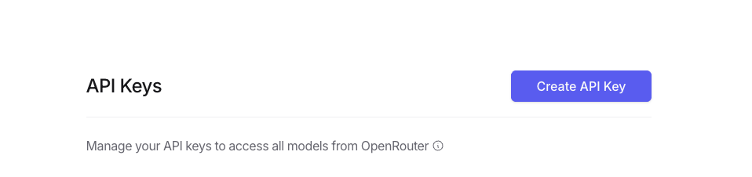

#### 1.3 Create New API Key

1. Click **"Create API Key"** button
1. In the modal, configure your key:
   - **Name**: `n8n-exercises` (or any descriptive name)
   - **Credit limit (optional)**: Leave blank for unlimited
   - **Reset limit every...**: N/A
   - **Expiration**: No expiration

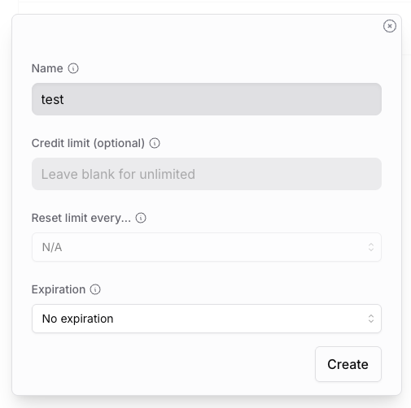

1. Click **"Create"**

#### 1.4 Copy Your API Key

1. Your new API key will be displayed (starts with `sk-or-v1-...`)
1. **Important**: Copy it immediately - you won't be able to see it again!

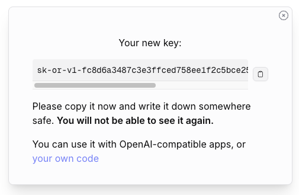

1. Save the key securely in your password manager

{: .warning }
> **Critical**: This is your only chance to copy the API key. Store it immediately!

### Part 2: Add OpenRouter Credential to n8n

#### 2.1 Access Credentials Menu

1. In n8n, click the **+ button** in the top-right corner
1. Select **Credential** from the dropdown

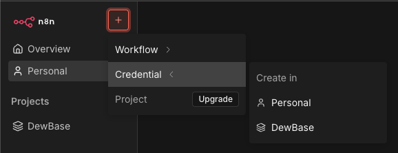

#### 2.2 Search for OpenRouter

1. In the "Add new credential" modal, search for **"OpenRouter"**
1. Select **"OpenRouter"** from the results

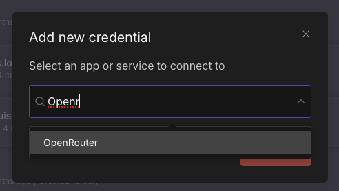

#### 2.3 Enter API Key

1. Paste your API key into the **API Key** field
1. Click **"Save"**

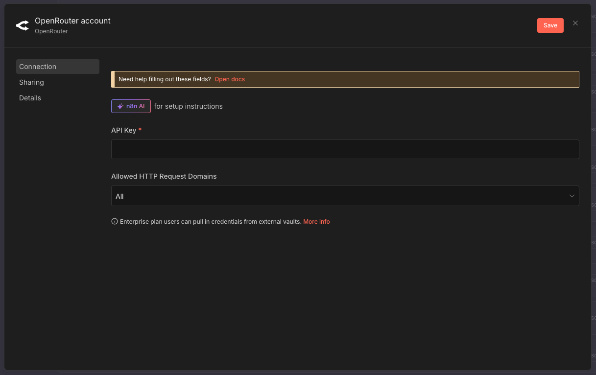

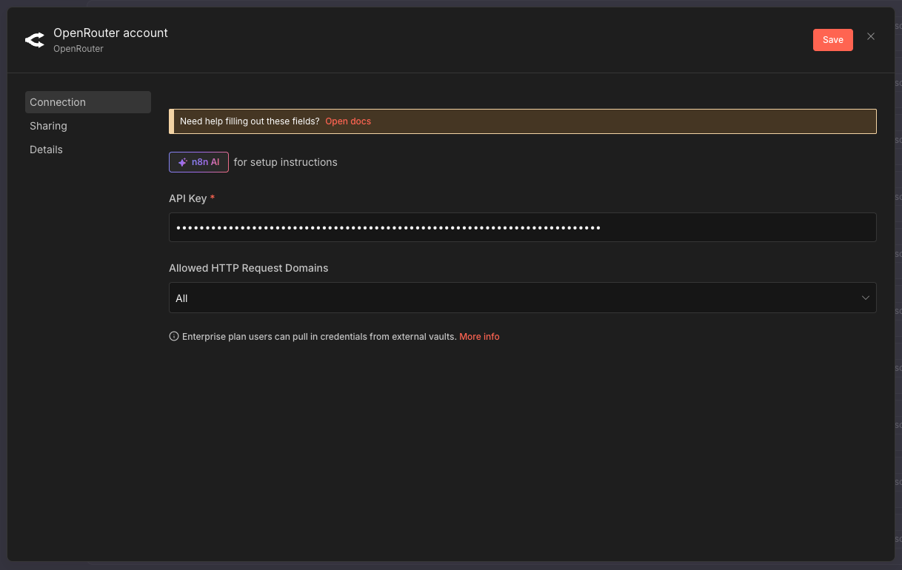

#### 2.4 Verify Connection

1. n8n will automatically test the connection
1. You should see **"Connection tested successfully"** in green

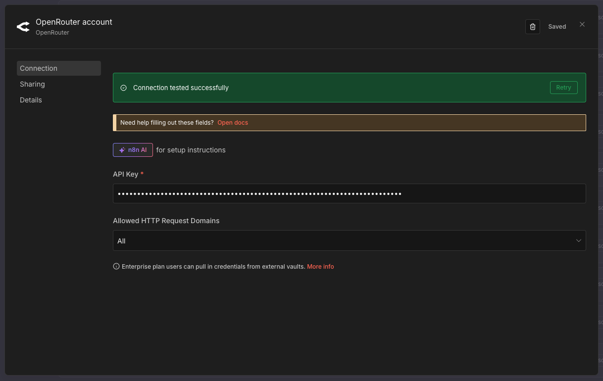

{: .highlight }
> **Success**: Your OpenRouter credential is now ready to use!

### Free Credits

{: .highlight }
> **Free Trial**: OpenRouter provides $1 free credit. Exercises use minimal credits (~$0.001 per operation).

### Recommended Free Models

All models below are completely free to use on OpenRouter. [Browse all free models](https://openrouter.ai/models?q=free)

| Model | Cost | Best For | Speed |
|-------|------|----------|-------|
| **meta-llama/llama-3.3-70b-instruct:free** | Free | Complex reasoning, high quality | Medium |
| **google/gemma-3-27b-it:free** | Free | Classification, general tasks | Fast |
| **google/gemma-3-12b-it:free** | Free | Quick responses, simple tasks | Very Fast |
| **mistralai/mistral-7b-instruct:free** | Free | Balanced performance | Fast |
| **x-ai/grok-4.1-fast:free** | Free | Fast inference | Very Fast |
| **kwaipilot/kat-coder-pro:free** | Free | Code generation | Fast |

{: .note }
> **Free Models Availability**: Free tier models are community-supported and perfect for learning and prototyping. For production use, consider paid models for better reliability and rate limits.

---

## Google Gemini (Free Tier)

### Why Gemini?

Google's Gemini offers generous free quotas perfect for AI agents, complex reasoning tasks, and iterative workflows.

### Part 1: Get Your Gemini API Key from Google AI Studio

#### 1.1 Visit Google AI Studio

1. Go to [Google AI Studio API Keys](https://aistudio.google.com/api-keys)
1. Sign in with your Google account


#### 1.2 Accept Terms of Service

1. On your first visit, you'll see a "Welcome to AI Studio" screen
1. Read the Gemini API Additional Terms of Service
1. Check the agreement checkbox
1. Optionally, check the second box to receive updates
1. Click **"Continue"**


#### 1.3 Create API Key

1. Click **"Create API key"** in the top-right corner
1. You'll see a "Create a new key" modal
1. Choose **"Default Gemini Project"** (or create a new project)


#### 1.4 Copy Your API Key

1. Your API key will appear in the list (starts with `AIza...`)
1. Click the **three-dot menu** (⋮) next to your key
1. Select **"Copy API key"**


1. Save the key securely in your password manager

{: .warning }
> **Important**: Store your API key immediately. While you can copy it again later, keeping it secure is critical.

### Part 2: Add Gemini Credential to n8n

#### 2.1 Access Credentials Menu

1. In n8n, click the **+ button** in the top-right corner

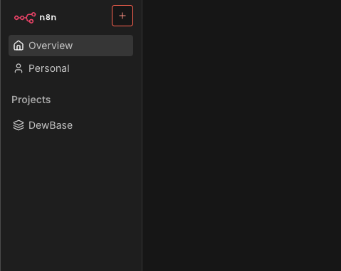

1. Select **Credential** from the dropdown

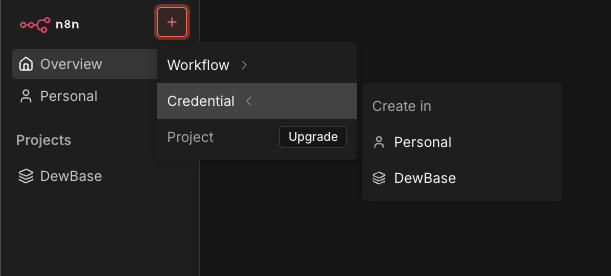

#### 2.2 Search for Gemini Credential

1. Search for **"Gemini"**
1. Select **"Google Gemini(PaLM) Api"**


#### 2.3 Configure Credential

1. The **Host** field should already be filled with:

   ```
   https://generativelanguage.googleapis.com
   ```

1. Paste your API key into the **API Key** field
1. Click **"Save"**


{: .highlight }
> **Success**: Your Gemini credential is now ready to use in any workflow!

### Free Tier Limits

{: .highlight }
> **Generous Free Quota**:
>
> - 60 requests/minute
> - 1 million tokens/month
> - 1,500 requests/day
>
> More than enough for all exercises!

### When to Use Gemini

- AI Agents with complex reasoning
- Iterative workflows with feedback loops
- Multi-step content generation
- LLM as a Judge patterns
- When you need consistent, free performance

### Gemini vs OpenRouter

| Feature | Google Gemini | OpenRouter |
|---------|--------------|------------|
| **Free Tier** | 1M tokens/month | $1 credit (~100K tokens) |
| **Setup** | Direct API key | Account + payment method |
| **Best For** | Learning, prototyping, AI agents | Production, model comparison |
| **Quota Reset** | Monthly | One-time credit |

---

## Perplexity API (Web Research)

### What is Perplexity?

Real-time web search capabilities for your AI agents. Essential for research tasks.

### Student Access (Recommended)

{: .highlight }
> **Students Get 12 Months Free!** Students worldwide can get Perplexity Pro for free for 12 months (worth $240), which includes API credits, unlimited searches, and access to the Comet browser.

**To claim your free student access:**

1. Visit [Perplexity Student Program](https://www.perplexity.ai/grow/comet/students)
2. Click to verify your student status
3. Verify using one of these methods:
   - **Student email** (`.edu` or university email address)
   - **Student ID card** or documentation upload
   - Verification is handled through SheerID
4. Get instant access to 12 months of Perplexity Pro
5. Bonus: Skip the waitlist for Comet browser

**What's Included for Students:**

- **12 months of Perplexity Pro** ($240 value)
- Unlimited Quick Searches
- 600+ Pro Searches per day
- Access to advanced AI models (GPT-4, Claude, etc.)
- **$5/month in API credits** (automatically included)
- File upload and analysis
- Access to Comet browser (AI-powered browser built for students)

**Eligibility:**

- Available to students globally (US, UK, and international)
- Must verify student status through student email or documentation
- UK students and international students can verify with university email or ID

### Part 1: Get Your Perplexity API Key

#### 1.1 Navigate to API Keys

1. Go to [Perplexity API Keys](https://www.perplexity.ai/account/api/keys)
1. Sign in with your Perplexity account (use your student account if eligible)

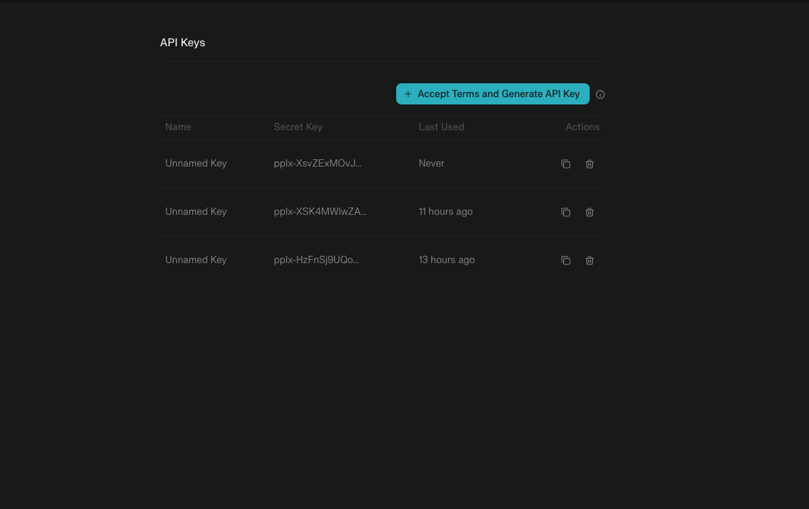

#### 1.2 Accept Terms and Generate Key

1. Click **"Accept Terms and Generate API Key"** button (first time only)
1. For subsequent keys, click **"+ Accept Terms and Generate API Key"**

#### 1.3 Create API Key

1. In the "Create API Key" modal, enter a descriptive name:
   - **Key name**: `n8n-research` (or any descriptive name)

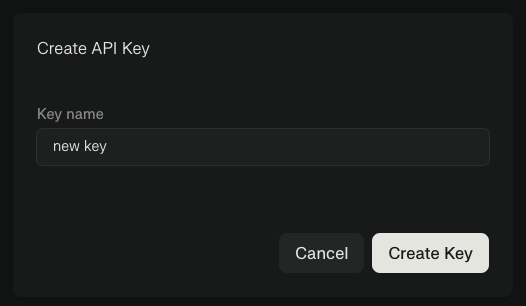

1. Click **"Create Key"**

#### 1.4 Copy Your API Key

1. Your new API key will appear in the list (starts with `pplx-...`)
1. Click the **copy icon** to copy the key

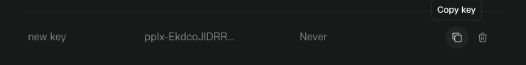

1. Save the key securely in your password manager

{: .warning }
> **Important**: Store your API key immediately. You can copy it again later from the list.

### Part 2: Add Perplexity Credential to n8n

#### 2.1 Access Credentials Menu

1. In n8n, click the **+ button** in the top-right corner
1. Select **Credential** from the dropdown

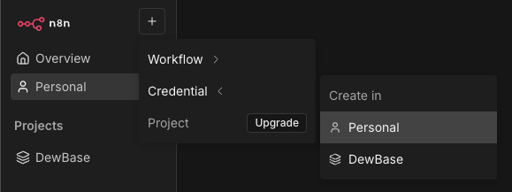

#### 2.2 Search for Perplexity

1. In the "Add new credential" modal, search for **"Perple"**
1. Select **"Perplexity API"** from the results

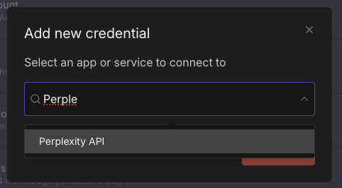

#### 2.3 Enter API Key

1. Paste your API key into the **API Key** field
1. Click **"Save"**

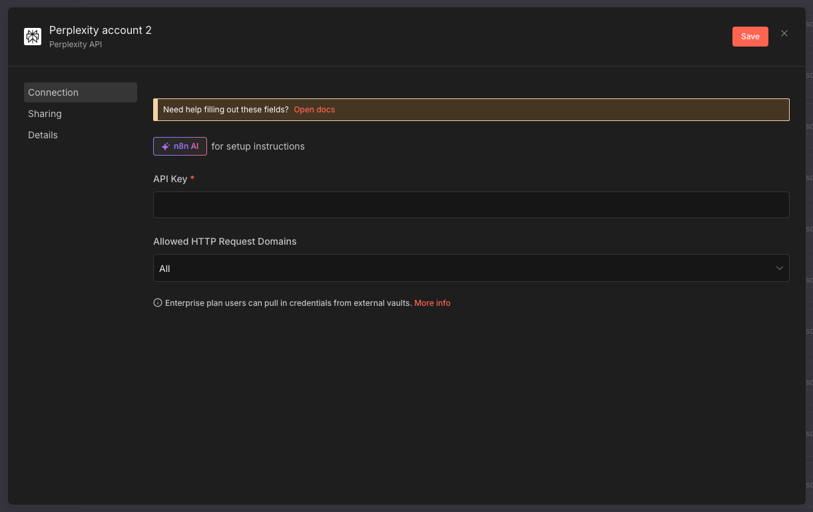

#### 2.4 Verify Connection

1. n8n will automatically test the connection
1. You should see **"Connection tested successfully"** in green

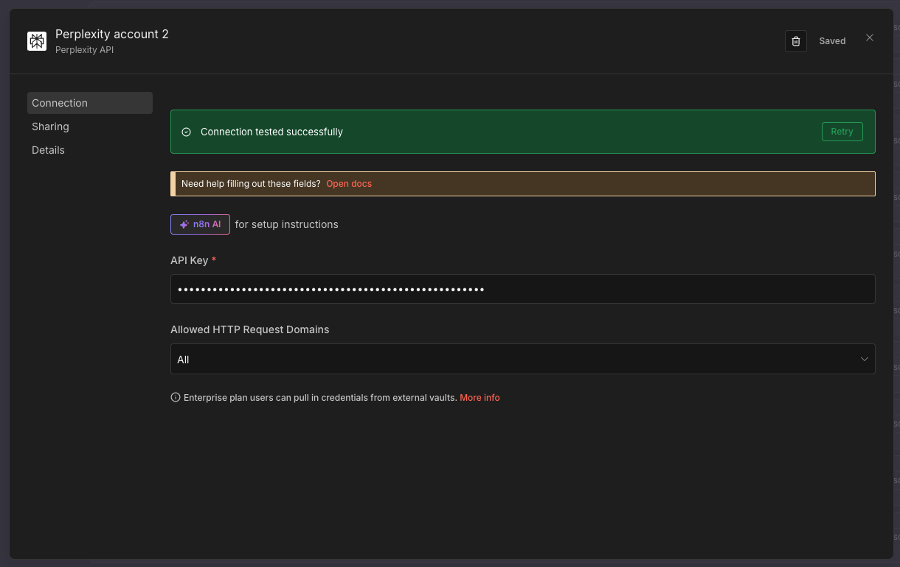

{: .highlight }
> **Success**: Your Perplexity credential is now ready to use for web research!

### Free Credits

{: .highlight }
> **Monthly Credits**: $5 free monthly (~1000 searches) - resets each month! Students get this automatically with Pro access.

### Available Models

| Model | Use Case | Speed |
|-------|----------|-------|
| **Sonar** | Basic research, fact-finding | Fast |
| **Sonar Pro** | Complex queries, reasoning | Medium |
| **Online Models** | Real-time web data | Fast |

---

## API Key Security

### Best Practices

1. **Never share API keys** in screenshots or support requests
2. **Store securely** in password manager
3. **Don't commit to git** - use .env files
4. **Rotate regularly** - every 90 days
5. **Monitor usage** - set up alerts

### Quick Security Check

- [ ] Keys stored in password manager
- [ ] No keys in code repositories
- [ ] Usage alerts configured
- [ ] Test/production keys separated

---

## Service Comparison

### Which Service for What?

| Need | Use This Service | Why |
|------|------------------|-----|
| Email classification | OpenRouter (Gemma) | Free, fast, simple |
| Content generation | OpenRouter or Gemini | Flexible options |
| AI agents | Google Gemini | Free tier, powerful, consistent |
| Web research | Perplexity | Real-time data access |
| Complex reasoning | Gemini or Claude | Better understanding |
| Iterative workflows | Google Gemini | Good for feedback loops |
| Quick tests | Free models | No cost, fast iteration |

---

## What You've Accomplished

✅ OpenRouter API key obtained
✅ Google Gemini API configured
✅ Perplexity API ready
✅ Understand which service for which task
✅ Keys stored securely
