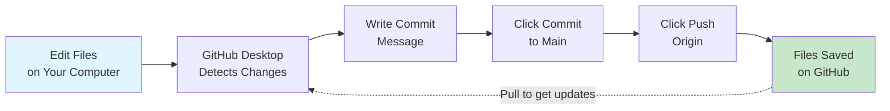

# GitHub Setup & Workflow Backup

{: .no_toc }

## Table of contents

{: .no_toc .text-delta }

1. TOC
{:toc}

---

## Overview

Set up GitHub to save and back up your n8n workflow files. GitHub is like a "save point" system for your code and workflows, letting you track changes and recover previous versions.

**Time Required**: 15 minutes

{: .important }
> **Why GitHub?**: Your n8n workflows are valuable! GitHub provides free backup, version history, and lets you share your work with others. Think of it as Google Drive specifically designed for code and technical files.

{: .highlight }
> **No Technical Skills Required**: This guide uses GitHub Desktop, a simple point-and-click application. No command line or coding knowledge needed!

---

## What You'll Learn

- ✅ Create a free GitHub account
- ✅ Install GitHub Desktop (easy visual interface)
- ✅ Create a repository for your workflows
- ✅ Save workflow JSON files from n8n
- ✅ Back up your workflows to GitHub

---

## Part 1: Create a GitHub Account

### Step-by-Step Account Creation

1. **Go to GitHub**
   - Visit [github.com](https://github.com)
   - Click "Sign up" in the top-right corner

2. **Enter Your Email**
   - Use an email you check regularly
   - You'll need to verify it later
   - Click "Continue"

3. **Create a Password**
   - Use a strong password (at least 15 characters)
   - Mix uppercase, lowercase, numbers, and symbols
   - Click "Continue"

4. **Choose a Username**
   - This will be your public identity (e.g., `john-smith-automation`)
   - Can only contain letters, numbers, and hyphens
   - Pick something professional (you might use this for work!)
   - Click "Continue"

5. **Verify You're Human**
   - Complete the puzzle or challenge
   - Click "Create account"

6. **Verify Your Email**
   - Check your email for a code from GitHub
   - Enter the 6-digit code
   - Your account is now active!

{: .highlight }
> **Success**: You now have a GitHub account! Bookmark `github.com/[your-username]` - this is your profile page.

---

## Part 2: Install GitHub Desktop

GitHub Desktop is a free application that makes working with Git simple - just click buttons instead of typing commands!

### Download and Install

#### For Windows

1. **Download GitHub Desktop**
   - Go to [desktop.github.com](https://desktop.github.com)
   - Click "Download for Windows"
   - File downloads: `GitHubDesktopSetup.exe`

2. **Install**
   - Double-click the downloaded file
   - Installation runs automatically (no choices needed!)
   - GitHub Desktop opens when complete

3. **Sign in to GitHub**
   - Click "Sign in to GitHub.com"
   - Enter your GitHub username and password
   - Click "Authorize desktop"
   - Your browser opens → Click "Authorize"
   - Return to GitHub Desktop

4. **Configure Git**
   - **Name**: Your real name or preferred name
   - **Email**: Same email you used for GitHub account
   - Click "Finish"

{: .highlight }
> **Success!** GitHub Desktop is installed and ready to use.

---

#### For macOS

1. **Download GitHub Desktop**
   - Go to [desktop.github.com](https://desktop.github.com)
   - Click "Download for macOS"
   - File downloads: `GitHubDesktop-arm64.dmg` or `GitHubDesktop-x64.dmg`

2. **Install**
   - Open the downloaded `.dmg` file
   - Drag GitHub Desktop to Applications folder
   - Open Applications → Double-click GitHub Desktop
   - Click "Open" when macOS asks for confirmation

3. **Sign in to GitHub**
   - Click "Sign in to GitHub.com"
   - Enter your GitHub username and password
   - Click "Authorize desktop"
   - Your browser opens → Click "Authorize"
   - Return to GitHub Desktop

4. **Configure Git**
   - **Name**: Your real name or preferred name
   - **Email**: Same email you used for GitHub account
   - Click "Finish"

{: .highlight }
> **Success!** GitHub Desktop is installed and ready to use.

---

#### For Linux

GitHub Desktop doesn't have an official Linux version. We recommend these alternatives:

**Option 1: GitKraken** (Recommended)
- Go to [gitkraken.com](https://www.gitkraken.com)
- Download for Linux
- Free for public repositories
- Very similar to GitHub Desktop

**Option 2: Use the Web Interface**
- You can upload files directly on github.com
- No software installation needed
- Perfect for simple backups

---

## Part 3: Create Your First Repository

A repository (or "repo") is like a project folder on GitHub that tracks all your changes.

### Create and Publish Repository

1. **Open GitHub Desktop**

2. **Create New Repository**
   - Click "File" → "New repository"
   - Or press `Ctrl+N` (Windows) / `Cmd+N` (macOS)

3. **Fill in Repository Details**:

   **Name**: `n8n-workflows`

   **Description**: `My n8n automation workflow backups`

   **Local Path**: Where to save on your computer
   - **Windows Default**: `C:\Users\[YourName]\Documents\GitHub`
   - **macOS Default**: `/Users/[YourName]/Documents/GitHub`
   - Click "Choose..." to pick a different location

   **Initialize this repository with a README**: ✅ Check this box

   **Git Ignore**: None

   **License**: MIT License (optional, good for open-source)

4. **Create Repository**
   - Click "Create repository"
   - Your repository is created on your computer!

5. **Publish to GitHub**
   - Look for the "Publish repository" button at the top
   - A window appears with options:
     - **Name**: `n8n-workflows` (already filled)
     - **Description**: (already filled)
     - **Keep this code private**: ✅ Check this if your workflows contain sensitive info
     - Leave unchecked if you want to share your learning publicly
   - Click "Publish repository"
   - Your repository is now on GitHub!

{: .highlight }
> **Quick Tip**: Click "Repository" → "Show in Explorer" (Windows) or "Show in Finder" (macOS) to see your repository folder.

{: .important }
> **Public vs Private**: Choose Private if your workflows will contain API keys or sensitive data. Choose Public if you want to build a portfolio and share your learning.

---

## Part 4: Save Your First Workflow to GitHub

Now let's back up an n8n workflow!

### Step 1: Export Workflow from n8n

1. **Open Your Workflow in n8n**
   - Go to your n8n instance
   - Open any workflow you've created

2. **Download the Workflow**
   - Click the "⋮" menu (three dots) in the top-right
   - Select "Download"
   - Your browser downloads a `.json` file (e.g., `My_workflow.json`)

3. **Find the Downloaded File**
   - Usually in your Downloads folder
   - Optionally rename it to something descriptive:
     - `email-classification.json`
     - `llm-judge-workflow.json`

---

### Step 2: Organize Your Workflows (Recommended)

Create folders to organize your workflows by exercise:

1. **Open Your Repository Folder**
   - In GitHub Desktop, click "Repository" → "Show in Explorer/Finder"
   - This opens your `n8n-workflows` folder

2. **Create Folder Structure**
   - Create a new folder called `exercises`
   - Inside `exercises`, create: `01-email-classification`
   - You can create more as needed: `02-cold-email`, `03-llm-judge`, etc.

3. **Move Your Workflow File**
   - Move the downloaded JSON file from Downloads
   - Put it in the appropriate exercise folder
   - Example: `n8n-workflows/exercises/01-email-classification/workflow.json`

**Your folder structure should look like:**
```
n8n-workflows/
├── README.md
└── exercises/
    ├── 01-email-classification/
    │   └── workflow.json
    ├── 02-cold-email/
    │   └── workflow.json
    └── 03-llm-judge/
        └── workflow.json
```

---

### Step 3: Commit and Push to GitHub

Now let's save these changes to GitHub!

1. **Open GitHub Desktop**
   - GitHub Desktop automatically detects the new file!
   - You'll see it listed under "Changes" on the left side

2. **Review Your Changes**
   - **Left panel**: Shows all files that changed
     - ✓ `exercises/01-email-classification/workflow.json`
   - **Right panel**: Shows what was added (in green)
   - Click on a file name to see details

3. **Write a Commit Message**
   - Look at the bottom-left corner
   - **Summary** (required): Brief description
     - Type: `Add email classification workflow`
   - **Description** (optional): More details if needed
     - Type: `First version from Exercise 1`

4. **Commit to Main**
   - Click the blue "Commit to **main**" button
   - This saves a snapshot of your changes locally

5. **Push to GitHub**
   - After committing, you'll see "Push origin" button at the top
   - Click "Push origin"
   - Wait for the upload to complete (usually just a few seconds)

6. **Verify on GitHub**
   - Click "Repository" → "View on GitHub"
   - Your browser opens showing your repository
   - You should see your new `exercises` folder and workflow file!

{: .highlight }
> **Congratulations!** You've backed up your first workflow to GitHub. It's now safely stored in the cloud with full version history!

---

## Part 5: Daily Workflow

Here's your simple routine for backing up workflows as you work through exercises:

### Every Time You Complete a Workflow

**1. Export from n8n**
- Open your workflow in n8n
- Click ⋮ menu → Download
- Save the JSON file

**2. Move to Repository Folder**
- Move the file from Downloads
- Put it in the appropriate exercise folder in `n8n-workflows`

**3. Open GitHub Desktop**
- GitHub Desktop automatically detects the new/changed file
- Review the changes in the right panel

**4. Write Commit Message**
- **Summary**: Describe what you did
  - ✅ Good: `Add Exercise 3: LLM as a Judge workflow`
  - ✅ Good: `Update email classifier - added error handling`
  - ✅ Good: `Fix: Correct OpenRouter credential ID`
  - ❌ Bad: `Update stuff`
  - ❌ Bad: `Changes`

**5. Commit and Push**
- Click "Commit to main"
- Click "Push origin"
- Done! ✅

### Visual Process

```
n8n Workflow → Download JSON → Move to folder →
GitHub Desktop detects changes → Write message →
Click "Commit" → Click "Push" → ✅ Backed up!
```

{: .highlight }
> **Time Required**: About 30 seconds once you're familiar with the process!

---

### Tips for Good Commit Messages

**DO:**
- ✅ `Add Exercise 1: Email classification workflow`
- ✅ `Update LLM judge - increase quality threshold to 85`
- ✅ `Fix: Correct Gmail credential reference`
- ✅ `Add exercises 2 and 3 workflows`

**DON'T:**
- ❌ `Update`
- ❌ `Fixed it`
- ❌ `asdfjkl`
- ❌ `Changes`

**Why It Matters**: Future you will thank present you when you need to find when you made a specific change!

---

### Working on Multiple Computers

If you work on different computers (home and school, laptop and desktop):

**Before Making Changes:**
1. Open GitHub Desktop
2. Click "Fetch origin" (top toolbar)
3. If updates are available, click "Pull origin"
4. Now you have the latest version!

**After Making Changes:**
1. Commit your changes
2. Push to GitHub
3. The changes will be available on your other computer

---

## Part 6: Understanding GitHub Desktop

### What You See in GitHub Desktop

**Main Areas:**

1. **Top Bar**
   - Current repository name
   - Current branch (usually "main")
   - "Fetch origin" / "Push origin" buttons

2. **Left Sidebar**
   - **Changes**: Files you've modified
   - **History**: Past commits (like a timeline)

3. **Left Panel (Changes Tab)**
   - List of all files that changed
   - Checkboxes to select which files to commit

4. **Right Panel**
   - Shows exactly what changed in the selected file
   - Green = added lines
   - Red = deleted lines
   - Yellow = modified lines

5. **Bottom-Left**
   - **Summary**: Required commit message
   - **Description**: Optional details
   - **Commit to main** button

---

### Color Coding

GitHub Desktop uses colors to show what changed:

- **Green (+)**: New content added
- **Red (-)**: Content removed
- **Yellow**: Line modified
- **Blue dot**: New file
- **Orange dot**: Modified file

---

## Part 7: Understanding Git Basics

### Key Concepts (Simple Explanations)

| Term | What It Means | Analogy |
|------|---------------|---------|
| **Repository** | A project folder tracked by Git | Like a Google Drive folder for your workflows |
| **Commit** | A saved snapshot of your changes | Like clicking "Save" in a video game |
| **Push** | Upload commits to GitHub | Like uploading photos to Google Photos |
| **Pull** | Download changes from GitHub | Like syncing Google Drive to a new computer |
| **Main** | The primary version of your project | Like the "final" version of a document |
| **Changes** | Files you've added or modified | Files waiting to be saved |

---

### How GitHub Works (Visual)



**The Flow:**
1. You make changes to files on your computer
2. GitHub Desktop automatically detects them
3. You write a message describing what you did
4. Click "Commit" to save locally
5. Click "Push" to upload to GitHub
6. Your files are safely backed up in the cloud!

---

## Part 8: Troubleshooting

### Common Issues & Solutions

<div style="background: #fff3cd; padding: 1rem; border-left: 4px solid #ffc107; margin: 1rem 0;">

#### "Authentication Failed"

**Problem**: GitHub Desktop can't connect to your account.

**Solutions**:
1. Sign out and sign back in:
   - **Windows**: "File" → "Options" → "Accounts" → "Sign out"
   - **macOS**: "GitHub Desktop" → "Preferences" → "Accounts" → "Sign out"
   - Sign back in with your GitHub credentials

2. Check your internet connection

3. Make sure you're using the correct email and password

</div>

<div style="background: #fff3cd; padding: 1rem; border-left: 4px solid #ffc107; margin: 1rem 0;">

#### "Push Rejected" or "Can't Push to GitHub"

**Problem**: Can't upload changes to GitHub.

**Solutions**:
1. Click "Repository" → "Pull" to get latest changes first
2. Try clicking "Push origin" again
3. Click "Repository" → "View on GitHub" to verify the repository exists
4. Make sure you have write permissions (you're the owner or collaborator)

</div>

<div style="background: #fff3cd; padding: 1rem; border-left: 4px solid #ffc107; margin: 1rem 0;">

#### "No Changes Detected"

**Problem**: You added files but GitHub Desktop doesn't see them.

**Solutions**:
1. Make sure files are in the repository folder (not still in Downloads!)
2. Click "Repository" → "Refresh"
3. Close and reopen GitHub Desktop
4. Check that the file isn't empty

</div>

<div style="background: #fff3cd; padding: 1rem; border-left: 4px solid #ffc107; margin: 1rem 0;">

#### "The Repository is Behind"

**Problem**: GitHub has newer changes than your computer.

**Solution**:
1. Click "Fetch origin" (top toolbar)
2. If updates appear, click "Pull origin"
3. Now you can push your changes

</div>

<div style="background: #fff3cd; padding: 1rem; border-left: 4px solid #ffc107; margin: 1rem 0;">

#### Can't Find Downloaded JSON File

**Problem**: Downloaded workflow but can't find it.

**Solution**:
1. Check your Downloads folder
2. In n8n, download the workflow again
3. Your browser might ask where to save it - choose Desktop for easy access
4. Then move it to your repository folder

</div>

---

## Best Practices

### Security: Clean Your Workflows Before Committing

{: .important }
> **Remove Sensitive Data**: Before committing workflows, check that they don't contain:
> - API keys or passwords
> - Personal email addresses
> - Company-specific information
> - Real customer data

### How to Check

Open the workflow JSON file in a text editor (Notepad, TextEdit, VS Code) and search for:
- `password`
- `apiKey`
- `secret`
- `token`

n8n workflow files usually contain credential *IDs* (safe to commit) not actual credentials (not safe). But double-check!

**If you find hard-coded credentials:**
1. Replace with placeholders: `"YOUR_API_KEY_HERE"`
2. Add a note in your README about which credentials are needed
3. Never store actual API keys in workflow files - use n8n's Credentials page

---

### Organizing Your Repository

Keep your workflows organized:

```
n8n-workflows/
├── README.md                    # Overview of your workflows
├── exercises/
│   ├── 01-email-classification/
│   │   ├── workflow.json
│   │   └── notes.md             # Your learning notes
│   ├── 02-cold-email/
│   │   ├── workflow.json
│   │   └── notes.md
│   └── 03-llm-judge/
│       ├── workflow.json
│       └── notes.md
├── personal-projects/
│   ├── project-1/
│   └── project-2/
└── templates/
    └── common-patterns/
```

**Pro Tip**: Add a `notes.md` file in each exercise folder to document:
- What you learned
- Challenges you faced
- How you solved problems
- Ideas for improvements

---

## What You've Accomplished

✅ Created a GitHub account
✅ Installed GitHub Desktop
✅ Created a repository for workflows
✅ Exported and committed your first workflow
✅ Pushed your backup to GitHub
✅ Learned the daily workflow routine
✅ Understand how to keep your work organized and safe

---

## Next Steps

Now that GitHub is set up, you can:

1. **Continue with Prerequisites**
   - Complete any remaining service setups
   - [Go to Verification →](./verification)

2. **Start Exercises**
   - Begin building n8n workflows
   - Back up each completed exercise to GitHub
   - [View All Exercises →](../exercises/)

3. **Learn More** (Optional)
   - [GitHub Desktop Documentation](https://docs.github.com/en/desktop)
   - [GitHub Desktop Video Tutorial](https://www.youtube.com/watch?v=8Dd7KRpKeaE)

{: .highlight }
> **Remember**: Commit often, write clear messages, and always back up your work. Your future self will thank you!

---

[← Back to Prerequisites](./index){: .btn .mr-2 }
[Continue to Verification →](./verification){: .btn .btn-primary }
