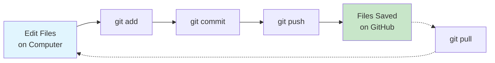

# GitHub Setup & Workflow Backup

{: .no_toc }

## Table of contents

{: .no_toc .text-delta }

1. TOC
{:toc}

---

## Overview

Set up GitHub to save and back up your n8n workflow files. GitHub is like a "save point" system for your code and workflows, letting you track changes and recover previous versions.

**Time Required**: 15 minutes

{: .important }
> **Why GitHub?**: Your n8n workflows are valuable! GitHub provides free backup, version history, and lets you share your work with others. Think of it as Google Drive specifically designed for code and technical files.

---

## What You'll Learn

- ✅ Create a free GitHub account
- ✅ Install Git on your computer
- ✅ Create a repository for your workflows
- ✅ Save workflow JSON files from n8n
- ✅ Push your workflows to GitHub for backup

---

## Part 1: Create a GitHub Account

### Step-by-Step Account Creation

1. **Go to GitHub**
   - Visit [github.com](https://github.com)
   - Click "Sign up" in the top-right corner

2. **Enter Your Email**
   - Use an email you check regularly
   - You'll need to verify it later
   - Click "Continue"

3. **Create a Password**
   - Use a strong password (at least 15 characters)
   - Mix uppercase, lowercase, numbers, and symbols
   - Click "Continue"

4. **Choose a Username**
   - This will be your public identity (e.g., `john-smith-automation`)
   - Can only contain letters, numbers, and hyphens
   - Pick something professional (you might use this for work!)
   - Click "Continue"

5. **Verify You're Human**
   - Complete the puzzle or challenge
   - Click "Create account"

6. **Verify Your Email**
   - Check your email for a code from GitHub
   - Enter the 6-digit code
   - Your account is now active!

{: .highlight }
> **Success**: You now have a GitHub account! Bookmark `github.com/[your-username]` - this is your profile page.

---

## Part 2: Choose Your Git Tool

Before proceeding, choose which tool you want to use to work with GitHub. Both accomplish the same tasks - it's just a matter of preference.

### Option A: GitHub Desktop (Recommended for Beginners)

**Best for**: Visual learners, beginners, anyone who prefers clicking buttons over typing commands

**Pros**:
- ✅ User-friendly visual interface
- ✅ No command line knowledge needed
- ✅ See your changes visually before saving
- ✅ Built-in conflict resolution
- ✅ Official GitHub tool

**What you'll do**: Click → Select files → Write message → Click "Push"

[Jump to GitHub Desktop Setup →](#part-2a-github-desktop-recommended-for-beginners)

---

### Option B: Command Line Git (For Those Comfortable with Terminals)

**Best for**: Developers, those comfortable with terminal/command prompt, power users

**Pros**:
- ✅ More powerful and flexible
- ✅ Works on any operating system
- ✅ Essential skill for professional development
- ✅ Faster for experienced users

**What you'll do**: Type commands in terminal like `git add .` and `git commit -m "message"`

[Jump to Command Line Git Setup →](#part-2b-command-line-git-advanced)

---

{: .important }
> **Not sure which to choose?** Go with **GitHub Desktop** (Option A). You can always learn command line later. Many professional developers use GitHub Desktop for day-to-day work!

---

## Part 2A: GitHub Desktop (Recommended for Beginners)

GitHub Desktop is a free application that makes working with Git visual and easy.

### Download and Install

#### For Windows

1. **Download GitHub Desktop**
   - Go to [desktop.github.com](https://desktop.github.com)
   - Click "Download for Windows"
   - File downloads: `GitHubDesktopSetup.exe`

2. **Install**
   - Double-click the downloaded file
   - Installation runs automatically (no choices needed!)
   - GitHub Desktop opens when complete

3. **Sign in to GitHub**
   - Click "Sign in to GitHub.com"
   - Enter your GitHub username and password
   - Click "Authorize desktop"
   - Your browser opens → Click "Authorize"
   - Return to GitHub Desktop

#### For macOS

1. **Download GitHub Desktop**
   - Go to [desktop.github.com](https://desktop.github.com)
   - Click "Download for macOS"
   - File downloads: `GitHubDesktop-arm64.dmg` or `GitHubDesktop-x64.dmg`

2. **Install**
   - Open the downloaded `.dmg` file
   - Drag GitHub Desktop to Applications folder
   - Open Applications → Double-click GitHub Desktop
   - Click "Open" when macOS asks for confirmation

3. **Sign in to GitHub**
   - Click "Sign in to GitHub.com"
   - Enter your GitHub username and password
   - Click "Authorize desktop"
   - Your browser opens → Click "Authorize"
   - Return to GitHub Desktop

#### For Linux

GitHub Desktop doesn't have an official Linux version, but you can use:
- **GitKraken** (free for public repos): [gitkraken.com](https://www.gitkraken.com)
- **Sublime Merge**: [sublimemerge.com](https://www.sublimemerge.com)
- Or use [Command Line Git](#part-2b-command-line-git-advanced) instead

### Configure Git

After signing in, GitHub Desktop will ask you to configure Git:

1. **Set your name and email**
   - Name: Your real name or preferred name
   - Email: Same email you used for GitHub account
   - Click "Finish"

{: .highlight }
> **Success!** GitHub Desktop is now installed and ready. Skip ahead to [Part 3: Create a Repository](#part-3-create-a-repository-for-your-workflows).

---

## Part 2B: Command Line Git (Advanced)

Git is the command-line tool that connects your computer to GitHub. Think of it as the "sync engine" between your files and the cloud.

### Installation by Operating System

<div style="background: #f6f8fa; padding: 1rem; border-radius: 6px; margin: 1rem 0;">

#### Windows

1. **Download Git**
   - Go to [git-scm.com/download/win](https://git-scm.com/download/win)
   - Download starts automatically
   - File name: `Git-[version]-64-bit.exe`

2. **Run the Installer**
   - Double-click the downloaded file
   - Click "Next" through most screens
   - **Important choices:**
     - Default editor: "Use Visual Studio Code" (or any editor you prefer)
     - Adjusting PATH: "Git from the command line and also from 3rd-party software" (default)
     - HTTPS transport: "Use the OpenSSL library" (default)
     - Line endings: "Checkout Windows-style, commit Unix-style" (default)
     - Terminal emulator: "Use MinTTY" (default)

3. **Complete Installation**
   - Click "Install"
   - Click "Finish"
   - **Verify**: Open Command Prompt and type:
     ```bash
     git --version
     ```
     You should see something like `git version 2.42.0`

</div>

<div style="background: #f6f8fa; padding: 1rem; border-radius: 6px; margin: 1rem 0;">

#### macOS

1. **Open Terminal**
   - Press `Cmd + Space`
   - Type "Terminal"
   - Press Enter

2. **Check if Git is Already Installed**
   ```bash
   git --version
   ```
   - If you see a version number, Git is installed! Skip to "Configure Git" below.
   - If you see a popup asking to install Command Line Tools, click "Install"

3. **Alternative: Install via Homebrew** (optional but recommended)
   ```bash
   # Install Homebrew first (if you don't have it)
   /bin/bash -c "$(curl -fsSL https://raw.githubusercontent.com/Homebrew/install/HEAD/install.sh)"

   # Then install Git
   brew install git
   ```

4. **Verify Installation**
   ```bash
   git --version
   ```

</div>

<div style="background: #f6f8fa; padding: 1rem; border-radius: 6px; margin: 1rem 0;">

#### Linux (Ubuntu/Debian)

1. **Open Terminal**
   - Press `Ctrl + Alt + T`

2. **Update Package List**
   ```bash
   sudo apt update
   ```

3. **Install Git**
   ```bash
   sudo apt install git
   ```

4. **Verify Installation**
   ```bash
   git --version
   ```

**For Other Linux Distributions:**
- **Fedora/RHEL**: `sudo dnf install git`
- **Arch**: `sudo pacman -S git`
- **openSUSE**: `sudo zypper install git`

</div>

---

## Part 3: Configure Git (Command Line Users Only)

{: .note }
> **Using GitHub Desktop?** You already configured Git during installation. [Skip to Part 4 →](#part-4-create-a-repository-for-your-workflows)

Tell Git who you are so your contributions are properly credited.

### Set Your Identity

Open your terminal (Command Prompt on Windows, Terminal on macOS/Linux) and run:

```bash
# Set your name (use your real name or preferred name)
git config --global user.name "Your Name"

# Set your email (use the same email as your GitHub account)
git config --global user.email "your.email@example.com"
```

### Verify Configuration

```bash
# Check your settings
git config --list
```

You should see:
```
user.name=Your Name
user.email=your.email@example.com
```

{: .highlight }
> **Why This Matters**: Every time you save changes (called a "commit"), Git records who made them. This helps with collaboration and tracking.

---

## Part 4: Create a Repository for Your Workflows

A repository (or "repo") is like a project folder on GitHub.

### Method 1: Create on GitHub Website (All Users)

1. **Start Repository Creation**
   - Go to [github.com](https://github.com) and sign in
   - Click the "+" icon in the top-right
   - Select "New repository"

2. **Configure Your Repository**
   - **Owner**: Your username (default)
   - **Repository name**: `n8n-workflows` (or any name you prefer)
   - **Description**: "My n8n automation workflow backups"
   - **Visibility**:
     - ⭐ **Public**: Anyone can see (good for sharing and learning)
     - 🔒 **Private**: Only you can see (choose this if workflows contain sensitive info)
   - **Initialise this repository with:**
     - ✅ Check "Add a README file"
     - ✅ Add .gitignore: "None" (for now)
     - ✅ Choose a licence: "MIT Licence" (optional, for open-source)

3. **Create Repository**
   - Click "Create repository"
   - You'll land on your new repository page!

{: .important }
> **Public vs Private**: If your workflows contain API keys, passwords, or sensitive data, choose Private. For learning exercises, Public is fine and helps build your portfolio.

---

### Method 2: Create Using GitHub Desktop (Desktop Users)

You can create a new repository directly in GitHub Desktop:

1. **Open GitHub Desktop**

2. **Create New Repository**
   - Click "File" → "New repository" (or press `Ctrl+N` / `Cmd+N`)

3. **Fill in Details**:
   - **Name**: `n8n-workflows`
   - **Description**: "My n8n automation workflow backups"
   - **Local Path**: Choose where to save (e.g., `Documents/GitHub`)
   - **Initialize with README**: ✅ Check this
   - **Git Ignore**: None
   - **License**: MIT (optional)

4. **Create Repository**
   - Click "Create repository"
   - Your repository is created locally!

5. **Publish to GitHub**
   - Click "Publish repository" button in the top bar
   - **Keep private**: Check this if workflows contain sensitive data
   - Click "Publish repository"

{: .highlight }
> **Success!** Your repository is now on GitHub and on your computer. You're ready to add workflow files!

---

## Part 5: Clone Repository to Your Computer

"Cloning" creates a copy of your GitHub repository on your computer.

{: .note }
> **Already created in GitHub Desktop?** If you used Method 2 above, your repository is already on your computer. [Skip to Part 6 →](#part-6-save-and-push-your-first-workflow)

### Option A: Clone with GitHub Desktop (Recommended)

This is the easiest method - no typing required!

1. **Open GitHub Desktop**

2. **Clone Repository**
   - Click "File" → "Clone repository" (or press `Ctrl+Shift+O` / `Cmd+Shift+O`)
   - Click the "GitHub.com" tab

3. **Find Your Repository**
   - Look for `your-username/n8n-workflows` in the list
   - Click on it to select it

4. **Choose Local Path**
   - **Local Path**: Where to save on your computer
   - **Default**: `C:\Users\[YourName]\Documents\GitHub\n8n-workflows` (Windows)
   - **Default**: `/Users/[YourName]/Documents/GitHub/n8n-workflows` (macOS)
   - You can click "Choose..." to pick a different location

5. **Clone**
   - Click "Clone"
   - GitHub Desktop downloads your repository
   - A progress bar shows the download

6. **Verify**
   - After cloning, you'll see "No local changes" in GitHub Desktop
   - The repository is now on your computer!

{: .highlight }
> **Quick Tip**: Click "Repository" → "Show in Explorer" (Windows) or "Show in Finder" (macOS) to see your repository folder.

---

### Option B: Clone with Command Line (Advanced Users)

1. **Get the Repository URL**
   - On your repository page on GitHub
   - Click the green "Code" button
   - Copy the HTTPS URL (looks like: `https://github.com/yourusername/n8n-workflows.git`)

2. **Open Terminal in Your Desired Location**

   **Windows:**
   ```bash
   # Navigate to Documents
   cd C:\Users\[YourName]\Documents

   # Create GitHub folder if it doesn't exist
   mkdir GitHub
   cd GitHub
   ```

   **macOS/Linux:**
   ```bash
   # Navigate to Documents
   cd ~/Documents

   # Create GitHub folder if it doesn't exist
   mkdir -p GitHub
   cd GitHub
   ```

3. **Clone the Repository**
   ```bash
   git clone https://github.com/yourusername/n8n-workflows.git
   ```

   Replace `yourusername` with your actual GitHub username.

4. **Navigate into the Repository**
   ```bash
   cd n8n-workflows
   ```

{: .highlight }
> **Success**: You now have a local copy of your repository! Any files you add here can be synced to GitHub.

---

## Part 6: Save and Push Your First Workflow

Now for the exciting part - backing up an n8n workflow to GitHub!

### Export Workflow from n8n

1. **Open Your Workflow in n8n**
   - Go to your n8n instance
   - Open any workflow you've created

2. **Download the Workflow JSON**
   - Click the "⋮" menu (three dots) in the top-right
   - Select "Download"
   - Your browser downloads a `.json` file (e.g., `My_workflow.json`)

3. **Move the File to Your Repository**
   - Find the downloaded file (usually in your Downloads folder)
   - Move it to your `n8n-workflows` folder
   - Optionally, rename it to something descriptive:
     - `email-classification.json`
     - `cold-email-automation.json`

### Create a Folder Structure (Optional but Recommended)

Organise your workflows by exercise or project.

**Using File Explorer/Finder:**
1. Open your `n8n-workflows` folder
2. Create new folders: `exercises/01-email-classification`, `exercises/02-cold-email-automation`
3. Move workflow files into appropriate folders

**Using Command Line:**
```bash
# Navigate to your repository
cd ~/Documents/GitHub/n8n-workflows

# Create folders for different exercises
mkdir -p exercises/01-email-classification
mkdir -p exercises/02-cold-email-automation

# Move your workflow file
mv ~/Downloads/My_workflow.json exercises/01-email-classification/workflow.json
```

---

### Option A: Save and Push with GitHub Desktop (Recommended)

This is the visual, beginner-friendly way to save your workflows to GitHub.

#### Step-by-Step with GitHub Desktop

1. **Add/Move Your Workflow File**
   - Move your downloaded workflow JSON file into your repository folder
   - Example: Put `workflow.json` in `n8n-workflows/exercises/01-email-classification/`

2. **Open GitHub Desktop**
   - GitHub Desktop automatically detects the new file!
   - You'll see it listed under "Changes" on the left side

3. **Review Your Changes**
   - The left panel shows all changed files
   - The right panel shows what was added (in green) or removed (in red)
   - Click on a file name to see what changed

4. **Write a Commit Message**
   - Bottom-left corner, you'll see two text boxes:
   - **Summary** (required): Brief description of changes
     - Example: `Add email classification workflow`
   - **Description** (optional): More details if needed
     - Example: `First version of the email classification workflow from Exercise 1`

5. **Commit to Main**
   - Click the blue "Commit to **main**" button
   - This saves a snapshot of your changes locally

6. **Push to GitHub**
   - After committing, you'll see "Push origin" button in the top bar
   - Click "Push origin" to upload your changes to GitHub
   - Wait for the progress bar to complete

7. **Verify on GitHub**
   - Click "Repository" → "View on GitHub"
   - Your browser opens to your repository
   - You should see your new files!

{: .highlight }
> **Visual Feedback**: GitHub Desktop shows you exactly what changed with color coding. Green = added, red = deleted, yellow = modified.

#### What You See in GitHub Desktop

**Changes Tab (left side)**:
```
✓ exercises/01-email-classification/workflow.json
```

**Summary Box (bottom-left)**:
```
Add email classification workflow
[Description box - optional]
```

**Commit Button**:
```
[Commit to main]
```

**Push Button (after commit)**:
```
↑ Push origin
```

---

### Option B: Save Changes with Command Line (Advanced)

Now we'll "commit" (save a snapshot) of your changes:

1. **Check What's Changed**
   ```bash
   git status
   ```

   You'll see:
   ```
   Untracked files:
     exercises/01-email-classification/workflow.json
   ```

2. **Stage Your Changes**
   ```bash
   # Add a specific file
   git add exercises/01-email-classification/workflow.json

   # Or add everything
   git add .
   ```

3. **Commit with a Message**
   ```bash
   git commit -m "Add email classification workflow"
   ```

   The message should briefly describe what you changed.

4. **Push to GitHub**
   ```bash
   git push origin main
   ```

   {: .note }
   > Some repositories use `master` instead of `main`. If you get an error, try `git push origin master`.

5. **Verify on GitHub**
   - Go to your repository on GitHub
   - Refresh the page
   - You should see your new folder and file!

{: .highlight }
> **Congratulations!** You've backed up your first workflow to GitHub. Now it's safely stored in the cloud with version history.

---

## Part 7: Daily Workflow

Here's your routine for backing up workflows as you work.

### Option A: Daily Workflow with GitHub Desktop

This is your simple, repeatable process for backing up workflows:

**Every time you complete or update a workflow:**

1. **Export from n8n**
   - Open workflow in n8n
   - Click ⋮ menu → Download
   - Save JSON file

2. **Move to Repository**
   - Move/copy the file to your `n8n-workflows` folder
   - Organize into appropriate subfolder

3. **Open GitHub Desktop**
   - GitHub Desktop shows the new/changed file automatically
   - Review the changes in the right panel

4. **Commit Changes**
   - Write summary: e.g., "Update email classifier - added error handling"
   - Click "Commit to main"

5. **Push to GitHub**
   - Click "Push origin" button
   - Done! Your workflow is backed up

**Visual Process:**
```
n8n → Download → Move to folder → GitHub Desktop detects →
Write message → Commit → Push → ✅ Backed up!
```

{: .highlight }
> **Time Required**: About 30 seconds once you're familiar with the process!

### Option B: Daily Workflow with Command Line

Quick reference commands for command-line users:

```bash
# 1. Navigate to your repository
cd ~/Documents/GitHub/n8n-workflows

# 2. Download new workflow from n8n, move to appropriate folder

# 3. Check what changed
git status

# 4. Add all changes
git add .

# 5. Commit with descriptive message
git commit -m "Update workflow: added error handling"

# 6. Push to GitHub
git push origin main
```

### Workflow Tips (All Users)

- **Commit often**: Save after completing each exercise or making significant changes
- **Write clear messages**: Future you will thank present you
  - ✅ Good: "Add Gmail trigger and AI classification logic"
  - ✅ Good: "Fix: Correct OpenRouter API credential reference"
  - ✅ Good: "Update: Increase judge score threshold to 85"
  - ❌ Bad: "Update stuff"
  - ❌ Bad: "Changes"
  - ❌ Bad: "Fixed it"

- **Pull before push**: If you work on multiple computers
  - **GitHub Desktop**: Click "Repository" → "Pull"
  - **Command Line**: `git pull origin main`

- **Review before committing**: Always check what you're about to save
  - **GitHub Desktop**: Look at the right panel to see changes
  - **Command Line**: Use `git diff` to see changes

### Common Scenarios

#### Scenario 1: Completed Exercise 1

**What to commit:**
```
✓ exercises/01-email-classification/workflow.json
```

**Commit message:**
```
Add Exercise 1: Email classification workflow
```

#### Scenario 2: Fixed a Bug in Existing Workflow

**What to commit:**
```
✓ exercises/01-email-classification/workflow.json (modified)
```

**Commit message:**
```
Fix: Correct Gmail credential ID in email classifier
```

#### Scenario 3: Completed Multiple Exercises

**What to commit:**
```
✓ exercises/02-cold-email/workflow.json
✓ exercises/03-llm-judge/workflow.json
```

**Commit message:**
```
Add Exercise 2 and 3 workflows
```

#### Scenario 4: Working on Multiple Computers

**Before making changes:**
1. **GitHub Desktop**: Click "Fetch origin" (top bar) then "Pull origin" if updates available
2. **Command Line**: `git pull origin main`

**This ensures you have the latest version before editing**

---

## Understanding Git Basics

### Key Concepts (Simple Explanations)

| Term | What It Means | Analogy |
|------|---------------|---------|
| **Repository** | A project folder tracked by Git | Like a Google Drive folder, but for code |
| **Commit** | A saved snapshot of your changes | Like clicking "Save" in a video game |
| **Push** | Upload commits to GitHub | Like uploading photos to Google Photos |
| **Pull** | Download changes from GitHub | Like syncing Google Drive to a new computer |
| **Clone** | Copy a repository to your computer | Like downloading a shared Google Drive folder |
| **Main/Master** | The primary version of your code | Like the "final" version of a document |

### Visual: How Git Works



---

## Troubleshooting

### Common Issues & Solutions

<div style="background: #fff3cd; padding: 1rem; border-left: 4px solid #ffc107; margin: 1rem 0;">

#### GitHub Desktop: "Authentication Failed"

**Problem**: GitHub Desktop can't connect to your account.

**Solutions**:
1. Sign out and sign back in:
   - "File" → "Options" (Windows) or "GitHub Desktop" → "Preferences" (macOS)
   - "Accounts" tab → "Sign out"
   - Sign back in with your GitHub credentials

2. Check internet connection

3. Try authorizing again in browser

</div>

<div style="background: #fff3cd; padding: 1rem; border-left: 4px solid #ffc107; margin: 1rem 0;">

#### GitHub Desktop: "Push Rejected" or "Could Not Push"

**Problem**: Can't upload changes to GitHub.

**Solutions**:
1. **Fetch first**: Click "Repository" → "Pull" to get latest changes
2. If that doesn't work: Click "Repository" → "View on GitHub", check if repository exists
3. Make sure you have write permissions to the repository

</div>

<div style="background: #fff3cd; padding: 1rem; border-left: 4px solid #ffc107; margin: 1rem 0;">

#### GitHub Desktop: "No Changes to Commit"

**Problem**: Added files but GitHub Desktop doesn't see them.

**Solutions**:
1. Make sure files are actually in the repository folder (not Downloads!)
2. Click "Repository" → "Refresh" or restart GitHub Desktop
3. Check if files are in .gitignore (unlikely for workflow JSONs)

</div>

<div style="background: #fff3cd; padding: 1rem; border-left: 4px solid #ffc107; margin: 1rem 0;">

#### Command Line: "git: command not found"

**Problem**: Git isn't installed or not in PATH.

**Solutions**:
- **Windows**: Reinstall Git, ensure "Add to PATH" is checked
- **macOS**: Run `xcode-select --install`
- **Linux**: Run `sudo apt install git`
- Restart your terminal after installation

</div>

<div style="background: #fff3cd; padding: 1rem; border-left: 4px solid #ffc107; margin: 1rem 0;">

#### Command Line: "Permission denied (publickey)"

**Problem**: GitHub can't verify your identity.

**Solutions**:
1. Use HTTPS instead of SSH:
   ```bash
   # Check your current remote URL
   git remote -v

   # If it shows git@github.com, change to HTTPS
   git remote set-url origin https://github.com/yourusername/n8n-workflows.git
   ```

2. **Or switch to GitHub Desktop** - it handles authentication automatically!

</div>

<div style="background: #fff3cd; padding: 1rem; border-left: 4px solid #ffc107; margin: 1rem 0;">

#### Command Line: "Authentication failed"

**Problem**: GitHub needs your credentials.

**Solutions**:
1. Make sure you're using the correct username/email
2. Use a Personal Access Token (PAT) instead of password:
   - Go to GitHub → Settings → Developer Settings → Personal Access Tokens → Tokens (classic)
   - Click "Generate new token (classic)"
   - Check "repo" scope
   - Copy the token (you'll only see it once!)
   - Use this token as your password when Git asks

3. **Or switch to GitHub Desktop** - no tokens needed!

</div>

<div style="background: #fff3cd; padding: 1rem; border-left: 4px solid #ffc107; margin: 1rem 0;">

#### Command Line: "fatal: not a git repository"

**Problem**: You're not in your repository folder.

**Solution**:
```bash
# Navigate to your repository
cd ~/Documents/GitHub/n8n-workflows

# Verify you're in the right place
git status
```

</div>

<div style="background: #fff3cd; padding: 1rem; border-left: 4px solid #ffc107; margin: 1rem 0;">

#### Command Line: "Your branch is behind 'origin/main'"

**Problem**: GitHub has newer changes than your computer.

**Solution**:
```bash
# Download and merge changes
git pull origin main

# Then you can push your changes
git push origin main
```

**GitHub Desktop Users**: Click "Repository" → "Pull"

</div>

---

## Best Practices for Workflow Backups

### Security Considerations

{: .important }
> **Remove Sensitive Data**: Before committing workflows, check that they don't contain:
> - API keys or passwords
> - Personal email addresses
> - Company-specific information
> - Real customer data

### How to Clean Workflow Files

n8n workflow JSON files sometimes include credential IDs. These are safe to commit (they're just references), but double-check:

```bash
# Search for potential secrets in a workflow file
grep -i "password\|secret\|key" your-workflow.json
```

If you find hard-coded credentials:
1. Replace them with placeholders: `"YOUR_API_KEY_HERE"`
2. Document in a README which credentials are needed
3. Store actual credentials only in n8n's Credentials page (never in workflow files)

### Organising Your Repository

Suggested folder structure:

```
n8n-workflows/
├── README.md                           # Overview of your workflows
├── exercises/
│   ├── 01-email-classification/
│   │   ├── workflow.json
│   │   └── notes.md                    # Your learning notes
│   ├── 02-cold-email-automation/
│   │   ├── workflow.json
│   │   └── notes.md
│   └── ...
├── personal-projects/
│   ├── project-1/
│   └── project-2/
└── templates/
    └── common-patterns/
```

---

## What You've Accomplished

✅ Created a GitHub account
✅ Installed and configured Git (command line) or GitHub Desktop (GUI)
✅ Created a repository for workflows
✅ Cloned repository to your computer
✅ Exported and committed your first workflow
✅ Pushed to GitHub for backup
✅ Understand basic Git workflow (visual or command-line)

---

## Next Steps

Now that GitHub is set up, you can:

1. **Continue with Prerequisites**
   - Complete any remaining service setups
   - [Go to Credentials Setup →](./credentials)

2. **Start Exercises**
   - Begin building n8n workflows
   - Back up each completed exercise to GitHub
   - [View All Exercises →](../exercises/)

3. **Learn More Git** (Optional)
   - [GitHub's Git Guide](https://docs.github.com/en/get-started/using-git)
   - [Interactive Git Tutorial](https://learngitbranching.js.org/)

{: .highlight }
> **Remember**: Commit often, write clear messages, and always back up your work. Your future self will thank you!

---

## Additional Resources

### Official Documentation

**GitHub Desktop Users:**
- [GitHub Desktop Docs](https://docs.github.com/en/desktop) - Official GitHub Desktop documentation
- [GitHub Desktop Guides](https://docs.github.com/en/desktop/installing-and-configuring-github-desktop) - Step-by-step tutorials

**Command Line Users:**
- [GitHub Docs](https://docs.github.com) - Official Git/GitHub documentation
- [Git Cheat Sheet](https://education.github.com/git-cheat-sheet-education.pdf) - Quick reference PDF
- [Visual Git Guide](https://marklodato.github.io/visual-git-guide/index-en.html) - Diagrams explaining Git concepts

### Video Tutorials (Optional)

**For GitHub Desktop:**
- [GitHub Desktop Tutorial](https://www.youtube.com/watch?v=8Dd7KRpKeaE) - 15 minute walkthrough
- [GitHub Desktop for Beginners](https://www.youtube.com/watch?v=77W2JSL7-r8) - Complete guide

**For Command Line:**
- [Git & GitHub for Beginners](https://www.youtube.com/watch?v=RGOj5yH7evk) - 1 hour crash course
- [Git Command Line Basics](https://www.youtube.com/watch?v=HVsySz-h9r4) - 30 minute tutorial

### Other Git GUI Tools

If you want to try alternatives to GitHub Desktop:

- **[GitKraken](https://www.gitkraken.com/)** - Feature-rich Git client (Windows/macOS/Linux) - Free for public repos
- **[Sourcetree](https://www.sourcetreeapp.com/)** - Free Git GUI (Windows/macOS)
- **[Tower](https://www.git-tower.com/)** - Professional Git client (Windows/macOS) - Paid
- **[Fork](https://git-fork.com/)** - Fast and friendly Git client (Windows/macOS) - Free

### Quick Comparison

| Tool | Best For | Price | Platforms |
|------|----------|-------|-----------|
| **GitHub Desktop** | Beginners, GitHub users | Free | Windows, macOS |
| **Command Line** | Advanced users, automation | Free | All |
| **GitKraken** | Visual workflows, teams | Free/Paid | All |
| **VS Code** | Developers using VS Code | Free | All |

---

[← Back to Prerequisites](./index){: .btn .mr-2 }
[Continue to Verification →](./verification){: .btn .btn-primary }
