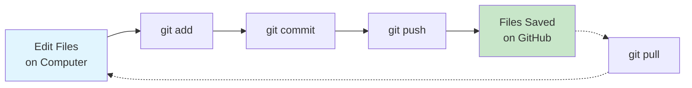

# GitHub Setup & Workflow Backup

{: .no_toc }

## Table of contents

{: .no_toc .text-delta }

1. TOC
{:toc}

---

## Overview

Set up GitHub to save and back up your n8n workflow files. GitHub is like a "save point" system for your code and workflows, letting you track changes and recover previous versions.

**Time Required**: 15 minutes

{: .important }
> **Why GitHub?**: Your n8n workflows are valuable! GitHub provides free backup, version history, and lets you share your work with others. Think of it as Google Drive specifically designed for code and technical files.

---

## What You'll Learn

- ✅ Create a free GitHub account
- ✅ Install Git on your computer
- ✅ Create a repository for your workflows
- ✅ Save workflow JSON files from n8n
- ✅ Push your workflows to GitHub for backup

---

## Part 1: Create a GitHub Account

### Step-by-Step Account Creation

1. **Go to GitHub**
   - Visit [github.com](https://github.com)
   - Click "Sign up" in the top-right corner

2. **Enter Your Email**
   - Use an email you check regularly
   - You'll need to verify it later
   - Click "Continue"

3. **Create a Password**
   - Use a strong password (at least 15 characters)
   - Mix uppercase, lowercase, numbers, and symbols
   - Click "Continue"

4. **Choose a Username**
   - This will be your public identity (e.g., `john-smith-automation`)
   - Can only contain letters, numbers, and hyphens
   - Pick something professional (you might use this for work!)
   - Click "Continue"

5. **Verify You're Human**
   - Complete the puzzle or challenge
   - Click "Create account"

6. **Verify Your Email**
   - Check your email for a code from GitHub
   - Enter the 6-digit code
   - Your account is now active!

{: .highlight }
> **Success**: You now have a GitHub account! Bookmark `github.com/[your-username]` - this is your profile page.

---

## Part 2: Install Git on Your Computer

Git is the tool that connects your computer to GitHub. Think of it as the "sync engine" between your files and the cloud.

### Installation by Operating System

<div style="background: #f6f8fa; padding: 1rem; border-radius: 6px; margin: 1rem 0;">

#### Windows

1. **Download Git**
   - Go to [git-scm.com/download/win](https://git-scm.com/download/win)
   - Download starts automatically
   - File name: `Git-[version]-64-bit.exe`

2. **Run the Installer**
   - Double-click the downloaded file
   - Click "Next" through most screens
   - **Important choices:**
     - Default editor: "Use Visual Studio Code" (or any editor you prefer)
     - Adjusting PATH: "Git from the command line and also from 3rd-party software" (default)
     - HTTPS transport: "Use the OpenSSL library" (default)
     - Line endings: "Checkout Windows-style, commit Unix-style" (default)
     - Terminal emulator: "Use MinTTY" (default)

3. **Complete Installation**
   - Click "Install"
   - Click "Finish"
   - **Verify**: Open Command Prompt and type:
     ```bash
     git --version
     ```
     You should see something like `git version 2.42.0`

</div>

<div style="background: #f6f8fa; padding: 1rem; border-radius: 6px; margin: 1rem 0;">

#### macOS

1. **Open Terminal**
   - Press `Cmd + Space`
   - Type "Terminal"
   - Press Enter

2. **Check if Git is Already Installed**
   ```bash
   git --version
   ```
   - If you see a version number, Git is installed! Skip to "Configure Git" below.
   - If you see a popup asking to install Command Line Tools, click "Install"

3. **Alternative: Install via Homebrew** (optional but recommended)
   ```bash
   # Install Homebrew first (if you don't have it)
   /bin/bash -c "$(curl -fsSL https://raw.githubusercontent.com/Homebrew/install/HEAD/install.sh)"

   # Then install Git
   brew install git
   ```

4. **Verify Installation**
   ```bash
   git --version
   ```

</div>

<div style="background: #f6f8fa; padding: 1rem; border-radius: 6px; margin: 1rem 0;">

#### Linux (Ubuntu/Debian)

1. **Open Terminal**
   - Press `Ctrl + Alt + T`

2. **Update Package List**
   ```bash
   sudo apt update
   ```

3. **Install Git**
   ```bash
   sudo apt install git
   ```

4. **Verify Installation**
   ```bash
   git --version
   ```

**For Other Linux Distributions:**
- **Fedora/RHEL**: `sudo dnf install git`
- **Arch**: `sudo pacman -S git`
- **openSUSE**: `sudo zypper install git`

</div>

---

## Part 3: Configure Git

Tell Git who you are so your contributions are properly credited.

### Set Your Identity

Open your terminal (Command Prompt on Windows, Terminal on macOS/Linux) and run:

```bash
# Set your name (use your real name or preferred name)
git config --global user.name "Your Name"

# Set your email (use the same email as your GitHub account)
git config --global user.email "your.email@example.com"
```

### Verify Configuration

```bash
# Check your settings
git config --list
```

You should see:
```
user.name=Your Name
user.email=your.email@example.com
```

{: .highlight }
> **Why This Matters**: Every time you save changes (called a "commit"), Git records who made them. This helps with collaboration and tracking.

---

## Part 4: Create a Repository for Your Workflows

A repository (or "repo") is like a project folder on GitHub.

### Create Repository on GitHub

1. **Start Repository Creation**
   - Go to [github.com](https://github.com) and sign in
   - Click the "+" icon in the top-right
   - Select "New repository"

2. **Configure Your Repository**
   - **Owner**: Your username (default)
   - **Repository name**: `n8n-workflows` (or any name you prefer)
   - **Description**: "My n8n automation workflow backups"
   - **Visibility**:
     - ⭐ **Public**: Anyone can see (good for sharing and learning)
     - 🔒 **Private**: Only you can see (choose this if workflows contain sensitive info)
   - **Initialise this repository with:**
     - ✅ Check "Add a README file"
     - ✅ Add .gitignore: "None" (for now)
     - ✅ Choose a licence: "MIT Licence" (optional, for open-source)

3. **Create Repository**
   - Click "Create repository"
   - You'll land on your new repository page!

{: .important }
> **Public vs Private**: If your workflows contain API keys, passwords, or sensitive data, choose Private. For learning exercises, Public is fine and helps build your portfolio.

---

## Part 5: Clone Repository to Your Computer

"Cloning" creates a copy of your GitHub repository on your computer.

### Choose a Location

First, decide where to keep your workflows:

**Recommended locations:**
- Windows: `C:\Users\[YourName]\Documents\GitHub\n8n-workflows`
- macOS: `/Users/[YourName]/Documents/GitHub/n8n-workflows`
- Linux: `/home/[YourName]/Documents/GitHub/n8n-workflows`

### Clone the Repository

1. **Get the Repository URL**
   - On your repository page on GitHub
   - Click the green "Code" button
   - Copy the HTTPS URL (looks like: `https://github.com/yourusername/n8n-workflows.git`)

2. **Open Terminal in Your Desired Location**

   **Windows:**
   ```bash
   # Navigate to Documents
   cd C:\Users\[YourName]\Documents

   # Create GitHub folder if it doesn't exist
   mkdir GitHub
   cd GitHub
   ```

   **macOS/Linux:**
   ```bash
   # Navigate to Documents
   cd ~/Documents

   # Create GitHub folder if it doesn't exist
   mkdir -p GitHub
   cd GitHub
   ```

3. **Clone the Repository**
   ```bash
   git clone https://github.com/yourusername/n8n-workflows.git
   ```

   Replace `yourusername` with your actual GitHub username.

4. **Navigate into the Repository**
   ```bash
   cd n8n-workflows
   ```

{: .highlight }
> **Success**: You now have a local copy of your repository! Any files you add here can be synced to GitHub.

---

## Part 6: Save and Push Your First Workflow

Now for the exciting part - backing up an n8n workflow to GitHub!

### Export Workflow from n8n

1. **Open Your Workflow in n8n**
   - Go to your n8n instance
   - Open any workflow you've created

2. **Download the Workflow JSON**
   - Click the "⋮" menu (three dots) in the top-right
   - Select "Download"
   - Your browser downloads a `.json` file (e.g., `My_workflow.json`)

3. **Move the File to Your Repository**
   - Find the downloaded file (usually in your Downloads folder)
   - Move it to your `n8n-workflows` folder
   - Optionally, rename it to something descriptive:
     - `email-classification.json`
     - `cold-email-automation.json`

### Create a Folder Structure (Optional but Recommended)

Organise your workflows by exercise or project:

```bash
# Navigate to your repository
cd ~/Documents/GitHub/n8n-workflows

# Create folders for different exercises
mkdir -p exercises/01-email-classification
mkdir -p exercises/02-cold-email-automation

# Move your workflow file
mv ~/Downloads/My_workflow.json exercises/01-email-classification/workflow.json
```

### Save Changes to Git

Now we'll "commit" (save a snapshot) of your changes:

1. **Check What's Changed**
   ```bash
   git status
   ```

   You'll see:
   ```
   Untracked files:
     exercises/01-email-classification/workflow.json
   ```

2. **Stage Your Changes**
   ```bash
   # Add a specific file
   git add exercises/01-email-classification/workflow.json

   # Or add everything
   git add .
   ```

3. **Commit with a Message**
   ```bash
   git commit -m "Add email classification workflow"
   ```

   The message should briefly describe what you changed.

4. **Push to GitHub**
   ```bash
   git push origin main
   ```

   {: .note }
   > Some repositories use `master` instead of `main`. If you get an error, try `git push origin master`.

5. **Verify on GitHub**
   - Go to your repository on GitHub
   - Refresh the page
   - You should see your new folder and file!

{: .highlight }
> **Congratulations!** You've backed up your first workflow to GitHub. Now it's safely stored in the cloud with version history.

---

## Part 7: Daily Workflow

Here's your routine for backing up workflows as you work:

### Quick Reference Commands

```bash
# 1. Navigate to your repository
cd ~/Documents/GitHub/n8n-workflows

# 2. Download new workflow from n8n, move to appropriate folder

# 3. Check what changed
git status

# 4. Add all changes
git add .

# 5. Commit with descriptive message
git commit -m "Update workflow: added error handling"

# 6. Push to GitHub
git push origin main
```

### Workflow Tips

- **Commit often**: Save after completing each exercise or making significant changes
- **Write clear messages**: Future you will thank present you
  - ✅ Good: "Add Gmail trigger and AI classification logic"
  - ❌ Bad: "Update stuff"
- **Pull before push**: If you work on multiple computers:
  ```bash
  git pull origin main
  ```

---

## Understanding Git Basics

### Key Concepts (Simple Explanations)

| Term | What It Means | Analogy |
|------|---------------|---------|
| **Repository** | A project folder tracked by Git | Like a Google Drive folder, but for code |
| **Commit** | A saved snapshot of your changes | Like clicking "Save" in a video game |
| **Push** | Upload commits to GitHub | Like uploading photos to Google Photos |
| **Pull** | Download changes from GitHub | Like syncing Google Drive to a new computer |
| **Clone** | Copy a repository to your computer | Like downloading a shared Google Drive folder |
| **Main/Master** | The primary version of your code | Like the "final" version of a document |

### Visual: How Git Works



---

## Troubleshooting

### Common Issues & Solutions

<div style="background: #fff3cd; padding: 1rem; border-left: 4px solid #ffc107; margin: 1rem 0;">

#### "git: command not found"

**Problem**: Git isn't installed or not in PATH.

**Solutions**:
- **Windows**: Reinstall Git, ensure "Add to PATH" is checked
- **macOS**: Run `xcode-select --install`
- **Linux**: Run `sudo apt install git`
- Restart your terminal after installation

</div>

<div style="background: #fff3cd; padding: 1rem; border-left: 4px solid #ffc107; margin: 1rem 0;">

#### "Permission denied (publickey)"

**Problem**: GitHub can't verify your identity.

**Solution**: Use HTTPS instead of SSH:
```bash
# Check your current remote URL
git remote -v

# If it shows git@github.com, change to HTTPS
git remote set-url origin https://github.com/yourusername/n8n-workflows.git
```

</div>

<div style="background: #fff3cd; padding: 1rem; border-left: 4px solid #ffc107; margin: 1rem 0;">

#### "Authentication failed"

**Problem**: GitHub needs your credentials.

**Solutions**:
1. Make sure you're using the correct username/email
2. Use a Personal Access Token (PAT) instead of password:
   - Go to GitHub → Settings → Developer Settings → Personal Access Tokens → Tokens (classic)
   - Click "Generate new token (classic)"
   - Check "repo" scope
   - Copy the token (you'll only see it once!)
   - Use this token as your password when Git asks

</div>

<div style="background: #fff3cd; padding: 1rem; border-left: 4px solid #ffc107; margin: 1rem 0;">

#### "fatal: not a git repository"

**Problem**: You're not in your repository folder.

**Solution**:
```bash
# Navigate to your repository
cd ~/Documents/GitHub/n8n-workflows

# Verify you're in the right place
git status
```

</div>

<div style="background: #fff3cd; padding: 1rem; border-left: 4px solid #ffc107; margin: 1rem 0;">

#### "Your branch is behind 'origin/main'"

**Problem**: GitHub has newer changes than your computer.

**Solution**:
```bash
# Download and merge changes
git pull origin main

# Then you can push your changes
git push origin main
```

</div>

---

## Best Practices for Workflow Backups

### Security Considerations

{: .important }
> **Remove Sensitive Data**: Before committing workflows, check that they don't contain:
> - API keys or passwords
> - Personal email addresses
> - Company-specific information
> - Real customer data

### How to Clean Workflow Files

n8n workflow JSON files sometimes include credential IDs. These are safe to commit (they're just references), but double-check:

```bash
# Search for potential secrets in a workflow file
grep -i "password\|secret\|key" your-workflow.json
```

If you find hard-coded credentials:
1. Replace them with placeholders: `"YOUR_API_KEY_HERE"`
2. Document in a README which credentials are needed
3. Store actual credentials only in n8n's Credentials page (never in workflow files)

### Organising Your Repository

Suggested folder structure:

```
n8n-workflows/
├── README.md                           # Overview of your workflows
├── exercises/
│   ├── 01-email-classification/
│   │   ├── workflow.json
│   │   └── notes.md                    # Your learning notes
│   ├── 02-cold-email-automation/
│   │   ├── workflow.json
│   │   └── notes.md
│   └── ...
├── personal-projects/
│   ├── project-1/
│   └── project-2/
└── templates/
    └── common-patterns/
```

---

## What You've Accomplished

✅ Created a GitHub account
✅ Installed and configured Git
✅ Created a repository for workflows
✅ Cloned repository to your computer
✅ Exported and committed your first workflow
✅ Pushed to GitHub for backup
✅ Understand basic Git workflow

---

## Next Steps

Now that GitHub is set up, you can:

1. **Continue with Prerequisites**
   - Complete any remaining service setups
   - [Go to Credentials Setup →](./credentials)

2. **Start Exercises**
   - Begin building n8n workflows
   - Back up each completed exercise to GitHub
   - [View All Exercises →](../exercises/)

3. **Learn More Git** (Optional)
   - [GitHub's Git Guide](https://docs.github.com/en/get-started/using-git)
   - [Interactive Git Tutorial](https://learngitbranching.js.org/)

{: .highlight }
> **Remember**: Commit often, write clear messages, and always back up your work. Your future self will thank you!

---

## Additional Resources

### Useful Links

- [GitHub Docs](https://docs.github.com) - Official documentation
- [Git Cheat Sheet](https://education.github.com/git-cheat-sheet-education.pdf) - Quick reference PDF
- [Visual Git Guide](https://marklodato.github.io/visual-git-guide/index-en.html) - Diagrams explaining Git concepts

### Video Tutorials (Optional)

- [Git & GitHub for Beginners](https://www.youtube.com/watch?v=RGOj5yH7evk) - 1 hour crash course
- [GitHub Desktop Tutorial](https://www.youtube.com/watch?v=8Dd7KRpKeaE) - GUI alternative to command line

### Alternative Tools

If you prefer a visual interface instead of command line:

- **[GitHub Desktop](https://desktop.github.com/)** - Official GUI for Git (Windows/macOS)
- **[GitKraken](https://www.gitkraken.com/)** - Feature-rich Git client (all platforms)
- **[Sourcetree](https://www.sourcetreeapp.com/)** - Free Git GUI (Windows/macOS)

---

[← Back to Prerequisites](./index){: .btn .mr-2 }
[Continue to Verification →](./verification){: .btn .btn-primary }
