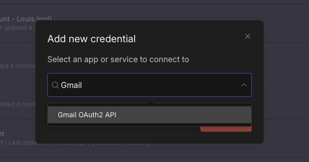
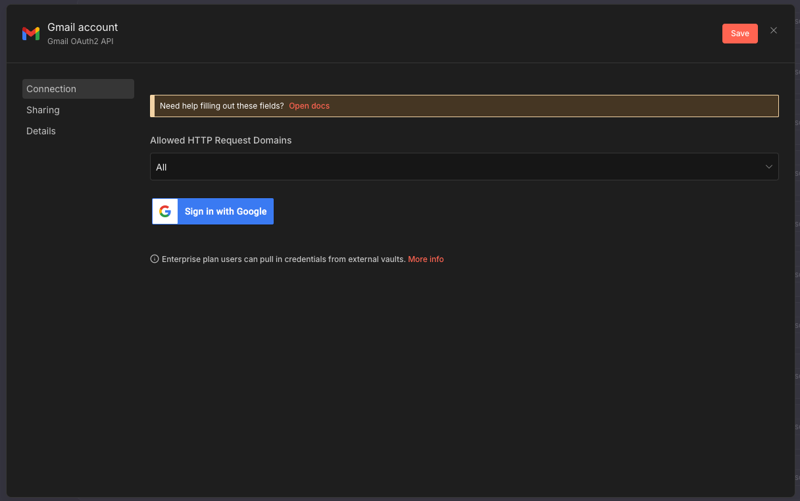
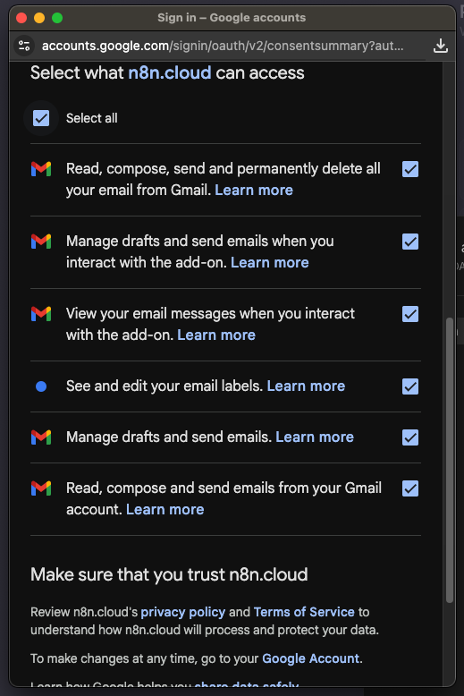
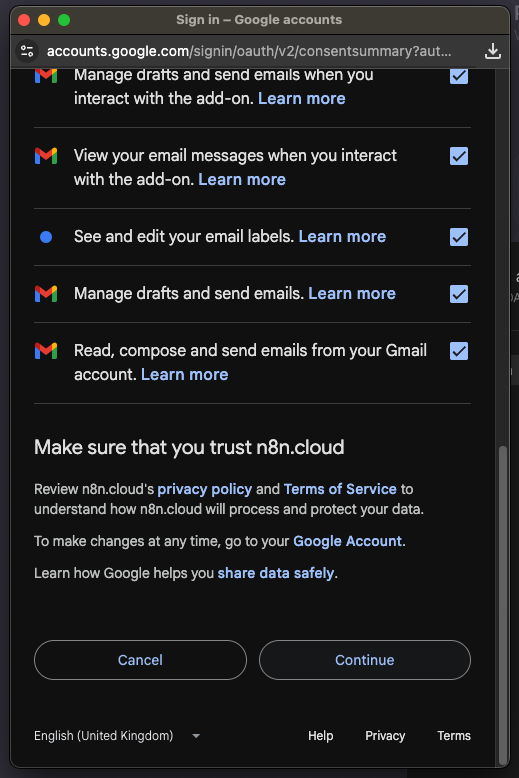
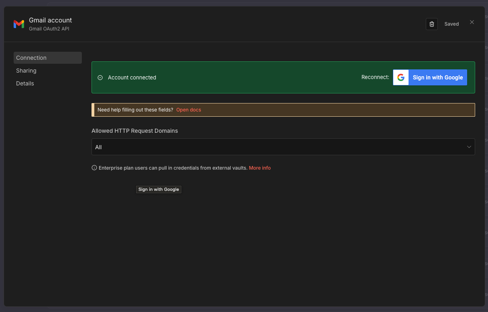
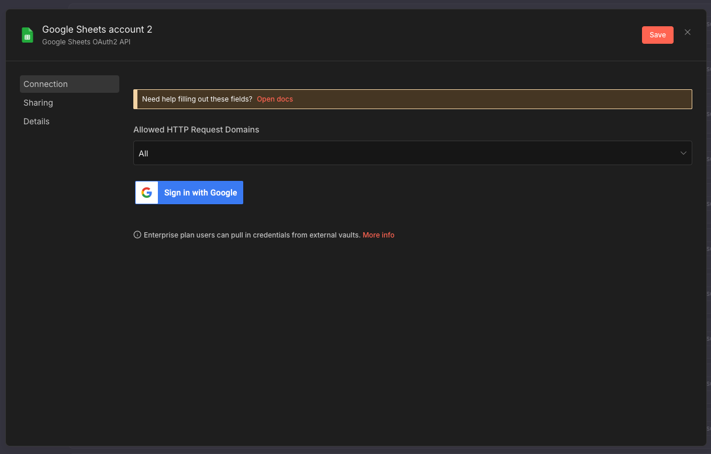
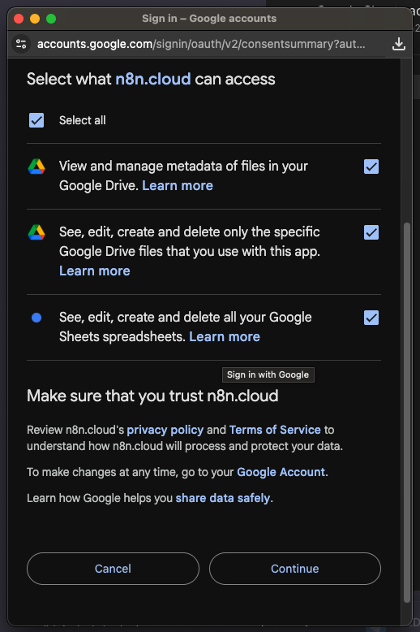
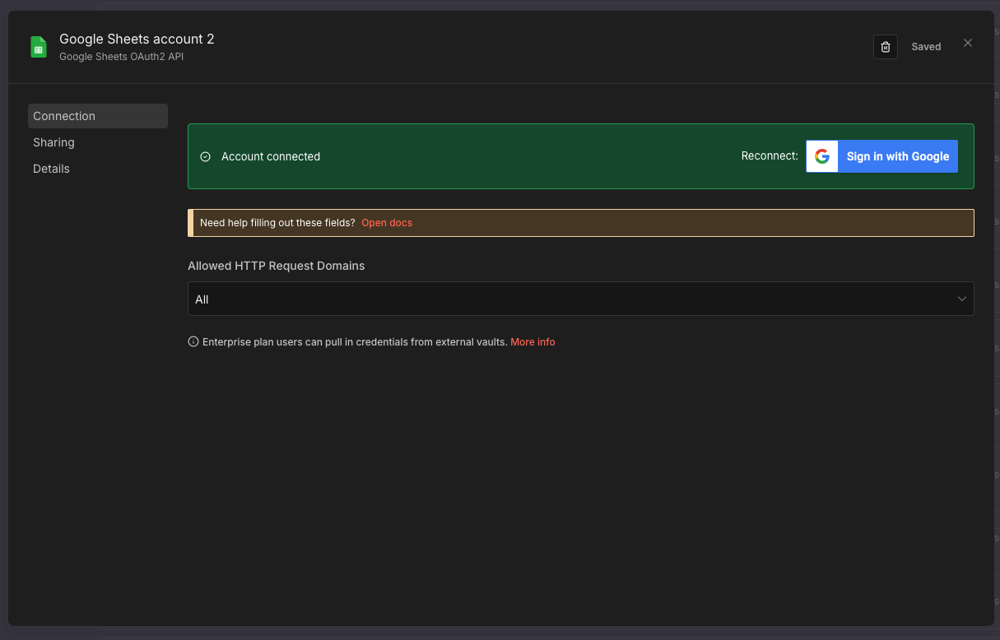

# Google Services Setup via n8n

{: .no_toc }

## Table of contents

{: .no_toc .text-delta }

1. TOC
{:toc}

---

## Overview

Connect Gmail and Google Sheets to n8n using OAuth2 authentication. n8n handles the credential management - you just need to authenticate your Google account.

**Time Required**: 5 minutes

**What You're Connecting**:

- Gmail (for sending/reading emails)
- Google Sheets (for data logging)

---

## Step 1: Connect Gmail in n8n

### 1.1 Access Credentials Menu

1. In n8n, click the **+ button** in the top-right corner

1. Select **Credential** from the dropdown menu

### 1.2 Search for Gmail Credential

1. In the "Add new credential" modal, type **"Gmail"** in the search box
1. Select **"Gmail OAuth2 API"** from the results

### 1.3 Initiate OAuth Connection

1. In the Gmail account credential screen, click **"Sign in with Google"**

### 1.4 Grant Permissions

1. A Google consent screen will appear. Review the permissions:
   - Read, compose, send and permanently delete all your email from Gmail
   - Manage drafts and send emails when you interact with the add-on
   - View your email messages when you interact with the add-on
   - See and edit your email labels
   - Manage drafts and send emails
   - Read, compose and send emails from your Gmail account

1. Scroll down and click **"Continue"**

{: .note }
> **First-time setup**: Google may show a warning that the app isn't verified. Click "Advanced" → "Go to n8n (unsafe)" → "Allow". This is normal for OAuth apps in development mode.

### 1.5 Verify Connection

1. You should see **"Account connected"** in green, indicating successful authentication

1. Click **"Save"** to store the credential

{: .highlight }
> **Success**: Your Gmail credential is now ready to use in any workflow!

---

## Step 2: Connect Google Sheets in n8n

### 2.1 Access Credentials Menu

1. In n8n, click the **+ button** in the top-right corner

1. Select **Credential** from the dropdown menu

### 2.2 Search for Google Sheets Credential

1. In the "Add new credential" modal, type **"Google Sheets"** in the search box
1. Select **"Google Sheets OAuth2 API"** from the results

### 2.3 Initiate OAuth Connection

1. In the Google Sheets account credential screen, click **"Sign in with Google"**

### 2.4 Grant Permissions

1. A Google consent screen will appear. Review the permissions:
   - View and manage metadata of files in your Google Drive
   - See, edit, create and delete only the specific Google Drive files that you use with this app
   - See, edit, create and delete all your Google Sheets spreadsheets

1. Scroll down and click **"Continue"**

{: .note }
> **Drive permissions**: Google Sheets requires Drive API access to create and manage spreadsheet files.

### 2.5 Verify Connection

1. You should see **"Account connected"** in green, indicating successful authentication

1. Click **"Save"** to store the credential

{: .highlight }
> **Success**: Your Google Sheets credential is now ready to use in any workflow!

---

## Troubleshooting

### "This app isn't verified" Warning

When connecting for the first time, Google may show a security warning:

1. Click **"Advanced"** at the bottom left
2. Click **"Go to n8n (unsafe)"**
3. Review permissions and click **"Allow"**

{: .important }
> **This is expected**: Apps in development mode show this warning. Your credentials are safe - n8n uses industry-standard OAuth2.

### "Access blocked" Error

If you see "Access blocked: n8n has not completed the Google verification process":

**Solution**: Use a different Google account that isn't managed by a Workspace admin, or contact your workspace administrator to allow n8n.

### Connection Expires

OAuth tokens may expire. If you see authentication errors:

1. Go to **Credentials** in n8n
2. Find your Gmail/Sheets credential
3. Click **"Reconnect"**
4. Re-authenticate with Google

---

## What You've Accomplished

✅ Connected Gmail to n8n via OAuth2
✅ Connected Google Sheets to n8n via OAuth2
✅ Ready to use Gmail and Sheets nodes in any workflow
