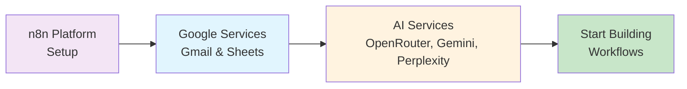

# Common Prerequisites & Service Setup

{: .fs-9 }

One-time setup guide for all services used across automation exercises.
{: .fs-6 .fw-300 }

[Start Setup](./n8n-setup){: .btn .btn-primary .fs-5 .mb-4 .mb-md-0 }

---

## Overview

Complete these prerequisites once, and you're ready for all 30+ exercises. This guide is broken into manageable sections that take 5-10 minutes each.

### What You'll Set Up

| Service | Purpose | Time |
|---------|---------|------|
| **[n8n Platform](./n8n-setup)** | Workflow automation platform | 5 min |
| **[Google Services](./google-setup)** | Connect Gmail & Sheets via n8n | 5 min |
| **[AI Services](./ai-services)** | Connect OpenRouter, Gemini, Perplexity | 10 min |
| **[GitHub Setup](./github-setup)** | Save workflows online | 10 min |

{: .important }
> **Do This First**: These prerequisites are required before starting any exercise. Once configured, you won't need to repeat these steps.

---

## Setup Path

Follow this recommended order:

---

## Quick Navigation

  

    

      <h4>⚙️ n8n Platform</h4>
      
Workflow automation setup

      <a href="./n8n-setup">Install →</a>
    

  

  

    

      <h4>🔐 Google Services</h4>
      
Gmail & Sheets via n8n OAuth

      <a href="./google-setup">Connect →</a>
    

  

  

    

      <h4>🤖 AI Services</h4>
      
OpenRouter, Gemini, Perplexity

      <a href="./ai-services">Setup →</a>
    

  

  

    

      <h4>📦 GitHub Setup</h4>
      
Save your workflows online

      <a href="./github-setup">Configure →</a>
    

  

---

## Why This Approach?

### OAuth Over App Passwords

{: .highlight }
> **Professional Best Practice**: OAuth provides better security, granular permissions, and works across all Google services with one setup. App passwords are deprecated and less secure.

### Benefits of Centralised Setup

- ✅ **One-time configuration** for all exercises
- ✅ **Single OAuth credential** for Gmail, Sheets, and Drive
- ✅ **Professional approach** suitable for production
- ✅ **Better security** with granular permissions
- ✅ **Easier troubleshooting** with clear separation

---

## Ready to Begin?

Start with n8n platform setup - it's the foundation for everything else.

[Begin with n8n Setup →](./n8n-setup){: .btn .btn-primary .fs-5 .mb-4 .mb-md-0 }

---

