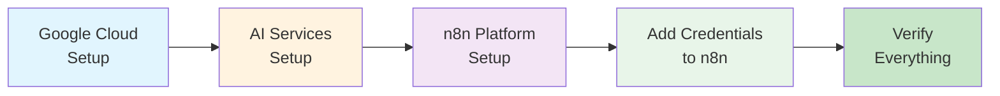

# Common Prerequisites & Service Setup

{: .fs-9 }

One-time setup guide for all services used across automation exercises.
{: .fs-6 .fw-300 }

[Start Setup](./google-setup){: .btn .btn-primary .fs-5 .mb-4 .mb-md-0 .mr-2 }
[Quick Checklist](./checklist){: .btn .fs-5 .mb-4 .mb-md-0 }

---

## Overview

Complete these prerequisites once, and you're ready for all 30+ exercises. This guide is broken into manageable sections that take 5-10 minutes each.

### What You'll Set Up

| Service | Purpose | Time |
|---------|---------|------|
| **[Google Cloud & OAuth](./google-setup)** | Authentication for Gmail, Sheets, Drive | 10 min |
| **[AI Services](./ai-services)** | OpenRouter, Gemini, Perplexity APIs | 10 min |
| **[n8n Platform](./n8n-setup)** | Workflow automation platform | 5 min |
| **[Credentials](./credentials)** | Connect everything in n8n | 10 min |
| **[GitHub Setup](./github-setup)** | Back up and version control workflows | 15 min |

{: .important }
> **Do This First**: These prerequisites are required before starting any exercise. Once configured, you won't need to repeat these steps.

---

## Setup Path

Follow this recommended order:

---

## Quick Navigation

  

    

      <h4>🔐 Google & OAuth</h4>
      
Gmail, Sheets, Drive authentication

      <a href="./google-setup">Configure →</a>
    

  

  

    

      <h4>🤖 AI Services</h4>
      
LLM APIs and research tools

      <a href="./ai-services">Get API Keys →</a>
    

  

  

    

      <h4>⚙️ n8n Platform</h4>
      
Workflow automation setup

      <a href="./n8n-setup">Install →</a>
    

  

  

    

      <h4>🔗 Connect Everything</h4>
      
Add credentials to n8n

      <a href="./credentials">Connect →</a>
    

  

  

    

      <h4>📦 GitHub Setup</h4>
      
Back up your workflows

      <a href="./github-setup">Set Up →</a>
    

  

  

    

      <h4>✅ Verification</h4>
      
Test all connections

      <a href="./verification">Verify →</a>
    

  

  

    

      <h4>🆘 Troubleshooting</h4>
      
Common issues & solutions

      <a href="./troubleshooting">Get Help →</a>
    

  

---

## Why This Approach?

### OAuth Over App Passwords

{: .highlight }
> **Professional Best Practice**: OAuth provides better security, granular permissions, and works across all Google services with one setup. App passwords are deprecated and less secure.

### Benefits of Centralised Setup

- ✅ **One-time configuration** for all exercises
- ✅ **Single OAuth credential** for Gmail, Sheets, and Drive
- ✅ **Professional approach** suitable for production
- ✅ **Better security** with granular permissions
- ✅ **Easier troubleshooting** with clear separation

---

## Ready to Begin?

Start with Google Cloud setup - it's the foundation for everything else.

[Begin with Google Setup →](./google-setup){: .btn .btn-primary .fs-5 .mb-4 .mb-md-0 }

---

