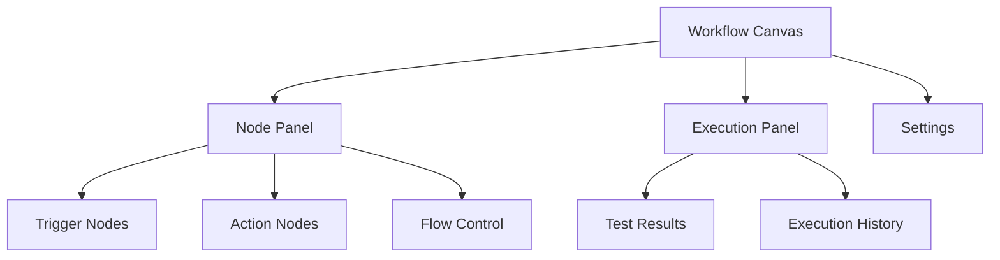

# n8n Platform Setup

{: .no_toc }

## Table of contents

{: .no_toc .text-delta }

1. TOC
{:toc}

---

## Overview

Set up n8n, the workflow automation platform that connects all your services.

**Time Required**: 5 minutes

---

## Choose Your Setup Method

### Option 1: Cloud (Recommended for Beginners)

#### Quick Cloud Setup

1. Go to [n8n.cloud](https://n8n.cloud)
2. Sign up with email or Google
3. Verify your email
4. Choose workspace name
5. Select "Starter" plan (free)

{: .highlight }
> **Your URL**: After setup, your instance will be at `https://[workspace-name].app.n8n.cloud`

#### Cloud Benefits

- ✅ No installation required
- ✅ Automatic updates
- ✅ Always accessible
- ✅ Built-in backups
- ✅ Free tier available

---

### Option 2: Self-Hosted

#### Using Docker (Easiest)

```bash
# Run with persistent data
docker run -it --rm \
  --name n8n \
  -p 5678:5678 \
  -v ~/.n8n:/home/node/.n8n \
  n8nio/n8n
```

Access at: `http://localhost:5678`

#### Using npm

```bash
# Install globally
npm install n8n -g

# Start n8n
n8n start
```

Access at: `http://localhost:5678`

#### Using Docker Compose

Create `docker-compose.yml`:

```yaml
version: '3'
services:
  n8n:
    image: n8nio/n8n
    ports:
      - "5678:5678"
    volumes:
      - ~/.n8n:/home/node/.n8n
    environment:
      - N8N_BASIC_AUTH_ACTIVE=true
      - N8N_BASIC_AUTH_USER=admin
      - N8N_BASIC_AUTH_PASSWORD=password
```

Then run:

```bash
docker-compose up -d
```

---

## First-Time Setup

### Initial Configuration

When you first access n8n:

1. **Create Owner Account**
   - Email address
   - Strong password
   - Full name

2. **Personalise Your Experience**
   - Company size: Select any
   - Use case: "Learning/Education"
   - Skip optional fields

3. **Complete Setup**
   - Skip templates (for now)
   - Land on workflow canvas

{: .highlight }
> **Success**: You should see an empty workflow canvas ready for building!

---

## Understanding the Interface

### Key Areas



### Navigation Tips

| Area | Purpose | Shortcut |
|------|---------|----------|
| **Canvas** | Build workflows | Click + drag |
| **Node Panel** | Add nodes | Tab key |
| **Executions** | View history | Ctrl/Cmd + E |
| **Credentials** | Manage APIs | Settings → Credentials |
| **Variables** | Global values | Settings → Variables |

---

## Workspace Settings

### Recommended Configuration

1. Go to **Settings** (bottom-left)
2. Configure these options:

#### Execution Settings

- **Save successful executions**: ON
- **Save failed executions**: ON
- **Execution timeout**: 5 minutes
- **Max execution time**: 30 minutes

#### Error Handling

- **Error workflow**: Create one later
- **Retry failed executions**: OFF (for learning)

#### Save Settings

- **Manual save**: ON (Ctrl/Cmd + S)
- **Auto-save**: Optional

---

## What You've Accomplished

✅ n8n platform installed/accessible
✅ Owner account created
✅ Workspace configured
✅ Familiar with interface
✅ Ready to add credentials

---

## Next Steps

Connect all your API credentials to n8n.

[Continue to Credentials →](./credentials){: .btn .btn-primary .fs-5 .mb-4 .mb-md-0 }
