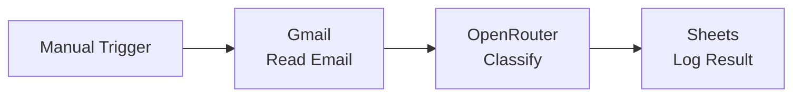

# Verify Your Setup

{: .no_toc }

## Table of contents

{: .no_toc .text-delta }

1. TOC
{:toc}

---

## Overview

Test all connections to ensure everything is working before starting exercises.

**Time Required**: 5 minutes

---

## Quick Checklist

### Google Cloud Setup

- [ ] Google Cloud Project created
- [ ] Gmail API enabled
- [ ] Google Sheets API enabled
- [ ] Google Drive API enabled
- [ ] OAuth consent screen configured
- [ ] Test users added
- [ ] OAuth credentials saved

### AI Services

- [ ] OpenRouter API key obtained
- [ ] Google Gemini API key generated
- [ ] Perplexity API key created
- [ ] All keys stored securely

### n8n Platform

- [ ] n8n instance accessible
- [ ] Owner account created
- [ ] Workspace configured
- [ ] Familiar with interface

### Credentials in n8n

- [ ] Google OAuth2 connected
- [ ] OpenRouter configured
- [ ] Gemini added
- [ ] Perplexity linked

---

## Test Each Service

### Test Google Services

#### Create Test Workflow

1. In n8n, click **"Add Workflow"**
2. Name it: "Prerequisites Test"

#### Test Gmail

1. Add **Gmail** node
2. Configure:
   - **Credential**: Google - All Services
   - **Operation**: Get Many
   - **Limit**: 1
3. Click **"Execute Node"**
4. Should return your latest email

{: .highlight }
> **Success**: If you see email data, Gmail is working!

#### Test Google Sheets

1. Add **Google Sheets** node
2. Configure:
   - **Credential**: Google - All Services
   - **Operation**: Read Sheet
3. Create a test spreadsheet first if needed
4. Click **"Execute Node"**
5. Should show sheet data or empty result

---

### Test AI Models

#### Test OpenRouter

1. Add **Basic LLM Chain** node
2. Add **OpenRouter Chat Model** under it
3. Configure:
   - **Credential**: OpenRouter - AI Models
   - **Model**: google/gemma-3-27b-it:free
   - **Prompt**: "Say hello"
4. Click **"Execute Node"**
5. Should return a greeting

#### Test Gemini

1. Add **Google Gemini (PaLM) Chat Model** node
2. Configure:
   - **Credential**: Gemini - Free AI
   - **Prompt**: "What is 2+2?"
3. Click **"Execute Node"**
4. Should return "4"

#### Test Perplexity

1. Add **HTTP Request** node
2. Configure:
   - **Method**: POST
   - **URL**: `https://api.perplexity.ai/chat/completions`
   - **Authentication**: Header Auth
   - **Header**: Authorization = `Bearer YOUR_KEY`
3. Add body:

```json
{
  "model": "sonar",
  "messages": [{"role": "user", "content": "What's the weather?"}]
}
```

Should return current weather info

---

## Integration Test

### Complete Workflow Test

Create a workflow that uses all services:



1. **Manual Trigger**: Start workflow
2. **Gmail**: Read latest email
3. **OpenRouter**: Classify the email
4. **Google Sheets**: Save classification

If this workflow runs successfully, everything is configured correctly!

---

## Performance Check

### API Quotas

Verify your quotas are sufficient:

| Service | Free Limit | Per |
|---------|-----------|-----|
| Gmail API | 250 units | Second |
| Sheets API | 100 requests | 100 seconds |
| Gemini | 60 requests | Minute |
| OpenRouter | $1 credit | Total |
| Perplexity | $5 credit | Month |

### Monitor Usage

1. **Google Cloud Console**: APIs & Services → Metrics
2. **OpenRouter Dashboard**: Usage tab
3. **Perplexity Dashboard**: API usage
4. **Gemini Console**: Quotas section

---

## Save Your Test Workflow

### Export for Reference

1. In your test workflow
2. Click **"Options"** (three dots)
3. Select **"Download"**
4. Save as `prerequisites-test.json`

You can import this later to retest if needed.

---

## What You've Verified

✅ All APIs responding
✅ Credentials working
✅ Services integrated
✅ Quotas checked
✅ Test workflow saved

---

## Ready for Exercises

Everything is working! You're ready to start building automations.

### Choose Your First Exercise

- **New to Automation?** Start with [Exercise 1: Email Classification](../../exercises/01-email-classification/)
- **Comfortable with APIs?** Try [Exercise 2: Cold Email Automation](../../exercises/02-cold-email-automation/)
- **Want a Challenge?** Browse [All Exercises](../../exercises/)

---

## Need Help?

If anything isn't working, check the troubleshooting guide.

[Troubleshooting Guide →](./troubleshooting){: .btn .btn-outline .fs-5 .mb-4 .mb-md-0 }
