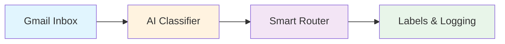

# Exercise 1: Email Classification System

{: .fs-9 }

Build an intelligent email classification system that automatically processes, categorises, and routes emails using AI.
{: .fs-6 .fw-300 }

---

## 45-Minute Hands-On Exercise

This exercise teaches you **dynamic routing** - a fundamental automation pattern where different situations get handled differently automatically. Perfect for beginners, no coding experience required.

**The Problem:** Professionals receive 50-150 emails daily. Manual sorting is time-consuming, important messages get buried, and urgent requests slip through. You need an intelligent system that automatically understands and routes emails based on content, not just rules.

**Why Dynamic Routing Matters:**

Instead of one giant AI trying to handle everything, you'll learn to **divide and conquer**:

- ✅ **More reliable**: Simpler logic means fewer failures
- ✅ **Faster**: Each AI handles one specific task, not everything
- ✅ **Easier to debug**: Know exactly which step failed
- ✅ **Easy to enhance**: Add new categories without breaking existing logic

This is how professional automations work in the real world.

### What You'll Build

A complete automation workflow featuring:

- **Real-time email monitoring** with Gmail API
- **AI-powered classification** using natural language processing
- **Intelligent routing system** based on priority and sentiment
- **Automated labelling** for inbox organisation
- **Analytics logging** to Google Sheets

### Skills You'll Demonstrate

By completing this exercise, you will have demonstrated:

- **AI Integration**: Connecting and using language models for text classification
- **API Orchestration**: Working with Gmail API, AI services, and Google Sheets
- **Workflow Design**: Building multi-step automation with conditional logic
- **Data Processing**: Extracting, transforming, and routing information

### The Pattern You'll Master

The **Intelligent Triage & Routing** pattern you'll learn applies to:

- **Customer Support**: Categorise tickets, assign priority, route to specialists
- **Error Monitoring**: Analyse logs, determine severity, trigger alerts
- **Document Processing**: Classify documents, route for approval, track workflow
- **Social Media**: Monitor mentions, detect sentiment, escalate issues
- **Lead Qualification**: Score leads, categorise inquiries, assign to sales team

### Exercise Structure

  

    

      <h4>⚙️ Part A: Setup</h4>
      
Environment & prerequisites (15 min)

      <a href="./part-a-setup">Start here →</a>
    

  

  

    

      <h4>🔧 Part B: Build & Test</h4>
      
Create, test, and activate (25 min)

      <a href="./part-b-workflow">Build →</a>
    

  

  

    

      <h4>🏆 Challenges</h4>
      
Advanced extensions (optional)

      <a href="./challenge-tasks">Level up →</a>
    

  

---

## Quick Navigation

| Section | Description | Duration |
|---------|-------------|----------|
| [Part A: Setup](./part-a-setup) | Account creation, API configuration, prerequisites | 15 min |
| [Part B: Build & Test](./part-b-workflow) | Node creation, AI integration, testing, activation | 25 min |
| [Challenges](./challenge-tasks) | Multi-language, auto-reply, analytics | Optional |

---

