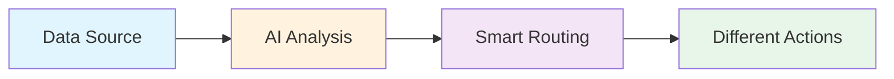

# Exercise 1: Email Classification System

{: .fs-9 }

Build an intelligent email classification system that automatically processes, categorizes, and routes emails using AI.
{: .fs-6 .fw-300 }

[Start Exercise](./overview){: .btn .btn-primary .fs-5 .mb-4 .mb-md-0 .mr-2 }
[Download Workflow](./downloads/email-classification-workflow.json){: .btn .fs-5 .mb-4 .mb-md-0 }

---

## 45-Minute Hands-On Exercise

This exercise teaches you to build a production-ready email automation system that combines Gmail, AI classification, and smart routing. Perfect for beginners, no coding experience required.

### What You'll Build

- **Real-time email monitoring** with Gmail API
- **AI-powered classification** using natural language processing
- **Intelligent routing system** based on priority and sentiment
- **Automated labeling** for inbox organization

### The Universal Pattern

You're learning the **Intelligent Triage & Routing** pattern:

**Today's Implementation:**

**Tomorrow's Applications:**

```mermaid
graph TD
    subgraph "Support System"
        ST[Support Tickets] --> CAT[Categorization]
        CAT --> PR[Priority Routing]
        PR --> TA[Team Assignment]
    end

    subgraph "Error Monitoring"
        EL[Error Logs] --> SA[Severity Analysis]
        SA --> AR[Alert Rules]
        AR --> IC[Incident Creation]
    end

    subgraph "Document Processing"
        DOC[Documents] --> CT[Content Type]
        CT --> AF[Approval Flow]
        AF --> PP[Processing Pipeline]
    end
```

### Exercise Structure

  

    

      <h4>📚 Overview</h4>
      
Understanding the why and how

      <a href="./overview">Start here →</a>
    

  

  

    

      <h4>⚙️ Part A: Setup</h4>
      
Environment & prerequisites (15 min)

      <a href="./part-a-setup">Configure →</a>
    

  

  

    

      <h4>🔧 Part B: Build & Test</h4>
      
Create, test, and activate (25 min)

      <a href="./part-b-workflow">Build →</a>
    

  

  

    

      <h4>🏆 Challenges</h4>
      
Advanced extensions (optional)

      <a href="./challenge-tasks">Level up →</a>
    

  

---

## Quick Navigation

| Section | Description | Duration |
|---------|-------------|----------|
| [Overview](./overview) | Why this matters, learning outcomes, architecture | 5 min |
| [Part A: Setup](./part-a-setup) | Account creation, API configuration, prerequisites | 15 min |
| [Part B: Build & Test](./part-b-workflow) | Node creation, AI integration, testing, activation | 25 min |
| [Challenges](./challenge-tasks) | Multi-language, auto-reply, analytics | Optional |

---

