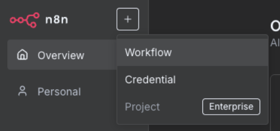
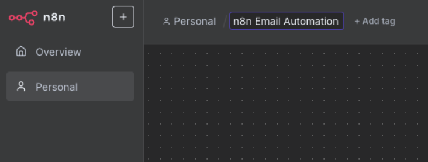
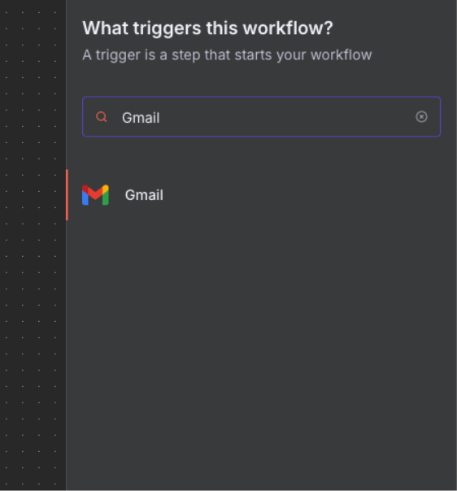

# Exercise 1: Email Classification

## What You'll Build

In this hands-on exercise, you'll create a **smart email classification system** that automatically processes
incoming emails, understands their content using AI, and takes intelligent actions based on the message context.
By the end of this 45-minute session, you'll have a working automation that can:

- Monitor your Gmail inbox in real-time
- Use AI to understand email priority, sentiment, and intent
- Automatically organise emails with smart labels
- Track all classifications for performance insights
- Route urgent matters for immediate attention

## Why This Exercise Matters

### The Problem We're Solving

The average knowledge worker spends **28% of their workweek** managing email (McKinsey Global Institute).
For a team of 10 people, that's equivalent to having 3 full-time employees just reading and sorting emails.
This exercise teaches you to reclaim that time through intelligent automation.

### Real-World Applications

| Department | Key Benefits | Time Saved | ROI |
|:-----------|:-------------|:-----------|:----|
| **Customer Support** | • Reduce response time to minutes<br>• Auto-escalate angry customers<br>• Create tickets automatically<br>• Track sentiment trends | 3-4 hours/day | 300% |
| **Sales Teams** | • Never miss hot leads<br>• Smart enquiry routing<br>• Automated follow-ups<br>• Priority opportunity ranking | 2-3 hours/day | 250% |
| **HR Departments** | • Categorise by urgency<br>• Route sensitive matters<br>• Track common questions<br>• Ensure compliance | 2 hours/day | 200% |
| **Personal Use** | • AI-powered inbox sorting<br>• Deadline detection<br>• Automated acknowledgements<br>• Searchable email database | 1-2 hours/day | Priceless |

## Learning Outcomes

By completing this exercise, you will:

1. **Master API Integration** - Connect multiple cloud services using OAuth2 authentication
2. **Understand AI Prompting** - Write effective prompts that get consistent results from LLMs
3. **Build Conditional Logic** - Create intelligent routing based on AI classifications
4. **Implement Error Handling** - Ensure your automation runs reliably 24/7
5. **Design User Workflows** - Think systematically about process automation

## Prerequisites

| Requirement Type | What You Need | What You DON'T Need |
|:----------------|:--------------|:--------------------|
| **Skills** | • Basic email understanding<br>• Web browser navigation<br>• Following instructions | • Programming experience<br>• Technical background<br>• Command line knowledge |
| **Accounts** | • Gmail with 2FA<br>• Modern web browser<br>• 45-60 minutes time | • Paid software<br>• Premium accounts<br>• API experience |
| **Hardware** | • Any modern computer<br>• Internet connection | • Special equipment<br>• Server access |

## System Architecture

### High-Level Overview


### Data Flow Explanation

1. **Email Ingestion**: Gmail API polls for new messages every minute
2. **Data Extraction**: Essential fields (sender, subject, body) are extracted and cleaned
3. **AI Processing**: GPT-4o analyses content for priority, sentiment, and routing
4. **Decision Making**: Switch node routes based on classification results
5. **Action Execution**: Labels applied, logs created, notifications sent
6. **Performance Tracking**: All actions logged for continuous improvement

## 🚀 Why We Built It This Way

### Design Decisions Explained

**Why n8n?**

- Visual workflow builder perfect for beginners
- No code required for complex logic
- Free tier sufficient for learning
- Industry-standard tool used by 40,000+ companies

**Why Gmail API instead of IMAP?**

- More reliable and faster than traditional email protocols
- Rich metadata access (labels, threads, etc.)
- Better security through OAuth2
- Real-time webhook capabilities (for production)

**Why OpenRouter for AI?**

- Access to multiple AI models through one API
- Free tier includes powerful models
- No credit card required to start
- Fallback options if one model fails

**Why Google Sheets for logging?**

- Zero setup database
- Easy to share and visualise
- Familiar interface for non-technical users
- Free and reliable

## 📊 Success Metrics

After implementing this system, you should see:

- ⏱️ **90% reduction** in email triage time
- 🎯 **95% accuracy** in priority classification
- 😊 **Improved team morale** from reduced email overwhelm
- 📈 **Data-driven insights** into communication patterns
- 🚀 **Faster response times** for urgent matters

## ⚠️ Common Pitfalls to Avoid

1. **Over-engineering the prompt** - Start simple, iterate based on results
2. **Ignoring rate limits** - Plan for API quotas from day one
3. **Skipping error handling** - Build resilience from the start
4. **Not testing edge cases** - What happens with empty emails or attachments?
5. **Forgetting about privacy** - Never log sensitive information

---

## Detailed Implementation

### Phase 1: Core Components Setup

#### Gmail Trigger Configuration

**What We're Building:**
A reliable email monitoring system that checks for new messages every minute without overwhelming your Gmail API quota.

**Technical Details:**

- **OAuth2 Authentication**: Secure token-based access (no password storage)
- **Polling Frequency**: Every 60 seconds (optimal for free tier)
- **Smart Filtering**: Process only unread messages to avoid duplicates
- **Error Recovery**: Automatic retry on temporary failures

#### AI Classification Engine

**What We're Building:**
An intelligent classification system that understands context, not just keywords.

**Classification Dimensions:**

1. **Priority Classification** (Low/Medium/High/Urgent)
   - Urgent: Contains deadlines < 24 hours, critical keywords, VIP senders
   - High: Important but not time-critical, key stakeholders
   - Medium: Regular business matters, standard requests
   - Low: FYI, newsletters, non-actionable content

2. **Sentiment Analysis** (Positive/Neutral/Negative/Angry)
   - Positive: Praise, satisfaction, enthusiasm
   - Neutral: Factual, informational, procedural
   - Negative: Complaints, concerns, dissatisfaction
   - Angry: Strong language, threats, escalation needed

3. **Department Routing** (Sales/Support/Technical/HR/Finance/Other)
   - Sales: Pricing enquiries, demos, purchasing intent
   - Support: Help requests, bug reports, how-to questions
   - Technical: API issues, integration questions, feature requests
   - HR: Employment queries, policy questions, complaints
   - Finance: Invoicing, payments, billing issues

**The AI Prompt Strategy:**

```json
{
  "prompt": "You are an expert email classifier. Analyse this email and return ONLY valid JSON.",
  "criteria": {
    "priority": "Consider deadlines, sender importance, and action requirements",
    "sentiment": "Detect emotional tone beyond just positive/negative",
    "department": "Match content to most appropriate team",
    "confidence": "Rate your certainty (0.0-1.0)"
  },
  "instruction": "Be consistent and objective. When uncertain, choose the safest option."
}
```

#### Intelligent Routing Logic

**What We're Building:**
A decision tree that takes different actions based on email characteristics.

**Routing Rules Matrix:**

| Classification | Primary Action | Secondary Action | SLA |
|---------------|---------------|------------------|-----|
| Urgent + Angry | Immediate escalation | Manager notification | 15 min |
| Urgent + Any | Priority queue | Slack alert | 1 hour |
| High + Support | Create ticket | Assign to team | 4 hours |
| High + Sales | Add to CRM | Sales team notify | Same day |
| Angry + Any | De-escalation template | Senior staff alert | 30 min |
| Low + Any | Batch processing | Weekly digest | 1 week |

**Why This Routing Strategy:**

- Prevents important emails from being buried
- Ensures angry customers get immediate attention
- Optimises team workload distribution
- Creates audit trail for compliance

#### Automated Response System

**What We're Building:**
Multi-channel response system that acknowledges, tracks, and escalates appropriately.

**Response Actions by Priority:**

1. **Gmail Label System**
   - Visual inbox organisation
   - Quick filtering for manual review
   - Colour coding for at-a-glance priority

2. **Auto-Acknowledgements** (Support & Urgent only)
   - Confirms receipt within 60 seconds
   - Sets expectations for response time
   - Provides ticket number for tracking

3. **Calendar Integration** (Urgent items)
   - Creates follow-up reminders
   - Blocks time for important responses
   - Syncs with team calendars

4. **Performance Analytics**
   - Every classification logged with timestamp
   - Confidence scores tracked for model improvement
   - Response time metrics calculated automatically
   - Weekly reports on classification accuracy

---

## Complete Walkthrough

{: .important }
> **Before you begin**: This exercise requires setting up OAuth2 authentication with Gmail. Allow 15 minutes for initial configuration.



### Part A: Environment Setup (15 minutes)

Follow each step carefully. Click on any screenshot to zoom in for details.

#### Step 1: n8n Account Setup

1. Navigate to [n8n.io](https://n8n.partnerlinks.io/gsl7xpbjua51)
2. Click "Get started for free"

   

3. Create account with email verification

   

4. Choose workspace name (e.g., "ai-automation-course")
5. Select the "Starter" plan for this exercise

{: .highlight }
> **Checkpoint**: You should see the n8n workflow canvas

#### Step 2: OpenRouter API Setup

1. Open new tab: [openrouter.ai](https://openrouter.ai)

   

2. Sign up using Google/GitHub authentication
3. Navigate to "API Keys" in dashboard
4. Click "Create New Key"
5. Name it: "n8n-email-classifier"
6. **Important**: Copy and save the API key immediately (shown only once)

{: .highlight }
> **Checkpoint**: API key saved securely

#### Step 3: Gmail API Configuration

1. Go to [Google Cloud Console](https://console.cloud.google.com/)
2. Create new project: "n8n-email-automation"
3. Enable Gmail API:
   - Search "Gmail API" in library
   - Click "Enable"

   

#### Step 4: Connect n8n with Gmail

1. **In n8n**, go to Credentials (left sidebar) and click "Add Credential"

   

2. Select "Gmail OAuth2 API" from the list

   

3. **Copy the OAuth Redirect URL** shown in n8n (you'll need this for Google)

4. **Back in Google Cloud Console**, create OAuth credentials:
   - Go to "Credentials" → "Create Credentials" → "OAuth Client ID"

   

5. Configure the OAuth Client:
   - Application type: "Web application"
   - Name: "n8n Gmail Integration"

   

6. Set up the consent screen if prompted:

   

7. Add the Authorized redirect URI (paste from n8n):

   

8. Copy the Client ID and Client Secret:

   

9. **Back in n8n**, paste the Client ID and Client Secret, then click "Sign in with Google"

   

10. Authorize n8n to access your Gmail:
    - If you see "Google hasn't verified this app", click "Advanced" → "Go to n8n (unsafe)"
    - Select all permissions requested

    

{: .highlight }
> **Checkpoint**: You should see "Connected" status in n8n with your Gmail account email displayed

### Part B: Workflow Construction (20 minutes)

#### Step 5: Create a New Workflow

1. Click "Add workflow" in your workspace
2. Name it: "Email Classification & Routing"
3. Click "Create"

   

{: .note }
> **Canvas navigation**: Click and drag to move around, scroll to zoom, right-click for options
>
#### Step 6: Gmail Trigger Setup

1. Click the plus button in the top right corner
2. Search for "Gmail" in the node panel
3. Select "On message received" trigger

   

4. Configure trigger:
   - Credential: select the credential we created earlier
   - Poll Time: Every Minute
   - Event: "Message Received"
   - Simplify Output: Toggle OFF

   

5. Test the trigger:
   - Click "Fetch Test Event"
   - Click "Listen for Event"
   - Send a test email to yourself

#### Step 7: Email Data Preparation

1. Add "Code" node after Gmail Trigger
2. Name it: "Prepare Email for AI"
3. Mode: "Run Once for Each Item"
4. Language: "Javascript"

   
Add this code:

// Extract and clean email data
const emailData = {
  sender: $input.item.json.from.value[0].address,
  senderName: $input.item.json.from.value[0].name || 'Unknown',
  subject: $input.item.json.subject,
  body: $input.item.json.text || $input.item.json.snippet,
  receivedDate: $input.item.json.date,
  messageId: $input.item.json.id,
  threadId: $input.item.json.threadId
};

// Clean body text (remove signatures, quotes)
emailData.cleanBody = emailData.body
  .split[/\r?\n-- \r?\n/](0)  // Remove signature
  .split[/On .+ wrote:/](0)    // Remove quoted text
  .trim();

// Truncate for API limits (first 1000 chars)
emailData.truncatedBody = emailData.cleanBody.substring(0, 1000);

return {
  json: emailData
};

#### Step 8: AI Classification Node

1. Add "Basic LLM Chain" node (under AI nodes)
2. Source for Prompt: "Define below"
3. Require Specific Output Format: toggle ON

Close the node. We will now add the Chat Model, and the Output Parser.

Click the “+” under Chat Model
Pick OpenRouter Chat Model

In the OpenRouter node, choose the credentials we created earlier.
Scroll down to select "google/gemma-3-27b-it:free"

   

Click the “+” under Output Parser

Click Structured Output Parser
Put the following content as the JSON Example

{
  "priority": "",
  "sentiment": "",
  "department": "",
  "actionRequired": false,
  "confidence": 0.0,
  "reasoning": "Brief explanation"
}

Go back to the Basic LLM Chain node. Now, add the Prompt:

   

Analyze this email and classify it. Return ONLY valid JSON.

Email from: {{$json.senderName}} <{{$json.sender}}>
Subject: {{$json.subject}}
Body: {{$json.truncatedBody}}

Classify as:

1. Priority: "urgent" | "high" | "medium" | "low"
2. Sentiment: "positive" | "neutral" | "negative" | "angry"
3. Department: "sales" | "support" | "technical" | "hr" | "finance" | "other"
4. Action Required: true | false
5. Confidence Score: 0.0-1.0

#### Step 9: Parse AI Response

Add "Edit Fields" node after Basic LLM Chain
 Name it: "Parse Classification"

   
 Operation: "Set Fields"
 Mode: "Manual Mapping"
Configure the following field assignments:
From the AI Classification (Basic LLM Chain output):
priority → ={{ $json.priority }}
sentiment → ={{ $json.sentiment }}
department → ={{ $json.department }}
actionRequired → ={{ $json.actionRequired }} (Type: Boolean)
confidence → ={{ $json.confidence }} (Type: Number)
reasoning → ={{ $json.reasoning }}
From the Email Data (Prepare Email for AI node):
emailId → ={{ $('Prepare Email for AI').item.json.messageId }}
subject → ={{ $('Prepare Email for AI').item.json.subject }}
sender → ={{ $('Prepare Email for AI').item.json.sender }}
senderName → ={{ $('Prepare Email for AI').item.json.senderName }}
Additional fields for error handling:
error → ={{ $json.error ? true : false }} (Type: Boolean)
This Edit Fields node will:
Extract the classification results from the Basic LLM Chain's structured output
Combine them with the original email data from the "Prepare Email for AI" node
Create a clean, unified data structure for the Switch node to use
The key difference from your example is that:
The Basic LLM Chain with Structured Output Parser outputs directly to $json (not $json.output)
We're adding the department field which was missing
We're using the correct node reference syntax $('Prepare Email for AI').item.json.fieldName

#### Step 10: Routing with Switch Node

Add "Switch" node
 Name it: "Route by Priority & Sentiment"
 Mode: "Rules"
 Options: Set "Fallback Output" to "extra"
Configure routing rules:
Output 1 - Urgent:
Conditions:
Priority equals "urgent"
Rename Output: Toggle ON
Output Name: "Urgent"
Output 2 - High Priority:
Conditions:
Priority equals "high"
Rename Output: Toggle ON
Output Name: "High Priority"
Output 3 - Angry Email:
Conditions:
Sentiment equals "angry"
Rename Output: Toggle ON
Output Name: "Angry Customers"
Output 4 - Low Priority:
Conditions:
Priority equals "low"
Rename Output: Toggle ON
Output Name: "Low Priority"
The fallback output (automatically created as "extra") will catch all medium priority and neutral sentiment emails.
How to add conditions in the Switch node:
Click "+ Add Rule" for each output
For each rule:
Set the Left Value to the field (e.g., {{ $json.priority }})
Choose the operator (equals)
Set the Right Value (e.g., "urgent")
Toggle "Rename Output" and give each output a descriptive name
The "extra" output will automatically handle any emails that don't match the rules
This simplified routing ensures:
Urgent emails get immediate attention
High-priority emails are fast-tracked
Angry customers get special handling
Low priority emails can be batched
Everything else (medium priority, neutral sentiment) follows standard processing

#### Step 11: Gmail Label Application

   

**Creating Labels in Gmail (Prerequisites)**
Open Gmail in your browser
Click the gear icon → "See all settings"
Go to "Labels" tab
Create these labels:
URGENT-SUPPORT
HIGH-PRIORITY
ANGRY-CUSTOMER
LOW-PRIORITY
STANDARD-PROCESSING
Configuring Gmail Nodes
For Urgent Output:
Operation: "Label Add"
Message ID: {{ $json.emailId }}
Labels: Select "URGENT-SUPPORT"
Now repeat the same for other labels
Real-World Impact
For Support Teams:
Urgent labels integrate with helpdesk software
Automatic ticket creation for high-priority items
SLA tracking becomes automated
For Sales Teams:
Hot leads are never missed
Follow-up reminders can be triggered
Response time metrics improve dramatically
For Management:
Real-time visibility into email volumes by priority
Can identify training needs (too many angry customers?)
Data-driven decisions about staffing

#### Step 12: Logging to Google Sheets

1. Add "Google Sheets" node at the end
2. Connect Google account

   

3. Configure:

Operation: "Append"
Document: Create "Email Classification Log"
Sheet: "Sheet1"
Data:

json{
  "Timestamp": "={{new Date().toISOString()}}",
  "Sender": "={{$json.sender}}",
  "Subject": "={{$json.subject}}",
  "Priority": "={{$json.priority}}",
  "Sentiment": "={{$json.sentiment}}",
  "Department": "={{$json.department}}",
  "Action Required": "={{$json.actionRequired}}",
  "Confidence": "={{$json.confidence}}",
  "Reasoning": "={{$json.reasoning}}"
}

### Part C: Testing & Optimization (10 minutes)

**Complete Workflow Overview:**

   

#### Step 13: Comprehensive Testing

   

Send test emails covering all scenarios:

Urgent support request
Sales inquiry
Technical bug report
HR policy question
Angry customer complaint

Monitor execution:

   

- Check execution history
- Verify correct classification

   

- Confirm labels applied in Gmail

   

- Review Google Sheets log

   

#### Step 14: Production Deployment

1. Activate workflow for production:

   

2. Monitor workflow performance:

   

3. Review execution history:

   

#### Step 15: Error Handling

Add error workflow:

Create "Error Workflow" in settings
Add Slack/Email notification for failures
Log errors to separate sheet

## Challenge Tasks (If Completed Early)

Challenge 1: Multi-Language Support (15 min)
Objective: Enhance classifier to handle non-English emails
Requirements:

Detect email language using GPT-4o
Translate if needed before classification
Maintain original language in logs
Apply language-specific labels

Implementation hints:
javascript// Add to prompt:
"First, detect the language. If not English, translate before classifying.
Include detected language in response as 'detectedLanguage' field."

Challenge 2: Smart Auto-Reply System (20 min)
Objective: Generate contextual auto-replies for certain classifications
Requirements:

For "urgent + support" → Generate empathetic acknowledgment
For "sales + positive" → Generate enthusiastic follow-up
For "angry + any" → Generate de-escalation response
Save drafts in Gmail, don't auto-send

Advanced features:

Use sender history for personalization
Include relevant KB articles for support
Schedule follow-ups for sales leads
Escalation paths for angry customers

Challenge 3: Intelligent Thread Analysis (25 min)
Objective: Analyze entire email threads for context
Requirements:

Fetch full thread history using threadId
Analyze conversation progression
Detect escalation patterns
Identify resolution status
Generate thread summary

Key metrics to track:

Response time patterns
Sentiment evolution
Topic drift detection
Resolution indicators

Challenge 4: Advanced Analytics Dashboard (30 min)
Objective: Create real-time classification analytics
Requirements:

Connect to visualization tool (e.g., Retool)
Track classification distributions
Monitor AI confidence scores
Identify classification drift
Alert on unusual patterns

Visualizations needed:

Priority distribution pie chart
Sentiment trends over time
Department workload heatmap
Confidence score histogram
Error rate tracking

Questions anticipated
Technical Challenges

OAuth2 Confusion

"Why is the redirect URI failing?"
"What scopes do I actually need?"
"How do I refresh expired tokens?"

API Key Management

"Where do I store the OpenRouter API key in n8n?"
"How do I test without burning through credits?"
"What's the difference between test and production keys?"

JSON Parsing Issues

"Why isn't the Switch node recognizing my AI output?"
"How do I handle malformed JSON responses?"
"What's the correct JSONPath expression?"

Gmail API Limits

"Why am I hitting rate limits?"
"How many emails can I process per day?"
"What happens when quota is exceeded?"
