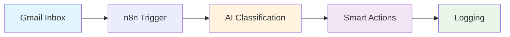

# Email Classification Exercise Overview

## What You'll Build

In this hands-on exercise, you'll create a **smart email classification system** that automatically processes incoming emails, understands their content using AI, and takes intelligent actions based on the message context. By the end of this 45-minute session, you'll have a working automation that can:

- Monitor your Gmail inbox in real-time
- Use AI to understand email priority, sentiment, and intent
- Automatically organise emails with smart labels
- Track all processing in a Google Sheets dashboard
- Handle errors gracefully with retry logic

## Why This Exercise Matters

### The Problem We're Solving

Every professional receives 50-150 emails daily. Manual sorting wastes 2+ hours per day. Important messages get buried, angry customers wait too long, and opportunities are missed.

### Real-World Applications

- **Customer Support**: Automatically categorise and prioritise support tickets
- **Sales Teams**: Never miss a hot lead or urgent client request
- **HR Departments**: Route employee queries to the right specialist
- **Personal Productivity**: Keep your inbox organised without lifting a finger

## Learning Outcomes

By completing this exercise, you will:

### Technical Skills

- Configure OAuth2 authentication with Gmail API
- Build multi-step automation workflows in n8n
- Integrate AI models for text classification
- Implement error handling and retry logic

### Business Skills

- Design intelligent routing systems
- Create actionable classification taxonomies
- Build performance monitoring dashboards
- Optimise workflows for scale

## System Architecture

### High-Level Overview

### Data Flow Explanation

1. **Email arrives** in Gmail inbox
2. **n8n detects** new message via polling
3. **AI analyses** content for classification
4. **Decision tree** routes based on classification
5. **Actions execute** (labels, sheets, notifications)
6. **Analytics captured** for reporting

### Node Breakdown

| Node Type | Purpose | Configuration |
|-----------|---------|---------------|
| **Gmail Trigger** | Monitor inbox for new emails | Poll interval: every minute, Event: Message Received |
| **Code (Prepare Email)** | Extract and clean email data | Extract sender, subject, body; remove signatures/quotes |
| **Basic LLM Chain** | AI-powered email classification | Structured output parser, classification prompt, OpenRouter model |
| **Edit Fields (Extract Results)** | Extract AI classification fields | Priority, confidence, reasoning, sender, subject, messageId |
| **Switch (Route by Priority)** | Route based on priority level | Rules: urgent → Output 1, high → Output 2, others → fallback |
| **Gmail (Add Labels)** | Apply priority labels to emails | Add URGENT-SUPPORT or HIGH-PRIORITY labels |
| **No Operation** | Skip labelling for standard emails | Pass-through for low/medium priority emails |
| **Edit Fields (Consolidate)** | Merge all data for logging | Combine email metadata with classification results |
| **Google Sheets** | Log all classifications | Append or update rows based on messageId |

### Why We Built It This Way

#### Design Decisions Explained

**Why n8n?**

- Visual workflow builder perfect for beginners
- Free tier sufficient for this exercise
- Connects to 400+ apps out of the box

**Why OpenRouter?**

- Access to multiple AI models with one API
- Free credits for getting started
- No complex setup required

**Why Gmail + Sheets?**

- Tools you already know and use
- Free with Google account
- Enterprise-grade reliability

## Success Metrics

### Common Pitfalls to Avoid

- **Authentication Confusion**: We'll walk through OAuth2 step-by-step with screenshots
- **AI Prompt Engineering**: Provided prompts are tested and optimised
- **Rate Limiting**: Built-in delays prevent API throttling
- **Error Handling**: Comprehensive error catching implemented

## Next Steps

Ready to begin? Proceed to [Part A: Environment Setup →](./part-a-setup)
