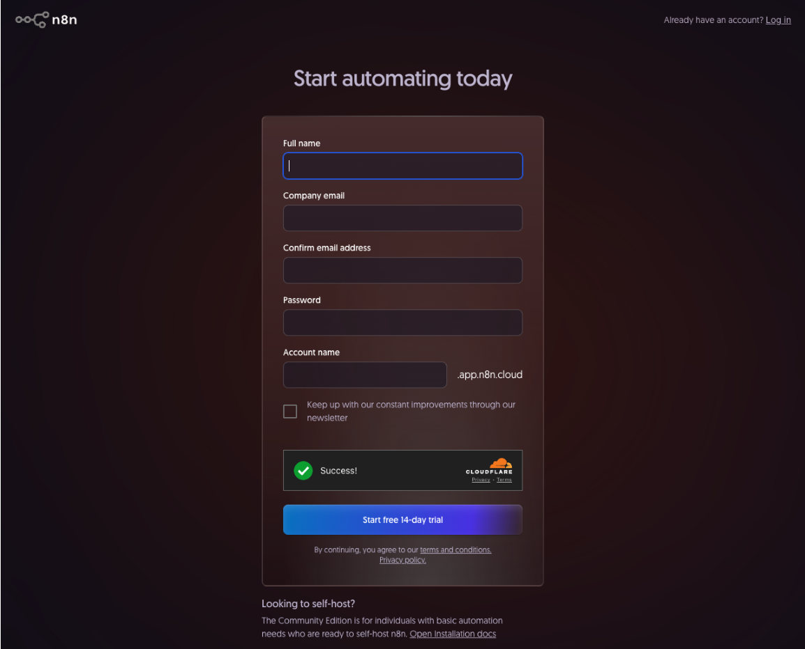
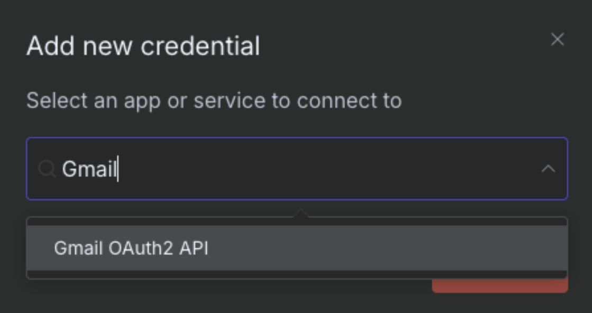
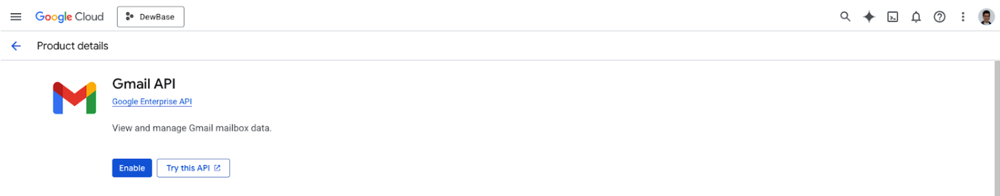
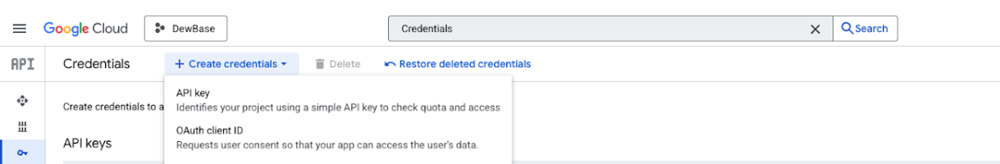
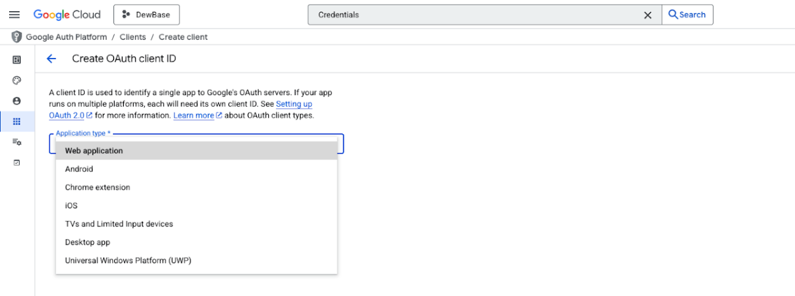
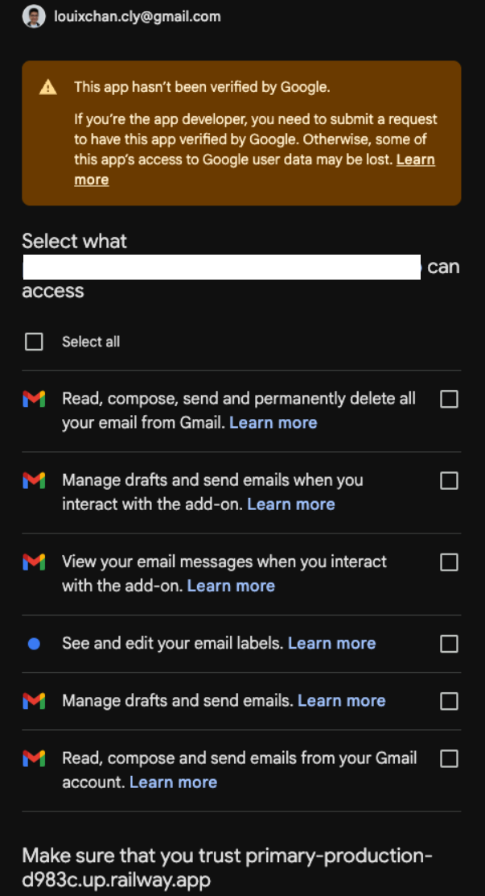
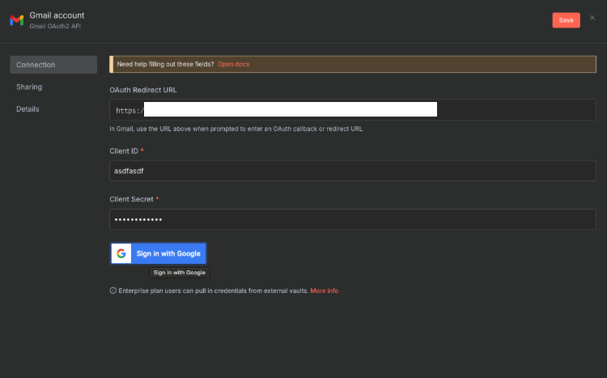
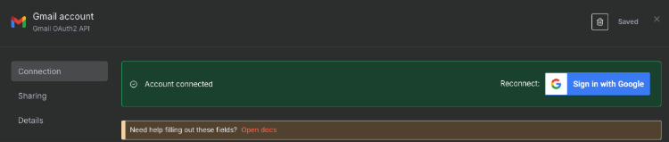

# Part A: Environment Setup

{: .no_toc }

## Table of contents

{: .no_toc .text-delta }

1. TOC
{:toc}

---

## Overview

In this section, we'll set up all the accounts and credentials needed for our email classification system. This takes about 15 minutes and only needs to be done once.

---

## Prerequisites

### Required Accounts (Free Tiers Available)

Before starting, ensure you have:

- **Gmail account** with API access enabled
- **n8n account** - [Sign up free](https://n8n.partnerlinks.io/gsl7xpbjua51)
- **OpenRouter account** - [Sign up free](https://openrouter.ai)

### Technical Requirements

- Modern web browser (Chrome, Firefox, Safari)
- Stable internet connection
- 15 minutes of focused time

{: .important }
> **Note**: All services used in this exercise offer free tiers sufficient for learning purposes.

---

## Step 1: n8n Account Setup

### Create Your n8n Workspace

1. Navigate to [n8n.io](https://n8n.partnerlinks.io/gsl7xpbjua51)
2. Click "Get started for free"

   

3. Create account with email verification

   

4. Choose workspace name (e.g., "ai-automation-course")
5. Select the "Starter" plan for this exercise

{: .highlight }
> **Checkpoint**: You should see the n8n workflow canvas

---

## Step 2: OpenRouter API Setup

### Get Your AI Access Token

1. Open new tab: [openrouter.ai](https://openrouter.ai)

   

2. Sign up using Google/GitHub authentication
3. Navigate to "API Keys" in dashboard
4. Click "Create New Key"
5. Name it "n8n-email-classifier"
6. Copy and save the API key securely

{: .warning }
> **Important**: This key is shown only once. Save it in a password manager.

---

## Step 3: Gmail API Configuration

### Enable Gmail Access for Automation

1. In n8n, click "Credentials" → "New"

   

2. Search and select "Gmail OAuth2 API"

   

3. You'll see the OAuth2 configuration screen
4. Copy the OAuth Redirect URL shown (you'll need this for Google Cloud Console)

{: .note }
> **Why these permissions?** We need to read emails, apply labels, and mark as read.

---

## Step 4: Configure Google Cloud Console

### Set Up OAuth Credentials

1. Go to [Google Cloud Console](https://console.cloud.google.com/)
2. Create a new project or select existing
3. Enable Gmail API:
   - Go to "APIs & Services" → "Library"
   - Search for "Gmail API"
   - Click "Enable"

   

4. Navigate to "APIs & Services" → "Credentials"

   

5. Click "Create Credentials" → "OAuth client ID"

   

6. If prompted, configure OAuth consent screen:
   - User type: External
   - App name: "n8n Email Automation"
   - Support email: Your email
   - Add scopes: Gmail API

   

7. Create OAuth client:
   - Application type: "Web application"
   - Name: "n8n Gmail Integration"
   - Authorized redirect URIs: Paste the URL from n8n (Step 3)

   

8. Copy the Client ID and Client Secret

   

9. Return to n8n and paste:
   - Client ID
   - Client Secret

   

10. Click "Sign in with Google" and authorize the app

   

{: .highlight }
> **Success!** You should see "Connection successful"

---

## Step 5: OpenRouter Credential Setup

### Add AI Model Access

1. In n8n, go to "Credentials" → "New"
2. Search for "OpenRouter"
3. Select "OpenRouter API"
4. Paste your API key from Step 2
5. Name it "OpenRouter - Free Tier"
6. Click "Save"
7. Test the connection

{: .highlight }
> **Checkpoint**: Both Gmail and OpenRouter show "Connected"

---

## Troubleshooting

### Common Issues and Solutions

#### Gmail Connection Fails

- **Issue**: "Access blocked" error
- **Solution**: Enable "Less secure app access" in Google Account settings
- **Alternative**: Use App Password if 2FA is enabled

#### OpenRouter API Key Invalid

- **Issue**: "Invalid API key" error
- **Solution**: Regenerate key in OpenRouter dashboard
- **Check**: No extra spaces when pasting

#### n8n Canvas Not Loading

- **Issue**: Blank screen after login
- **Solution**: Clear browser cache and cookies
- **Try**: Different browser or incognito mode

---

## Next Steps

Environment setup complete! You now have:

- ✅ n8n workspace created
- ✅ OpenRouter API configured
- ✅ Gmail OAuth connected
- ✅ All credentials tested

Continue to [Part B: Build & Test →](./part-b-workflow)
