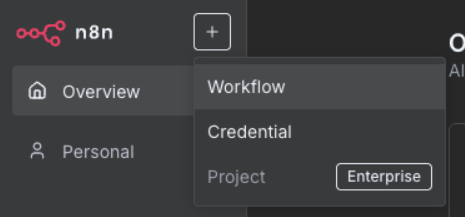
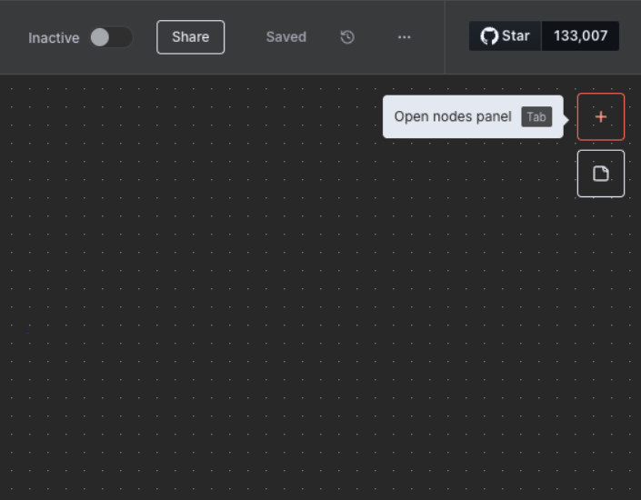
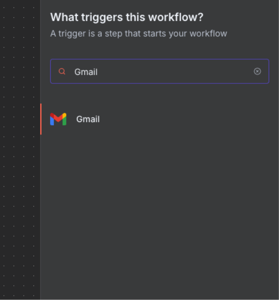
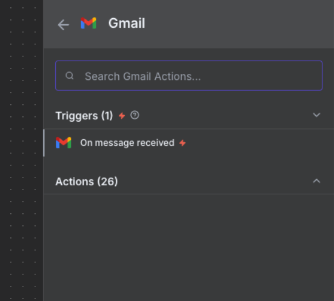
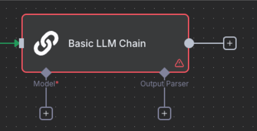
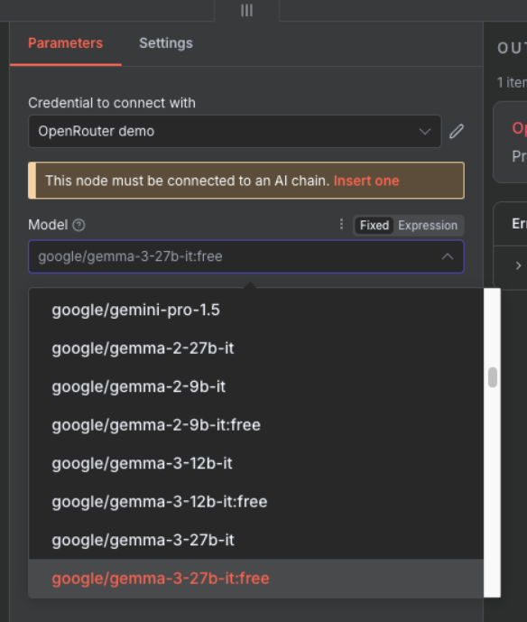
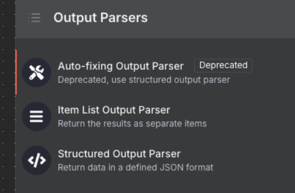
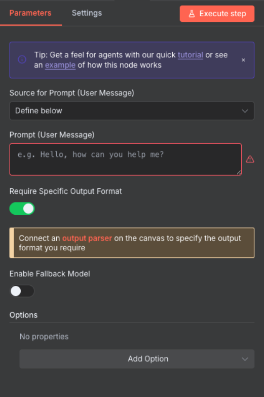
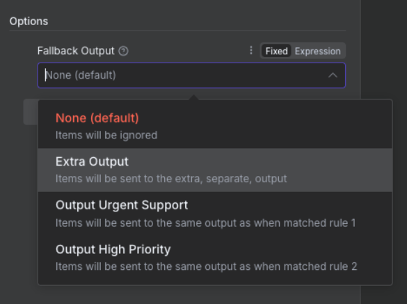

# Part B: Build & Test

{: .no_toc }

## Table of contents

{: .no_toc .text-delta }

1. TOC
{:toc}

---

## Overview

Now we'll build, test, and activate the automation workflow. This section takes about 25 minutes and covers creating nodes, configuring AI classification, testing, and going live.

---

## Step 5: Create a New Workflow

### Set Up Your Canvas

1. Click "Add workflow" in your workspace
2. Name it: "Email Classification & Routing"
3. Click "Create"

   

{: .note }
> **Canvas navigation**: Click and drag to move around, scroll to zoom, right-click for options

---

## Step 6: Gmail Trigger Setup

### Configure Email Detection

1. Click the plus button in the top right corner to open the nodes panel

   

2. Search for "Gmail" in the search box

   

3. Select "On message received" trigger

   

4. Configure trigger settings:
   - **Credential**: Select the credential we created earlier
   - **Poll Time**: Every Minute
   - **Event**: "Message Received"
   - **Simplify Output**: Toggle OFF

   

5. Test the trigger:
   - Click "Fetch Test Event"
   - Click "Listen for Event"
   - Send a test email to yourself
   - Wait for it to appear in n8n

{: .highlight }
> **Success**: You should see your test email data in the output panel

---

## Step 7: Email Data Preparation

### Extract and Clean Email Content

1. Add "Code" node after Gmail Trigger (click the + on the connection)
2. Name it: "Code" (or "Prepare Email for AI")
3. Configure:
   - **Mode**: "Run Once for Each Item"
   - **Language**: "Javascript"


4. Add this code:

```javascript
// Extract and clean email data
const emailData = {
  sender: $input.item.json.from.value[0].address,
  senderName: $input.item.json.from.value[0].name || 'Unknown',
  subject: $input.item.json.subject,
  body: $input.item.json.text || $input.item.json.snippet,
  receivedDate: $input.item.json.date,
  messageId: $input.item.json.id,
  threadId: $input.item.json.threadId
};

// Clean body text (remove signatures, quotes)
emailData.cleanBody = emailData.body
  .split(/\r?\n-- \r?\n/)[0]  // Remove signature
  .split(/On .+ wrote:/)[0]    // Remove quoted text
  .trim();

// Truncate for API limits (first 1000 chars)
emailData.truncatedBody = emailData.cleanBody.substring(0, 1000);

return {
  json: emailData
};
```

{: .note }
> **Why clean the data?** AI models work better with clean, focused text without signatures or quoted content.

---

## Step 8: AI Classification Node

### Configure the AI Model

1. Add "Basic LLM Chain" node (under AI nodes)
2. Configure initial settings:
   - **Source for Prompt**: "Define below"
   - **Require Specific Output Format**: Toggle ON

   

3. This node needs three components: Chat Model, Output Parser, and the Prompt (configured below)

### Add Chat Model

1. Click the "+" under Chat Model to see available language models

   

2. Select "OpenRouter Chat Model" from the list
3. Configure:
   - **Credential**: Choose the OpenRouter credential
   - **Model**: Select "google/gemma-3-27b-it:free"

   

### Add Output Parser

1. Click the "+" under Output Parser

   

2. Select "Structured Output Parser"
3. Add this JSON schema in the JSON Example field:

```json
{
  "priority": "",
  "sentiment": "",
  "department": "",
  "actionRequired": false,
  "confidence": 0.0,
  "reasoning": "Brief explanation"
}
```

### Configure the Prompt

Return to the Basic LLM Chain node and enter this prompt in the "Prompt" text field (copy and paste exactly):



```
Analyze this email and classify it. Return ONLY valid JSON.

Email from: {{ $json.senderName }} <{{ $json.sender }}>
Subject: {{ $json.subject }}
Body: {{ $json.truncatedBody }}

Classify as:
1. Priority: "urgent" | "high" | "medium" | "low"
2. Sentiment: "positive" | "neutral" | "negative" | "angry"
3. Department: "sales" | "support" | "technical" | "hr" | "finance" | "other"
4. Action Required: true | false
5. Confidence Score: 0.0-1.0
```



   

{: .important }
> **Critical**: Copy this prompt exactly as shown above, including the spaces inside `{{ }}`. These field references pull data from the "Prepare Email for AI" node. The prompt should appear in n8n's interface with the variable references highlighted in a different colour.

---

## Step 9: Routing with Switch Node

### Create Decision Tree

1. Add "Switch" node after Basic LLM Chain
2. Name it: "Route by Priority & Sentiment"
3. Configure:
   - **Mode**: "Rules"
   - **Fallback Output**: "Extra Output"

   

4. Add routing rules by clicking "+ Add Rule" for each output:

**Output 1 - Urgent:**

- Click "+ Add Rule"

- Left Value: `{{ $json.priority }}`

- Operator: equals
- Right Value: `urgent`
- Toggle "Rename Output" ON
- Output Name: "Urgent"

**Output 2 - High Priority:**

- Click "+ Add Rule"

- Left Value: `{{ $json.priority }}`

- Operator: equals
- Right Value: `high`
- Toggle "Rename Output" ON
- Output Name: "High Priority"

**Output 3 - Angry Customer:**

- Click "+ Add Rule"

- Left Value: `{{ $json.sentiment }}`

- Operator: equals
- Right Value: `angry`
- Toggle "Rename Output" ON
- Output Name: "Angry Customers"

---

## Step 10: Gmail Label Application

### Apply Smart Labels

**Prerequisites - Create Labels in Gmail:**

1. Open Gmail in your browser
2. Click the gear icon → "See all settings"
3. Go to "Labels" tab
4. Create these labels by clicking "Create new label" for each:
   - URGENT-SUPPORT
   - HIGH-PRIORITY
   - ANGRY-CUSTOMER
   - STANDARD-PROCESSING

**Configure Gmail Nodes in n8n:**

For each Switch output, add a Gmail node:

**For Urgent Output:**

1. Add "Gmail" node connected to the "Urgent" output
2. Configure:
   - Operation: "Label Add"

   - Message ID: `{{ $('Prepare Email for AI').item.json.messageId }}`

   - Labels: Select "URGENT-SUPPORT" from dropdown

**For High Priority Output:**

1. Add "Gmail" node connected to the "High Priority" output
2. Configure:
   - Operation: "Label Add"

   - Message ID: `{{ $('Prepare Email for AI').item.json.messageId }}`

   - Labels: Select "HIGH-PRIORITY" from dropdown

**For Angry Customers Output:**

1. Add "Gmail" node connected to the "Angry Customers" output
2. Configure:
   - Operation: "Label Add"

   - Message ID: `{{ $('Prepare Email for AI').item.json.messageId }}`

   - Labels: Select "ANGRY-CUSTOMER" from dropdown

**For Fallback (Extra) Output:**

1. Add "Gmail" node connected to the "extra" output
2. Configure:
   - Operation: "Label Add"

   - Message ID: `{{ $('Prepare Email for AI').item.json.messageId }}`

   - Labels: Select "STANDARD-PROCESSING" from dropdown

---

## Step 11: Prepare Data for Logging

### Consolidate Email Classification Data

Before sending to Google Sheets, we need to combine the email metadata with the AI classification results.

1. Add "Edit Fields" node (or "Set" node in newer versions)
2. Connect all Gmail label nodes to this single Edit Fields node
3. Configure:
   - **Mode**: "Manual Mapping"
   - **Keep Only Set**: Toggle OFF

4. Add these field assignments:


**Email Metadata Fields:**

- `messageId` → `={{ $('Code').item.json.messageId }}`
- `threadId` → `={{ $('Code').item.json.threadId }}`
- `receivedDate` → `={{ $('Code').item.json.receivedDate }}`
- `sender` → `={{ $('Code').item.json.sender }}`
- `senderName` → `={{ $('Code').item.json.senderName }}`
- `subject` → `={{ $('Code').item.json.subject }}`
- `processed_date` → `={{ DateTime.now().toISO() }}`

**AI Classification Fields:**

- `priority` → `={{ $('Basic LLM Chain').item.json.output.priority }}`
- `sentiment` → `={{ $('Basic LLM Chain').item.json.output.sentiment }}`
- `department` → `={{ $('Basic LLM Chain').item.json.output.department }}`
- `actionRequired` → `={{ $('Basic LLM Chain').item.json.output.actionRequired }}` (Set Type: Boolean)
- `confidence` → `={{ $('Basic LLM Chain').item.json.output.confidence }}` (Set Type: Number)
- `reasoning` → `={{ $('Basic LLM Chain').item.json.output.reasoning }}`


{: .note }
> **Why Edit Fields?** This node consolidates all data paths from the Switch node into a single stream for Google Sheets. This is crucial for API optimization - instead of making multiple Google Sheets API calls from different branches, we make just one call per email processed.

---

## Step 12: Logging to Google Sheets

### Create Analytics Dashboard

**First, prepare your Google Sheet:**

1. Go to [Google Sheets](https://sheets.google.com)
2. Create a new spreadsheet named "Email Classification Log"
3. In the first row, add these column headers:
   - messageId
   - threadId
   - receivedDate
   - sender
   - senderName
   - subject
   - processed_date
   - priority
   - sentiment
   - department
   - actionRequired
   - confidence
   - reasoning

**Then configure the Google Sheets node in n8n:**

1. Add "Google Sheets" node connected to the Edit Fields node
2. Name it: "Append row in sheet"
3. When prompted, connect your Google account (similar to Gmail OAuth)
4. Configure the node:
   - **Operation**: "Append"
   - **Document**: Select "Email Classification Log" from dropdown
   - **Sheet**: "Sheet1"
   - **Mapping Mode**: "Auto-Map Input Data"
   - **Options**:
     - Toggle "Use Append" ON
     - Toggle "Data Property Name" OFF

{: .note }
> **Auto-Mapping**: Since we prepared all fields in the Edit Fields node with matching column names, Google Sheets will automatically map them to the correct columns.

{: .important }
> **API Rate Limits**: Google Sheets has quota limits (300 requests per minute for free accounts). By consolidating all paths through Edit Fields into a single Google Sheets node, we ensure only one API call per email, preventing rate limit errors even during high email volumes.

---

## Step 13: Test Your Workflow

### Complete Workflow Overview

Your complete workflow should look like this:


### Run Test

1. Click "Test Workflow" button in n8n

2. Send test emails covering all scenarios:
   - **Urgent support request**: Subject: "URGENT: Server is down!" Body: "Our production server has been down for 2 hours. Need immediate assistance!"
   - **Sales inquiry**: Subject: "Interested in enterprise pricing" Body: "We're looking to purchase licenses for 500 users. Can you send pricing?"
   - **Technical bug report**: Subject: "Bug found in login process" Body: "Users cannot log in with special characters in passwords."
   - **HR policy question**: Subject: "Question about vacation policy" Body: "How many vacation days do new employees get?"
   - **Angry customer complaint**: Subject: "Terrible service!" Body: "I've been waiting 3 days for a response. This is unacceptable!"

3. Monitor the execution:
   - Watch the workflow execute in real-time
   - Click on each node to see the output data
   - Verify the classification results match expectations

### Verify Results

Check that:

- All nodes show green checkmarks (successful execution)
- Gmail labels were applied correctly in your inbox
- Classifications match the email content:
  - Urgent emails → "urgent" priority
  - Complaints → "angry" sentiment
  - Questions → appropriate department routing
- Data appears in Google Sheets with all fields populated
- Confidence scores are reasonable (0.7-1.0 for clear cases)

---

## Step 14: Activate Your Workflow

### Go Live

Once testing is complete:

1. Toggle the "Active" switch in the top-right corner of the workflow canvas

2. Configure workflow settings (click workflow name → Settings):
   - **Execution timeout**: 5 minutes
   - **Retry on failure**: Yes (2 attempts)
   - **Retry wait time**: 5 seconds
   - **Save execution data**: Last 100 runs
   - **Error Workflow**: Optional (for error notifications)

3. Save the workflow (Ctrl/Cmd + S)

Your workflow is now live and will automatically:

- Check Gmail every minute for new emails
- Classify each email using AI
- Apply appropriate labels
- Log all classifications to Google Sheets
- Handle errors gracefully with retries

---

## Next Steps

Workflow complete! You've successfully:

- ✅ Built an email classification system
- ✅ Integrated AI for intelligent routing
- ✅ Tested with real emails
- ✅ Activated automatic processing

---

## Download Complete Workflow

### Import Pre-Built Template

Save time by importing our complete workflow:

1. Download the workflow JSON file:
   - [📥 Download Email Classification Workflow](./downloads/email-classification-workflow.json)

2. Import into n8n:
   - Open n8n
   - Click "Workflows" → "Import"
   - Select the downloaded JSON file
   - Click "Import"

3. Update credentials:
   - Gmail OAuth2 connection
   - OpenRouter API key
   - Google Sheets OAuth2 connection

4. Update label IDs:
   - Check your Gmail label IDs
   - Update in each Gmail node

{: .warning }
> **Important**: The imported workflow uses placeholder credentials. You must update them with your own before testing.

Ready for more? Try the [Challenge Tasks →](./challenge-tasks)
