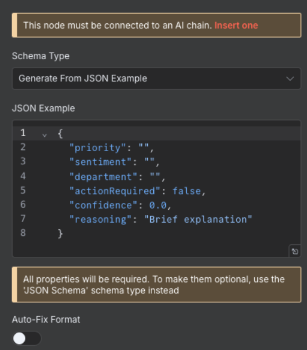

# Part B: Build & Test

{: .no_toc }

## Table of contents

{: .no_toc .text-delta }

1. TOC
{:toc}

---

## Overview

Now we'll build, test, and activate the automation workflow. This section takes about 25 minutes and covers creating nodes, configuring AI classification, testing, and going live.

---

## Step 5: Create a New Workflow

### Set Up Your Canvas

1. Click "Add workflow" in your workspace
2. Name it: "Email Classification & Routing"
3. Click "Create"

   

{: .note }
> **Canvas navigation**: Click and drag to move around, scroll to zoom, right-click for options

---

## Step 6: Gmail Trigger Setup

### Configure Email Detection

1. Click the plus button in the top right corner to open the nodes panel

   

2. Search for "Gmail" in the search box

   

3. Select "On message received" trigger

   

4. Configure trigger settings:
   - **Credential**: Select the credential we created earlier
   - **Poll Time**: Every Minute
   - **Event**: "Message Received"
   - **Simplify Output**: Toggle OFF

   

5. Test the trigger:
   - Click "Fetch Test Event"
   - Click "Listen for Event"
   - Send a test email to yourself
   - Wait for it to appear in n8n

{: .highlight }
> **Success**: You should see your test email data in the output panel

---

## Step 7: Email Data Preparation

### Extract and Clean Email Content

1. Add "Code" node after Gmail Trigger (click the + on the connection)
2. Name it: "Prepare Email for AI"
3. Configure:
   - **Mode**: "Run Once for Each Item"
   - **Language**: "Javascript"


4. Add this code:

```javascript
// Extract and clean email data
const emailData = {
  sender: $input.item.json.from.value[0].address,
  senderName: $input.item.json.from.value[0].name || 'Unknown',
  subject: $input.item.json.subject,
  body: $input.item.json.text || $input.item.json.snippet,
  receivedDate: $input.item.json.date,
  messageId: $input.item.json.id,
  threadId: $input.item.json.threadId
};

// Clean body text (remove signatures, quotes)
emailData.cleanBody = emailData.body
  .split(/\r?\n-- \r?\n/)[0]  // Remove signature
  .split(/On .+ wrote:/)[0]    // Remove quoted text
  .trim();

// Truncate for API limits (first 1000 chars)
emailData.truncatedBody = emailData.cleanBody.substring(0, 1000);

return {
  json: emailData
};
```

{: .note }
> **Why clean the data?** AI models work better with clean, focused text without signatures or quoted content.

---

## Step 8: AI Classification Node

### Configure the AI Model

1. Add "Basic LLM Chain" node (under AI nodes)
2. Configure initial settings:
   - **Source for Prompt**: "Define below"
   - **Require Specific Output Format**: Toggle ON

   

3. This node needs three components: Chat Model, Output Parser, and the Prompt (configured below)

### Add Chat Model

1. Click the "+" under Chat Model to see available language models

   

2. Select "OpenRouter Chat Model" from the list
3. Configure:
   - **Credential**: Choose the OpenRouter credential
   - **Model**: Select "google/gemma-2-9b-it:free"

   

### Add Output Parser

1. Click the "+" under Output Parser

   

2. Select "Structured Output Parser"
3. Add this JSON schema in the JSON Example field:

```json
{
  "priority": "",
  "sentiment": "",
  "department": "",
  "actionRequired": false,
  "confidence": 0.0,
  "reasoning": "Brief explanation"
}
```

### Configure the Prompt

Return to the Basic LLM Chain node and add this prompt:

   

```
Analyze this email and classify it. Return ONLY valid JSON.

Email from: {{$json.senderName}} <{{$json.sender}}>
Subject: {{$json.subject}}
Body: {{$json.truncatedBody}}

Classify as:

1. Priority: "urgent" | "high" | "medium" | "low"
2. Sentiment: "positive" | "neutral" | "negative" | "angry"
3. Department: "sales" | "support" | "technical" | "hr" | "finance" | "other"
4. Action Required: true | false
5. Confidence Score: 0.0-1.0
```

---

## Step 9: Parse AI Response

### Structure the Classification Data

1. Add "Edit Fields" node after Basic LLM Chain
2. Name it: "Parse Classification"

3. Configure:
   - **Operation**: "Set Fields"
   - **Mode**: "Manual Mapping"

4. Add these field mappings by clicking "Add Field" for each:

**From AI Classification:**
Configure these fields from the LLM output:

- Field: `priority` → Value: `={{ $json.priority }}`
- Field: `sentiment` → Value: `={{ $json.sentiment }}`
- Field: `department` → Value: `={{ $json.department }}`
- Field: `actionRequired` → Value: `={{ $json.actionRequired }}` (Set Type: Boolean)
- Field: `confidence` → Value: `={{ $json.confidence }}` (Set Type: Number)
- Field: `reasoning` → Value: `={{ $json.reasoning }}`

**From Email Data:**
Add these fields from the original email (reference the "Prepare Email for AI" node):

- Field: `emailId` → Value: `={{ $('Prepare Email for AI').item.json.messageId }}`
- Field: `subject` → Value: `={{ $('Prepare Email for AI').item.json.subject }}`
- Field: `sender` → Value: `={{ $('Prepare Email for AI').item.json.sender }}`
- Field: `senderName` → Value: `={{ $('Prepare Email for AI').item.json.senderName }}`

{: .important }
> This Edit Fields node is crucial - it combines the AI's classification with the original email data so the Switch node can route appropriately.

---

## Step 10: Routing with Switch Node

### Create Decision Tree

1. Add "Switch" node after Parse Classification
2. Name it: "Route by Priority & Sentiment"
3. Configure:
   - **Mode**: "Rules"
   - **Fallback Output**: "Extra Output"

   

4. Add routing rules:

**Output 1 - Urgent:**

- Condition: `{{ $json.priority }}` equals "urgent"
- Rename Output: "Urgent"

**Output 2 - High Priority:**

- Condition: `{{ $json.priority }}` equals "high"
- Rename Output: "High Priority"

**Output 3 - Angry Customer:**

- Condition: `{{ $json.sentiment }}` equals "angry"
- Rename Output: "Angry Customers"

**Output 4 - Low Priority:**

- Condition: `{{ $json.priority }}` equals "low"
- Rename Output: "Low Priority"

---

## Step 11: Gmail Label Application

### Apply Smart Labels

First, create labels in Gmail:

1. Open Gmail in browser
2. Settings → Labels → Create new labels:
   - URGENT-SUPPORT
   - HIGH-PRIORITY
   - ANGRY-CUSTOMER
   - LOW-PRIORITY
   - STANDARD-PROCESSING


Then for each Switch output, add a Gmail node:

**For Urgent Output:**

- Operation: "Label Add"
- Message ID: `{{ $json.emailId }}`
- Labels: Select "URGENT-SUPPORT"

Repeat for other priority levels with appropriate labels.

---

## Step 12: Logging to Google Sheets

### Create Analytics Dashboard

1. Add "Google Sheets" node at the end
2. Connect Google account when prompted
3. Configure:


   - **Operation**: "Append"
   - **Document**: Create "Email Classification Log"
   - **Sheet**: "Sheet1"

4. Map data fields:

```json
{
  "Timestamp": "={{new Date().toISOString()}}",
  "Sender": "={{$json.sender}}",
  "Subject": "={{$json.subject}}",
  "Priority": "={{$json.priority}}",
  "Sentiment": "={{$json.sentiment}}",
  "Department": "={{$json.department}}",
  "Action Required": "={{$json.actionRequired}}",
  "Confidence": "={{$json.confidence}}",
  "Reasoning": "={{$json.reasoning}}"
}
```

---

## Step 13: Test Your Workflow

### Complete Workflow Overview

Your complete workflow should look like this:


### Run Test

1. Click "Test Workflow" button in n8n

   

2. Send test emails covering different scenarios:
   - **Urgent request**: "URGENT: Server is down!"
   - **Sales inquiry**: "Interested in enterprise pricing"
   - **Support ticket**: "Bug found in login process"
   - **Low priority**: "Question about vacation policy"

3. Monitor the execution:

   

### Verify Results

Check that:

- All nodes show green checkmarks
- Gmail labels were applied correctly
- Data appears in Google Sheets (if configured)

   

---

## Step 14: Activate Your Workflow

### Go Live

Once testing is complete:

1. Toggle the "Active" switch in the top-right corner

   

2. Configure settings:
   - **Execution timeout**: 5 minutes
   - **Retry on failure**: Yes (2 attempts)
   - **Save execution data**: Last 100 runs

Your workflow is now live and will automatically process incoming emails!

---

## Next Steps

Workflow complete! You've successfully:

- ✅ Built an email classification system
- ✅ Integrated AI for intelligent routing
- ✅ Tested with real emails
- ✅ Activated automatic processing

Ready for more? Try the [Challenge Tasks →](./challenge-tasks)
