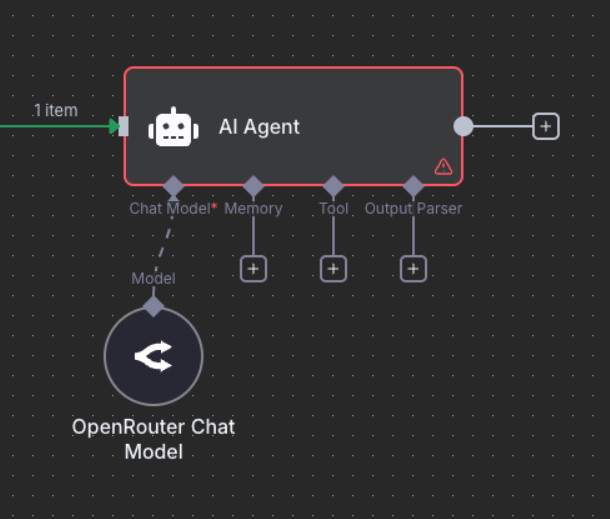
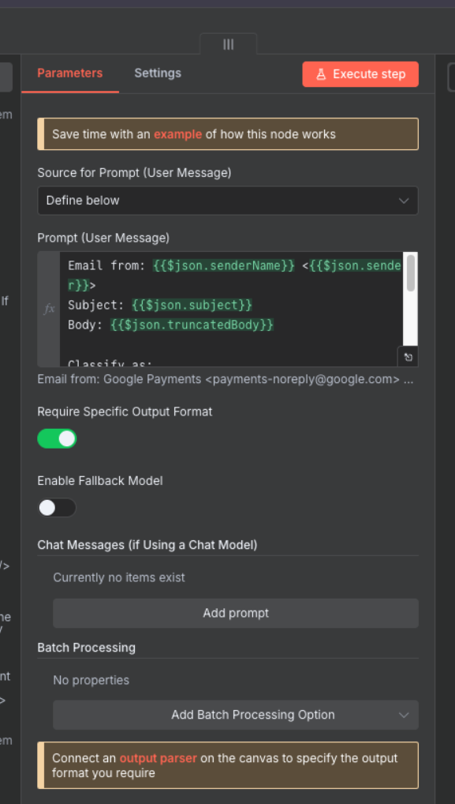
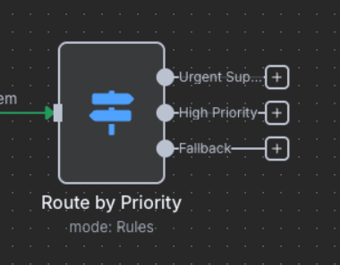

# Part C: Testing & Deployment

{: .no_toc }

## Table of contents

{: .no_toc .text-delta }

1. TOC
{:toc}

---

## Overview

Time to test our workflow and deploy it to production. This section takes about 10 minutes and ensures everything works correctly before going live.

---

## Step 13: Comprehensive Testing

### Test Your Workflow

1. Click "Test Workflow" button in n8n

   

2. Send test emails covering all scenarios:
   - **Urgent support request**: "URGENT: Server is down!"
   - **Sales inquiry**: "Interested in enterprise pricing"
   - **Technical bug report**: "Bug found in login process"
   - **HR policy question**: "Question about vacation policy"
   - **Angry customer complaint**: "This is UNACCEPTABLE service!"

3. Monitor the execution flow:

   

### Verify Results

Check each component:

1. **Execution Panel**
   - All nodes should show green checkmarks
   - Click each node to see input/output data

   

2. **Gmail Labels**
   - Open Gmail and verify labels were applied
   - Check that emails match their classifications

   

3. **Google Sheets Log**
   - Open your spreadsheet
   - Verify all fields are populated correctly

   

---

## Step 14: Production Deployment

### Activate Your Workflow

1. Toggle the "Active" switch in top-right corner

   

2. Configure production settings:
   - **Execution timeout**: 5 minutes
   - **Retry on failure**: Yes (2 attempts)
   - **Save execution data**: Last 100 runs

### Monitor Performance

1. Check the monitoring dashboard:

   

2. Review execution history regularly:

   

---

## Step 15: Error Handling

### Add Resilience to Your Workflow

1. Create an error workflow:
   - Go to Settings → Error Workflow
   - Create new workflow: "Error Handler"

2. Add error notifications:

   ```javascript
   // Error notification node
   const error = $input.item.json;
   const message = `
   Workflow Failed: ${error.workflow.name}
   Error: ${error.execution.error.message}
   Time: ${new Date().toISOString()}
   `;
   // Send to Slack/Email/Discord
   ```

3. Configure retry logic:
   - On each node → Settings → Retry on Fail
   - Wait between retries: 5 seconds
   - Max attempts: 3

---

## Performance Optimization

### Tips for Scale

#### Batch Processing

Instead of processing emails one-by-one:

```javascript
// Process multiple emails in single API call
const emails = $input.all().map(item => item.json);
const batchSize = 10;
const batches = [];
for (let i = 0; i < emails.length; i += batchSize) {
  batches.push(emails.slice(i, i + batchSize));
}
```

#### Rate Limiting

Prevent API throttling:

- Add "Wait" node between API calls
- Set delay: 1 second minimum
- Use exponential backoff for retries

#### Caching Results

Store frequently used data:

- Cache sender domains → department mappings
- Store common classification patterns
- Reuse AI responses for similar emails

---

## Troubleshooting Guide

### Common Issues and Solutions

#### Workflow Not Triggering

- **Check**: Is workflow active?
- **Verify**: Gmail credentials still valid
- **Test**: Manual trigger with test data

#### AI Classification Errors

- **Issue**: Inconsistent classifications
- **Solution**: Refine prompt with examples
- **Alternative**: Try different AI model

#### Labels Not Applying

- **Check**: Label exists in Gmail
- **Verify**: Correct Message ID format
- **Permission**: Gmail API has label access

#### Sheets Not Updating

- **Check**: Google Sheets connection
- **Verify**: Column headers match
- **Permission**: Write access to sheet

---

## Success Metrics

### What Good Looks Like

After 24 hours of operation, you should see:

- **Processing rate**: 95%+ emails classified
- **Accuracy**: 85%+ correct classifications
- **Speed**: <30 seconds per email
- **Uptime**: 99%+ availability

### Performance Dashboard

Create a Google Sheets dashboard showing:

- Total emails processed
- Classification distribution
- Average confidence scores
- Error rate trends
- Processing time metrics

---

## Production Checklist

Before going live, ensure:

- [ ] All test scenarios pass
- [ ] Error handling configured
- [ ] Monitoring alerts set up
- [ ] Documentation updated
- [ ] Team trained on system
- [ ] Backup workflow created
- [ ] Rate limits configured
- [ ] Security review complete

---

## Next Steps

Deployment complete! Your system is now:

- ✅ Fully tested
- ✅ Running in production
- ✅ Monitoring enabled
- ✅ Error handling active
- ✅ Performance optimized

Continue to [Challenge Tasks →](./challenge-tasks)
