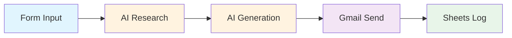

# Exercise 2: AI-Powered Cold Email System

{: .fs-9 }

Build an intelligent cold email system that researches prospects and generates personalised outreach at scale. By completing this exercise, you'll demonstrate your ability to use AI agents for autonomous research and content generation—applicable to sales outreach, recruiting, partnership building, and any scenario requiring personalised, research-backed communication.
{: .fs-6 .fw-300 }

---

## 60-Minute Hands-On Exercise

This exercise teaches you to build an AI-powered outreach system that combines autonomous research, personalisation, and automation. Perfect for building skills in AI agent orchestration and structured content generation.

### What You'll Build

A complete AI research and personalisation workflow featuring:

- **Web form interface** for lead capture and campaign initiation
- **AI research agent** using Perplexity for autonomous prospect intelligence gathering
- **Structured email generator** with AI-created hooks, body, and CTAs
- **Automated sending** via Gmail with comprehensive tracking
- **Analytics dashboard** in Google Sheets

### Skills You'll Demonstrate

By completing this exercise, you will have demonstrated:

- **AI Agent Configuration**: Setting up autonomous agents that use tools independently
- **Tool Integration**: Connecting Perplexity for real-time web research
- **Structured Output Design**: Using JSON schemas to enforce consistent AI responses
- **Multi-Step Workflows**: Chaining AI operations where one agent's output feeds another
- **Prompt Engineering**: Crafting prompts that produce reliable, high-quality results

### The Pattern You'll Master

The **AI Research & Personalisation** pattern you'll learn applies to:

- **Job Applications**: Research company → Generate tailored cover letter
- **Sales Proposals**: Research client needs → Create customised proposal
- **Partnership Outreach**: Research organisation → Craft collaboration pitch
- **Event Follow-up**: Research attendees → Generate personalised follow-ups
- **Content Creation**: Research topic → Generate informed article drafts
- **Customer Onboarding**: Research customer → Create personalised welcome materials

### Exercise Structure

  

    

      <h4>📚 Overview</h4>
      
Understanding AI agents and research automation

      <a href="./overview">Start here →</a>
    

  

  

    

      <h4>⚙️ Part A: Setup</h4>
      
API keys & environment (20 min)

      <a href="./part-a-setup">Configure →</a>
    

  

  

    

      <h4>🔧 Part B: Build & Test</h4>
      
Create, test, and activate (35 min)

      <a href="./part-b-workflow">Build →</a>
    

  

  

    

      <h4>🏆 Challenges</h4>
      
Advanced personalization (optional)

      <a href="./challenge-tasks">Level up →</a>
    

  

---

## Quick Navigation

| Section | Description | Duration |
|---------|-------------|----------|
| [Overview](./overview) | Why AI agents matter, learning outcomes, architecture | 5 min |
| [Part A: Setup](./part-a-setup) | Perplexity API, Gmail, Google Sheets setup | 20 min |
| [Part B: Build & Test](./part-b-workflow) | Agent configuration, prompt engineering, testing | 35 min |
| [Challenges](./challenge-tasks) | Multi-channel outreach, A/B testing, follow-ups | Optional |

---

