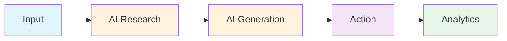
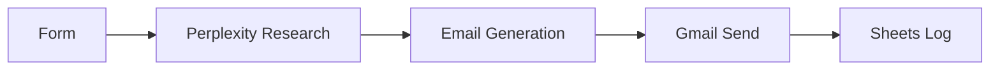

# Exercise 2: AI-Powered Cold Email System

{: .fs-9 }

Build an intelligent cold email system that researches prospects and generates personalized outreach at scale.
{: .fs-6 .fw-300 }

[Start Exercise](./overview){: .btn .btn-primary .fs-5 .mb-4 .mb-md-0 .mr-2 }
[Download Workflow](./downloads/cold-email-automation.json){: .btn .fs-5 .mb-4 .mb-md-0 }

---

## 60-Minute Hands-On Exercise

This exercise teaches you to build an AI-powered cold outreach system that combines research, personalization, and automation. Perfect for sales teams, recruiters, and networkers.

### What You'll Build

- **Web form** for lead capture and campaign initiation
- **AI research agent** using Perplexity for prospect intelligence
- **Personalized email generator** with structured components
- **Automated sending** via Gmail with full tracking
- **Analytics dashboard** in Google Sheets

### The Universal Pattern

You're learning the **AI Research & Personalization** pattern:

**Today's Implementation:**

**Tomorrow's Applications:**

```mermaid
graph TD
    subgraph "LinkedIn Outreach"
        LP[LinkedIn Profile] --> CR1[Company Research]
        CR1 --> CNR[Connection Request]
        CNR --> CRM[CRM Update]
    end

    subgraph "Job Applications"
        JP[Job Posting] --> CCR[Company Culture Research]
        CCR --> CL[Cover Letter]
        CL --> AS[Application Submit]
    end

    subgraph "Sales Pipeline"
        CD[Customer Data] --> MR[Market Research]
        MR --> PG[Proposal Generation]
        PG --> SN[Slack Notification]
    end

    subgraph "Event Follow-up"
        ER[Event Registration] --> AR[Attendee Research]
        AR --> PF[Personalised Follow-up]
        PF --> DE[Database Entry]
    end
```

### Exercise Structure

  

    

      <h4>📚 Overview</h4>
      
Understanding AI agents and research automation

      <a href="./overview">Start here →</a>
    

  

  

    

      <h4>⚙️ Part A: Setup</h4>
      
API keys & environment (20 min)

      <a href="./part-a-setup">Configure →</a>
    

  

  

    

      <h4>🔧 Part B: Build & Test</h4>
      
Create, test, and activate (35 min)

      <a href="./part-b-workflow">Build →</a>
    

  

  

    

      <h4>🏆 Challenges</h4>
      
Advanced personalization (optional)

      <a href="./challenge-tasks">Level up →</a>
    

  

---

## Quick Navigation

| Section | Description | Duration |
|---------|-------------|----------|
| [Overview](./overview) | Why AI agents matter, learning outcomes, architecture | 5 min |
| [Part A: Setup](./part-a-setup) | Perplexity API, Gmail, Google Sheets setup | 20 min |
| [Part B: Build & Test](./part-b-workflow) | Agent configuration, prompt engineering, testing | 35 min |
| [Challenges](./challenge-tasks) | Multi-channel outreach, A/B testing, follow-ups | Optional |

---

