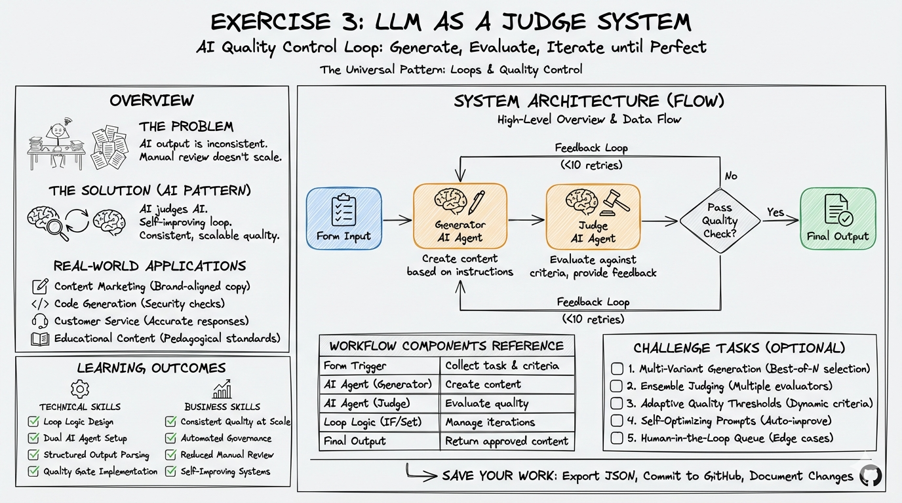
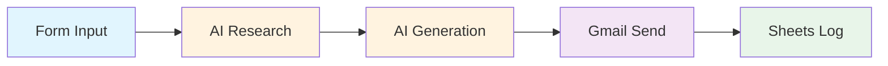

# Exercise 2: AI-Powered Cold Email System

{: .fs-9 }

Build an intelligent cold email system that researches prospects and generates personalised outreach at scale.
{: .fs-6 .fw-300 }

---

## 60-Minute Hands-On Exercise

This exercise teaches you **AI agents with tools** - giving AI the ability to research and act autonomously, then **chaining operations** for isolation of concern. This makes automations maintainable and extensible.

**The Problem:** Cold outreach has a poor success rate—77% of cold emails never get opened. Generic templates feel impersonal and get ignored, but manual research for personalisation doesn't scale. You need an AI system that can research prospects autonomously and generate genuinely personalised messages based on real data.

**Why AI Agents + Tools Matter:**

You'll learn to give AI superpowers by letting it use tools (like web search), then chain multiple AI operations together:

- ✅ **Autonomous research**: AI finds information you need without you doing anything
- ✅ **Isolation of concern**: Each AI does one job well (research vs writing)
- ✅ **Maintainable**: Change the research step without touching the writing step
- ✅ **Extensible**: Add new tools or steps without rebuilding everything
- ✅ **Scalable**: Turn 2 hours of manual work into 30 seconds of automation

This pattern applies to any task requiring research + action.

---

## Understanding AI Tools: Your AI's Superpowers

### What Are Tools?

{: .important }
> Think of AI Tools like apps on your phone. Your phone is smart, but **apps** let it do specific things: check weather, play music, send messages.
>
> Similarly, AI models are smart, but **tools** let them:
>
> - **Search the web** for current information
> - **Run calculations** with precise accuracy
> - **Access databases** to retrieve specific data
> - **Call APIs** to check stock prices, weather, or CRM records
> - **Execute code** to process data or generate reports

### The Three Generations of AI Capabilities

1. **First Generation** (2022): AI that only knows what it was trained on
   - Can write, reason, and chat
   - Cannot access current information
   - Cannot take actions in the real world

2. **Second Generation** (2023-2024): **AI with Function Calling** ← You'll learn this today!
   - AI can **decide** to use tools when needed
   - Connects to external services autonomously
   - Takes actions based on real-time information

3. **Third Generation** (2024-2025): **AI with MCP (Model Context Protocol)**
   - Connect hundreds of tools at once
   - AI orchestrates complex multi-tool workflows
   - Enterprise-grade integrations (coming soon!)

### Why This Matters for Your Future

The pattern you learn in this exercise - **giving AI tools and letting it decide how to use them** - is the foundation of:

- **AI Assistants** (like ChatGPT with plugins)
- **Autonomous Agents** (like Auto-GPT)
- **Agentic Workflows** (the future of automation)

You're not just building an email tool. You're learning how to **give AI superpowers**.

---

### What You'll Build

A complete AI research and personalisation workflow featuring:

- **Web form interface** for lead capture and campaign initiation
- **AI research agent** using Perplexity for autonomous prospect intelligence gathering
- **Structured email generator** with AI-created hooks, body, and CTAs
- **Automated sending** via Gmail with comprehensive tracking
- **Analytics dashboard** in Google Sheets

### Skills You'll Demonstrate

By completing this exercise, you will have demonstrated:

- **AI Agent Configuration**: Setting up autonomous agents that use tools independently
- **Tool Integration**: Connecting Perplexity for real-time web research
- **Structured Output Design**: Using JSON schemas to enforce consistent AI responses
- **Multi-Step Workflows**: Chaining AI operations where one agent's output feeds another
- **Prompt Engineering**: Crafting prompts that produce reliable, high-quality results

### The Pattern You'll Master

The **AI Research & Personalisation** pattern you'll learn applies to:

- **Job Applications**: Research company → Generate tailored cover letter
- **Sales Proposals**: Research client needs → Create customised proposal
- **Partnership Outreach**: Research organisation → Craft collaboration pitch
- **Event Follow-up**: Research attendees → Generate personalised follow-ups
- **Content Creation**: Research topic → Generate informed article drafts
- **Customer Onboarding**: Research customer → Create personalised welcome materials

### Exercise Structure

  

    

      <h4>⚙️ Part A: Setup</h4>
      
Perplexity, Gmail, Gemini + tracking

      <a href="./part-a-setup">Start here →</a>
    

  

  

    

      <h4>🔧 Part B: Build & Test</h4>
      
Form, research agent, writer, send, log

      <a href="./part-b-workflow">Build →</a>
    

  

  

    

      <h4>🏆 Challenges</h4>
      
Multi-channel, A/B testing, follow-ups

      <a href="./challenge-tasks">Level up →</a>
    

  

---

## Quick Navigation

| Section | What You'll Do | Duration |
|---------|----------------|----------|
| [Part A: Setup](./part-a-setup) | Configure AI tools, connect services, create tracking sheet | 20 min |
| [Part B: Build & Test](./part-b-workflow) | Build autonomous research and personalisation workflow | 35 min |
| [Challenges](./challenge-tasks) | Extend with advanced outreach and optimisation patterns | Optional |

---

