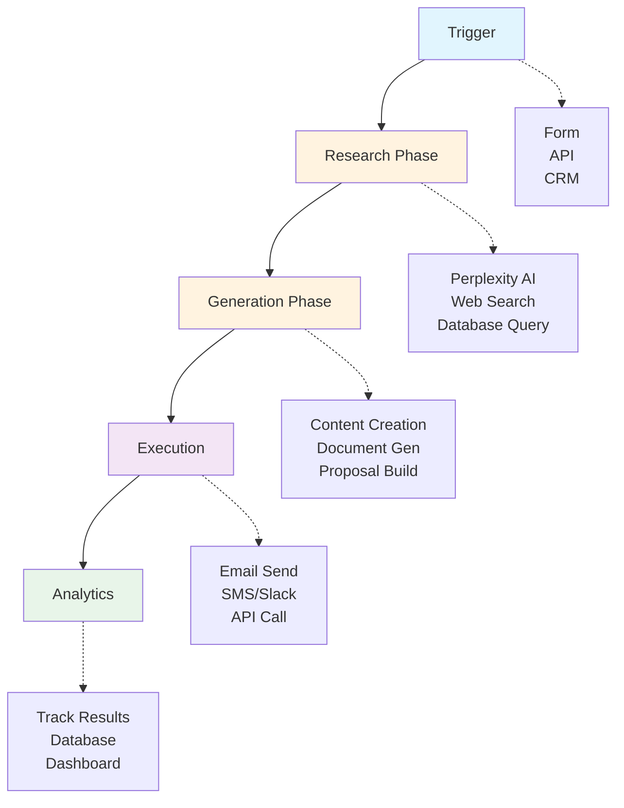
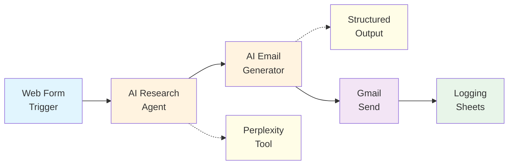

# Overview: AI-Powered Cold Email Automation

{: .no_toc }

## Table of contents

{: .no_toc .text-delta }

1. TOC
{:toc}

---

## Why This Matters

Cold outreach is broken. Generic templates get ignored. Manual personalization doesn't scale. This exercise teaches you to build a system that achieves both: **personalization at scale** using AI agents.

### The Problem

- **77%** of cold emails never get opened
- Manual research takes **15-20 minutes** per prospect
- Generic templates feel impersonal and get marked as spam
- Personalization at scale seems impossible

### The Solution

An AI-powered system that:

- Researches prospects automatically using Perplexity
- Generates genuinely personalised emails based on real data
- Maintains your authentic voice whilst scaling outreach
- Tracks everything for continuous improvement

---

## The Universal Pattern

You're learning the **AI Research & Personalization** archetype:

{: .important }
> **Not Just Email**: This pattern works for any scenario requiring research-based personalization: job applications, sales proposals, customer onboarding, content creation, or partnership outreach.

---

## What You'll Learn

By completing this exercise, you'll master:

### Technical Skills

- **AI Agents**: Configure autonomous agents that can use tools
- **Perplexity Integration**: Real-time web research via API
- **Structured Output**: Force AI to return consistent, usable data
- **Multi-step Workflows**: Chain AI operations for complex tasks
- **Form Triggers**: Create web forms for workflow initiation

### Business Applications

- Scale personalised outreach from 10 to 1000+ contacts
- Reduce research time from 20 minutes to 20 seconds
- Increase email open rates through genuine personalisation
- Build reusable templates for different outreach scenarios

---

## Workflow Architecture

### Visual Flow

### Node Breakdown

| Node Type | Purpose | Configuration |
|-----------|---------|---------------|
| **Form Trigger** | Collect lead information via web form | Fields: Name, Company, Email, Key Points/Context |
| **AI Agent (Research)** | Autonomous research using Perplexity | Tools: Perplexity API, Model: Gemini, research prompt |
| **AI Agent (Email Generator)** | Generate personalized email content | Structured output parser (subject, hook, body, cta), Model: Gemini |
| **Gmail (Send)** | Send personalized cold emails | Compose email from AI output, send to prospect |
| **Set/Edit Fields (Metadata)** | Enrich data for logging | Combine prospect info, research summary, email content |
| **Google Sheets (Log)** | Track all outreach activity | Append all data to tracking spreadsheet |

---

## Real-World Applications

### Sales & Business Development

- Research prospects before demos
- Personalise pitches based on company news
- Follow up with relevant value propositions

### Recruiting & Talent

- Research candidates' backgrounds
- Personalise outreach to passive candidates
- Tailor job descriptions to candidate interests

### Networking & Partnerships

- Research conference attendees
- Personalise connection requests
- Follow up with relevant collaboration ideas

### Content & Marketing

- Research influencers for campaigns
- Personalise partnership proposals
- Create targeted content suggestions

---

## Prerequisites Check

Before starting, ensure you have:

- [ ] n8n account (from Exercise 1 or new)
- [ ] Gmail account with API access
- [ ] Google Sheets access
- [ ] 30 minutes of uninterrupted time

{: .note }
> **New to n8n?** If you haven't completed Exercise 1, you'll need to create an n8n account first. The setup section will guide you through this.

---

## Success Metrics

Your completed workflow will:

- ✅ Accept form submissions with lead information
- ✅ Research prospects in real-time using Perplexity
- ✅ Generate personalised emails with <150 words
- ✅ Send via Gmail automatically
- ✅ Log all activity to Google Sheets
- ✅ Process leads in under 30 seconds

---

## Ready to Build?

You're about to create a system that turns cold outreach into warm conversations. This same pattern can be adapted for any scenario requiring intelligent research and personalisation.

[Continue to Part A: Environment Setup →](./part-a-setup){: .btn .btn-primary .fs-5 .mb-4 .mb-md-0 }
