# Part B: Build & Test

{: .no_toc }

## Table of contents

{: .no_toc .text-delta }

1. TOC
{:toc}

---

## Overview

### What You're Really Building: Retrieval Augmented Generation (RAG)

{: .important }
> **You're Implementing RAG**: This exercise builds a **Retrieval Augmented Generation** system - the same architectural pattern used by ChatGPT with web search, Claude with tools, and enterprise AI assistants.
>
> **The RAG Pattern You're Building**:
>
> 1. **Retrieve**: Perplexity searches the web for current information about prospects
> 2. **Augment**: Research findings enrich the AI's context
> 3. **Generate**: Gemini creates personalised emails using retrieved data + its training
>
> **Why This Matters**: RAG is the foundation of modern production AI systems. Without retrieval, AI can only use training data (outdated, generic). With retrieval, AI accesses current, specific information to generate accurate, personalised content.

### The Universal Pattern You're Building

While we use cold emails today, this RAG pattern works for any research-driven content generation:

1. **Data Collection** (Form) → Could be API, database, CSV
2. **AI Research** (Perplexity) → Could be Google, internal docs, CRM
3. **Content Generation** (Gemini) → Could be GPT-4, Claude, Llama
4. **Action** (Gmail) → Could be Slack, SMS, API call
5. **Analytics** (Sheets) → Could be database, dashboard, webhook

---

## Key Concepts You'll Learn

Before diving into the build, let's understand the fundamental concepts that make this workflow powerful:

### 1. Retrieval Augmented Generation (RAG) - The Pattern You're Implementing

{: .important }
> **This Exercise = RAG in Action**: You're not just building an email tool. You're implementing **Retrieval Augmented Generation**, the most important pattern in modern AI systems.
>
> **Your RAG Workflow**:
>
> 1. **Retrieve** (Perplexity Agent): Search the web for current prospect information
> 2. **Augment** (Context Enrichment): Feed research findings into the generation agent
> 3. **Generate** (Email Agent): Create personalised content using training data + retrieved context
>
> **Why RAG Is Critical**:
>
> - ❌ **Without RAG**: "Hi [Name], I saw you work at [Company]..." (generic, based on 2023 training data)
> - ✅ **With RAG**: "Hi John, I saw your recent post about scaling microservices at Acme..." (specific, based on current retrieved data)
>
> **RAG in Production**:
>
> - **ChatGPT**: Searches web → Augments context → Answers your question
> - **GitHub Copilot**: Retrieves your codebase → Augments context → Suggests code
> - **Enterprise AI**: Queries company docs → Augments context → Answers employees
> - **Your Email System**: Researches prospects → Augments context → Writes personalised outreach
>
> **The Perplexity Connection**: Perplexity is your **retrieval tool** - it fetches current, relevant information that would be impossible for the AI to know from training data alone. This is what makes your emails personalised and current!

### 2. What Are AI Tools? (Giving AI Superpowers)

Think of AI Tools like giving a calculator to a student during a maths exam:

{: .important }
> **AI Without Tools**: Like a brilliant student who can only work with information in their head
>
> **AI With Tools**: Like that same student who can now use a calculator, reference books, and the internet
>
> Tools are **external capabilities** that AI can use autonomously to:
>
> - 🔍 **Search the web** (Perplexity, Google)
> - 📊 **Query databases** (SQL, APIs)
> - 📁 **Read/write files** (Documents, spreadsheets)
> - 🧮 **Perform calculations** (Python, calculators)
> - 🌐 **Call external services** (Weather APIs, stock prices, CRM systems)

### 3. How AI Agents Use Tools (Autonomous Decision Making & MCP)

This is the magic: **The AI decides when and how to use tools**:

{: .important }
> **You give instructions**: "Research this person and company"
>
> **The AI thinks**:
>
> - "I need current information" → Uses Perplexity to search
> - "I found 5 articles" → Reads and synthesises them
> - "Now I have enough context" → Writes the personalised email
>
> **This is called "function calling" or "tool use"** - the AI autonomously chooses which tools to use and how to use them based on your instructions. Without tools, AI can only guess based on training data (which ends in 2023-2024). With tools, AI accesses real-time, current information!
>
> **You're Touching MCP (Model Context Protocol)**: By letting the AI **decide autonomously** when to use Perplexity (rather than always forcing it), you're experiencing the foundation of MCP - AI that chooses which tools to use and when based on the task. This autonomous tool selection is how ChatGPT, Claude, and modern AI assistants work!

### 4. Why Chain AI Agents (Simplicity & Modularity)

Instead of one massive AI prompt doing everything, we're chaining **two specialised agents**:

{: .important }
> **Agent 1 (Research)**: Expert at finding and synthesising information using tools
>
> **Agent 2 (Writing)**: Expert at crafting compelling, personalised emails
>
> **Why separate them? The power of modularity:**
>
> - ✅ Each agent is **simpler** - does one job extremely well
> - ✅ **Easier to debug**: Bad research? Fix Agent 1. Poor writing? Fix Agent 2.
> - ✅ **Reusable components**: Use research agent for proposals, cover letters, social posts
> - ✅ **Maintainable**: Swap model providers or change agents without breaking the system
>
> This is the same principle behind microservices, Unix tools, and modular code design!

### 5. Why Google Gemini for This Exercise

{: .important }
> **Technical Choice Explained**:
>
> In Exercise 1, you used **OpenRouter** to explore different models. Now we're using **Google Gemini** because:
>
> - ⚡ **Faster responses** (critical when chaining multiple AI calls in RAG workflows)
> - 💰 **Generous free tier** (15 requests per minute)
> - 🎯 **Excellent instruction following** (essential for research retrieval and structured generation)
>
> **The modularity lesson**: Notice how easily we switched from OpenRouter to Google? The RAG pattern stays the same - we just changed which model provider we use. This is the power of modular design!

---

## Workflow Components Reference

Here's a quick reference of all the nodes you'll build in this exercise:

| Node Type | Purpose | Configuration |
|-----------|---------|---------------|
| **Form Trigger** | Collect lead information via web form | Fields: Name, Company, Email, Key Points/Context |
| **AI Agent (Research)** | Autonomous research using Perplexity | Tools: Perplexity API, Model: Gemini, research prompt |
| **AI Agent (Email Generator)** | Generate personalised email content | Structured output parser (subject, hook, body, cta), Model: Gemini |
| **Gmail (Send)** | Send personalised cold emails | Compose email from AI output, send to prospect |
| **Set/Edit Fields (Metadata)** | Enrich data for logging | Combine prospect info, research summary, email content |
| **Google Sheets (Log)** | Track all outreach activity | Append all data to tracking spreadsheet |

---

## Step 1: Create Your Workflow Canvas

### 1.1 Initialize the Workspace

1. Log into your n8n instance
2. Click "Add Workflow"
3. Name it: "AI Cold Email Automation"
4. Click "Create"

{: .note }
> **Canvas Tips**: Use Ctrl/Cmd+S to save frequently. Arrange nodes left-to-right for clarity.

---

## Step 2: Form Trigger Setup

### 2.1 Create Lead Capture Form

{: .note }
> **What's a Form Trigger?** It creates a web form that anyone can fill out to trigger your workflow. Perfect for collecting data without requiring API knowledge.

1. Add "Form Trigger" node (type "form" in search)
2. Configure the form:
   - **Form Title**: "Leads"
   - **Form Description**: "e.g. We'll get back to you soon"

3. Add form fields by clicking "Add Field":

   **Field 1 - Name:**
   - Label: "Name"
   - Type: Text
   - Required: Yes

   **Field 2 - Company:**
   - Label: "Company"
   - Type: Text
   - Required: No

   **Field 3 - Email:**
   - Label: "Email"
   - Type: Email
   - Required: Yes

   **Field 4 - Context:**
   - Label: "Key Points / Context"
   - Type: Text Area
   - Required: Yes
   - Placeholder: "What's your goal with this outreach?"

4. Click "Save" and copy the form URL from "Production URL"

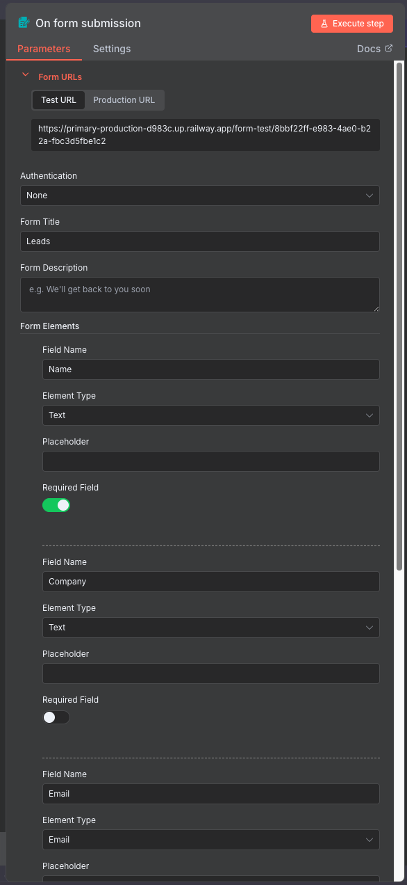

{: .highlight }
> **Test Your Form**: Open the URL in a browser. You should see your custom form!

**Your workflow so far:**

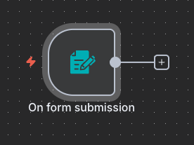

---

## Step 3: AI Research Agent

### 3.1 Add and Connect the Node

{: .note }
> **Understanding AI Agents**: Unlike basic LLM nodes, agents can use tools autonomously. They decide when and how to search based on your instructions.

1. Add "AI Agent" node to your canvas
2. **Connect it**: Drag a connection line from the **Form Trigger** to this new node
3. Name it: "AI Agent - Research Prospect"

{: .highlight }
> **Why connect first?** Once connected, you can see the form data available in expressions like `{{ $json.Name }}`.

**Your workflow so far:**

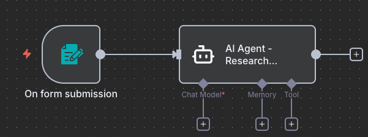

### 3.2 Configure the Agent

Now set up the agent's behaviour:

1. **Source for Prompt (User Message)**: "Define below"

2. In the **Prompt (User Message)** field, enter:

   

   ```
   Research the following person/company and find relevant information for a personalized cold email:

   Name: {{ $json.Name }}
   Company: {{ $json.Company }}
   Email: {{ $json.Email }}
   Context: {{ $json['Key Points / Context'] }}

   Use the Perplexity tool to find:
   1. Recent news or achievements about them or their company
   2. Their business challenges or interests
   3. Common connections or shared interests
   4. Any relevant context for personalization

   Provide a concise research summary focusing on information useful for email personalization.
   ```

   

3. Scroll down to **Options** section and expand it

4. In the **System Message** field, enter:

   ```
   You are an expert researcher specializing in finding relevant information about prospects for cold outreach. Use the Perplexity tool to search for recent, relevant information that can help personalize the email. Focus on finding genuine connection points and value opportunities.
   ```

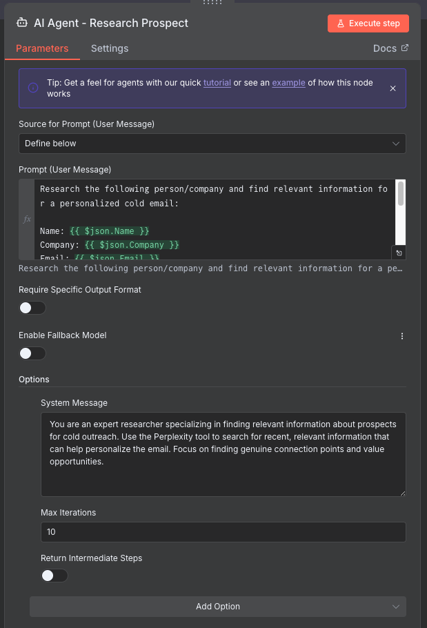

### 3.3 Add Perplexity Tool

1. Click the "+" under Tools
2. Select "Perplexity" from the list
3. Configure:
   - **Credential to connect with**: Select your Perplexity credential
   - **Model**: "Sonar"

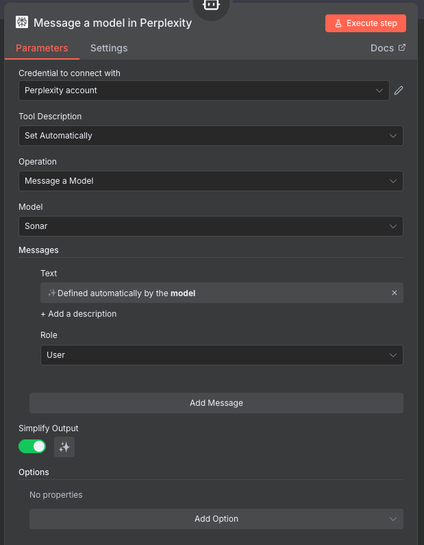

{: .important }
> **What Just Happened? You Gave AI a Superpower!**
>
> By adding the Perplexity tool, you've just taught the AI agent how to **search the web autonomously**. Here's what's magical about this:
>
> **Without the tool**:
>
> - AI: "I can only guess about John Smith based on my training data from 2023..."
>
> **With the tool**:
>
> - AI: "I need current information about John Smith"
> - AI: "Let me use Perplexity to search the web" ← **Decides on its own!**
> - AI: "I found recent news articles and LinkedIn updates"
> - AI: "Now I can write a truly personalised email based on current facts"
>
> **This is called "function calling" or "tool use"** - the AI autonomously decides when and how to use the tool based on your prompt instructions!

{: .tip }
> **The Future of Tools**:
>
> Today: You connect **one tool** (Perplexity for web search)
>
> Tomorrow: You could connect:
>
> - **Multiple tools**: Web search + CRM lookup + database query
> - **Custom tools**: Your own company data, internal docs, proprietary APIs
> - **MCP servers**: Pre-built tool collections (hundreds of integrations)
> - **Tool chains**: AI uses tools in sequence based on what it learns
>
> The pattern stays the same - you just add more tools to the agent!

### Add Language Model

1. Click the "+" under Chat Model
2. Select "Google Gemini Chat Model"
3. Configure:
   - **Credential to connect with**: Select your Gemini credential
   - **Model**: "models/gemini-2.5-flash"
4. Under **Options**, set:
   - **Maximum Number of Tokens**: 32000

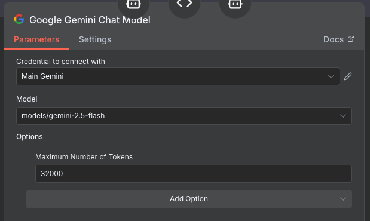

{: .tip }
> **Pin Output During Development**: After testing once, pin the agent output to save API calls while building the rest of your workflow.

**Your workflow so far:**

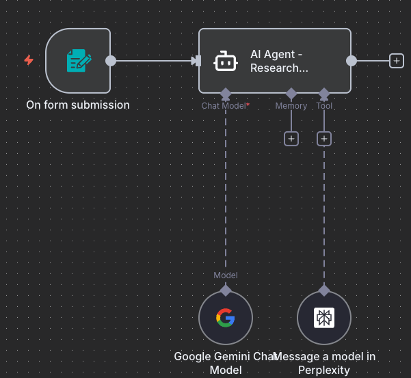

---

## Step 4: Email Generation Agent

### 4.1 Add and Connect the Node

{: .note }
> **Why Two Agents?** Separation of concerns - one agent researches, another writes. This makes each agent better at its specific task and easier to debug.

1. Add another "AI Agent" node to your canvas
2. **Connect it**: Drag a connection line from **AI Agent - Research Prospect** to this new node
3. Name it: "AI Agent - Craft Email"

{: .highlight }
> **Research data flows in**: This agent now receives the research findings from the previous node.

**Your workflow so far:**

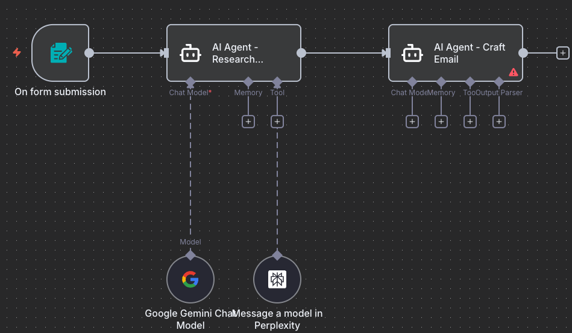

### 4.2 Configure the Prompt

Set up the agent to craft personalised emails:

1. **Source for Prompt (User Message)**: "Define below"

2. In the **Prompt (User Message)** field, enter:

   

   ```
   Based on the research about {{ $('On form submission').item.json.Name }}, create a personalized cold email.

   Research findings:
   {{ $('AI Agent - Research Prospect').item.json.output }}

   Original context: {{ $('On form submission').item.json['Key Points / Context'] }}

   Create a cold email that:
   1. Opens with a personalized hook based on the research
   2. Shows understanding of their situation or interests
   3. Presents a clear value proposition
   4. Has a specific, low-commitment call-to-action
   5. Stays under 150 words
   6. Feels genuine and conversational, not templated

   Format the output with clear sections for subject, hook, body, and CTA.
   ```

   

3. Scroll down to **Options** section and expand it

4. In the **System Message** field, enter:

   ```
   You are an expert email copywriter specializing in personalized cold outreach. Write genuine, conversational emails that build trust and provide value. Use the research to create authentic connections, not generic pitches.
   ```

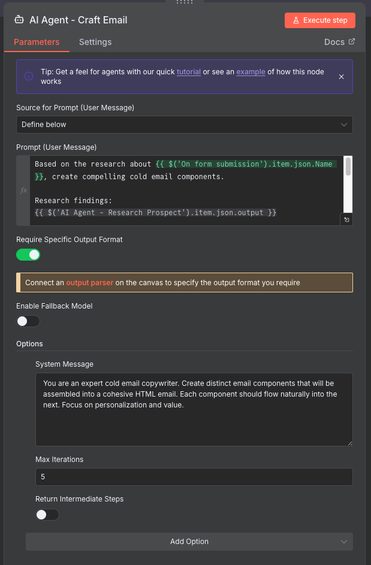

### 4.3 Add Output Parser for Structure

{: .important }
> **Structured Output**: We need consistent email components for reliable automation. The output parser ensures the AI returns data in the exact format we need.

1. Click "+" under Output Parser

2. Select "Structured Output Parser"

3. Add this JSON schema:

   ```json
   {
     "type": "object",
     "properties": {
       "subject": {
         "type": "string",
         "description": "Compelling subject line under 60 characters"
       },
       "hook": {
         "type": "string",
         "description": "Personalized opening line based on research"
       },
       "body": {
         "type": "string",
         "description": "Main value proposition and context"
       },
       "cta": {
         "type": "string",
         "description": "Specific call-to-action"
       }
     },
     "required": ["subject", "hook", "body", "cta"]
   }
   ```

4. Under **Options**, enable **"Auto fix format"** (toggle it on)

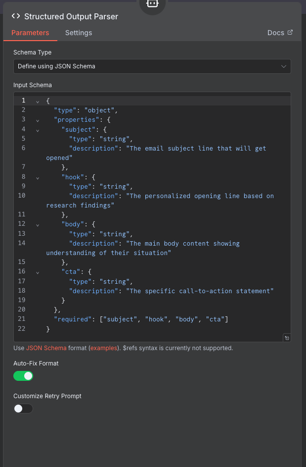

**Your workflow so far:**

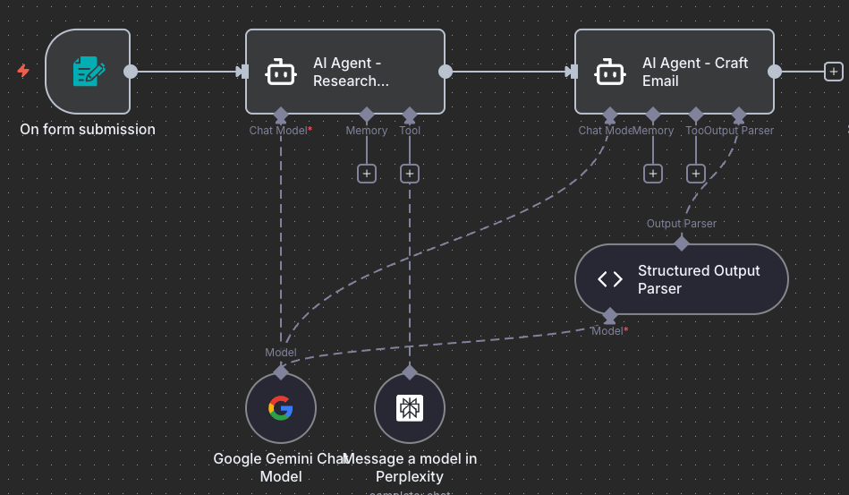

### Add Language Model

Use the same Gemini model (it's already configured from the first agent).

---

## Step 5: Gmail Integration

### 5.1 Add and Connect the Node

1. Add "Gmail" node to your canvas
2. **Connect it**: Drag a connection line from **AI Agent - Craft Email** to this new node
3. Name it: "Send Email via Gmail"

{: .highlight }
> **Email components ready**: This node receives the structured email output (subject, hook, body, cta).

### 5.2 Configure Email Sending

{: .note }
> **Email Composition**: We'll combine the AI-generated components into a professional email.

1. **Operation**: "Send"
2. **Credential**: Your Gmail credential
3. Set email fields using expressions:



- **To**: `{{ $('On form submission').item.json.Email }}`
- **Subject**: `{{ $json.output.subject }}`
- **Message Type**: "Text" (or HTML for formatting)
- **Message**:

   ```
   {{ $json.output.hook }}

   {{ $json.output.body }}

   {{ $json.output.cta }}

   Best regards,
   [Your Name]
   ```



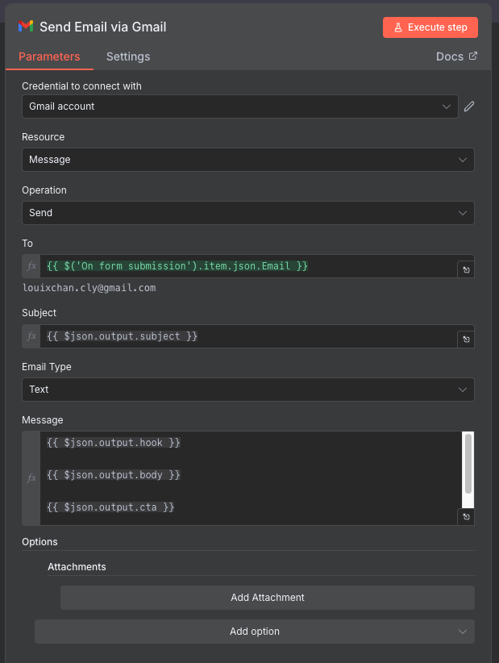

{: .warning }
> **Sender Reputation**: Start with a few test emails. Sudden high volume can trigger spam filters.

**Your workflow so far:**

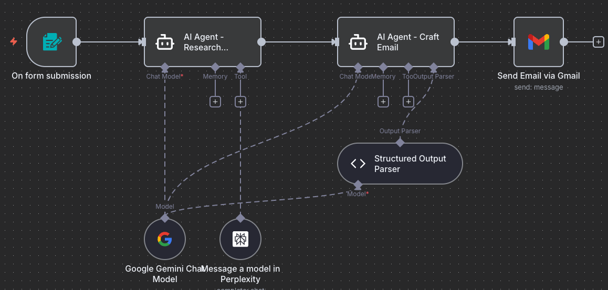

---

## Step 6: Metadata Enrichment

### 6.1 Add and Connect the Node

1. Add "Set" node (or "Edit Fields" in newer versions) to your canvas
2. **Connect it**: Drag a connection line from **Send Email via Gmail** to this new node
3. Name it: "Enrich with Metadata"

{: .highlight }
> **Data consolidation**: This node pulls data from all previous nodes to create a complete record.

### 6.2 Configure Field Assignments

{: .note }
> **Why Enrich?** We're extracting the structured email components (subject, hook, body, cta) from the AI agent's output to use in Gmail.

1. **Mode**: "Manual Mapping"
2. Add these field assignments in **Fields to Set**:



| Field Name | Value |
|------------|-------|
| **id** | `{{ $json.id }}` |
| **subject** | `{{ $('AI Agent - Craft Email').item.json.output.subject }}` |
| **hook** | `{{ $('AI Agent - Craft Email').item.json.output.hook }}` |
| **body** | `{{ $('AI Agent - Craft Email').item.json.output.body }}` |
| **cta** | `{{ $('AI Agent - Craft Email').item.json.output.cta }}` |



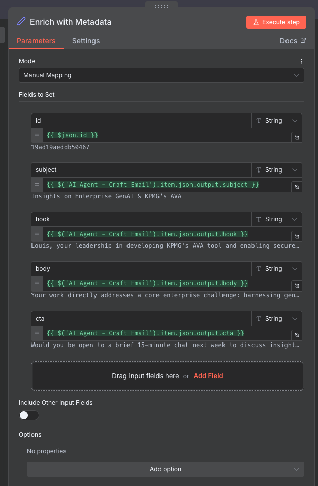

{: .tip }
> **What's Happening?** The AI agent returns a structured JSON object with separate fields. We're splitting these out so Gmail can access each part individually.

**Your workflow so far:**

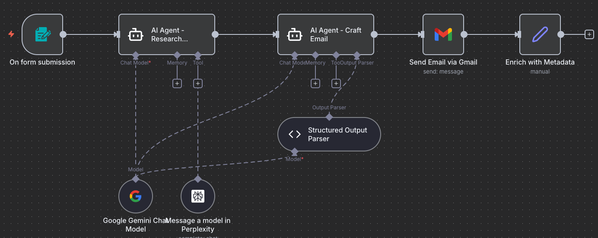

---

## Step 7: Analytics Logging

### 7.1 Add and Connect the Node

1. Add "Google Sheets" node to your canvas
2. **Connect it**: Drag a connection line from **Enrich with Metadata** to this new node
3. Name it: "Log to Google Sheets"

{: .highlight }
> **Final node**: Every email sent will now be logged to your tracking spreadsheet.

### 7.2 Configure Sheets Logging

{: .note }
> **Create Your Tracking Sheet**: Before configuring, create a new Google Sheet to track your emails. Go to [Google Sheets](https://sheets.google.com), create a new blank spreadsheet, and name it "Cold Email Tracking".

1. **Operation**: "Append Row"
2. **Credential**: Your Sheets credential
3. **Document ID**: Paste the URL of your "Cold Email Tracking" spreadsheet
   - Example: `https://docs.google.com/spreadsheets/d/1ABC123xyz/edit`
4. **Sheet**: "Sheet1"
5. **Mapping Mode**: "Auto-map Input Data"

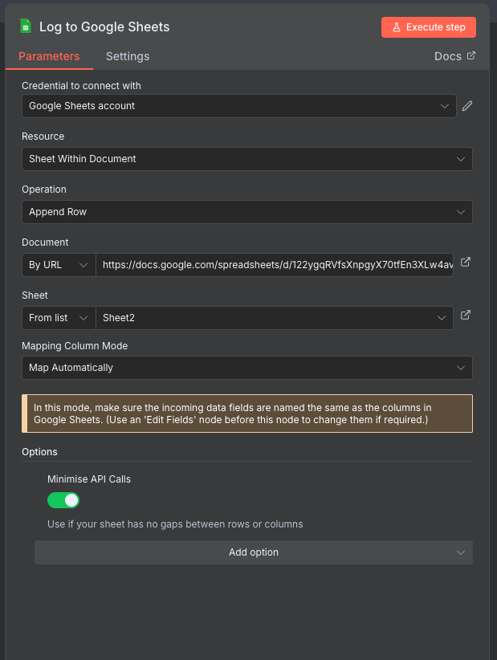

{: .note }
> **Auto-mapping**: Since we named our fields to match the spreadsheet columns, they'll map automatically.

{: .highlight }
> **Workflow Complete**: All nodes connected! Form → Research → Email → Gmail → Enrich → Sheets.

**Your complete workflow:**

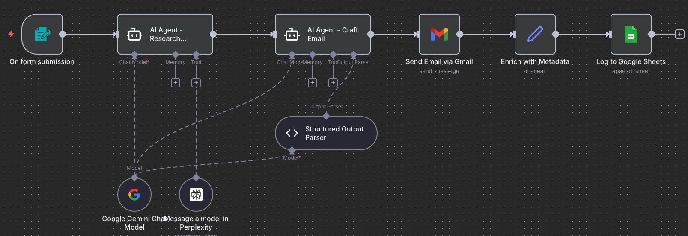

---

## Step 8: Test & Activate

### 8.1 Test Your Workflow

1. Click "Test Workflow"
2. Open your form URL
3. Submit test data:
   - Name: "Test User"
   - Company: "Test Company"
   - Email: <your-email@gmail.com>
   - Context: "Testing the automation"

4. Watch the execution:
   - Research agent should find information
   - Email agent should craft personalized content
   - Email should arrive in your inbox
   - Data should appear in Google Sheets

### 8.2 Troubleshooting

| Issue | Solution |
|-------|----------|
| Research returns generic results | Add more specific search instructions to agent prompt |
| Email too generic | Ensure research data is passing to email agent |
| Gmail fails | Check credentials, verify email address format |
| Sheets not updating | Verify column names match exactly |

### 8.3 Go Live

Once tested successfully:

1. Toggle "Active" switch
2. Share your form URL with team
3. Monitor Google Sheets for results

{: .highlight }
> **Success!** You've built an AI system that researches and personalizes at scale!

---

## Next Steps

Your workflow is complete! You've successfully:

- ✅ Built an autonomous research agent
- ✅ Created personalized content generation
- ✅ Integrated multiple AI models
- ✅ Automated the entire outreach process

### What You've Really Learned

The **AI Research & Personalization** pattern you've mastered can be applied to:

1. **Job Applications**: Research company → Generate cover letter
2. **Sales Proposals**: Research client → Create proposal
3. **Content Creation**: Research topic → Generate article
4. **Customer Support**: Research issue → Generate solution

{: .tip }
> **Your Turn**: What other use cases can you think of for this pattern?

---

## Push Your Workflow to GitHub

### Export and Save Your Work

Now that you've built your workflow, it's important to save it to your GitHub repository. This creates a backup and allows you to track changes over time.

#### 8.3.1 Export Your Workflow from n8n

1. In your n8n workflow canvas, click the **three-dot menu** (⋮) in the top-right corner
2. Select **"Download"** or **"Export workflow"**
3. Save the JSON file to your computer with a descriptive name:
   - Example: `cold-email-automation-workflow.json`

{: .note }
> **Tip**: The exported file contains your entire workflow structure, but credentials are not included for security reasons.

#### 8.3.2 Upload to GitHub via UI

1. **Navigate to your GitHub repository** in your web browser
2. **Go to the workflows folder** (or create one if it doesn't exist):
   - Click **"Add file"** → **"Create new file"**
   - Type `workflows/` in the filename field to create the folder
3. **Upload your workflow**:
   - Click **"Add file"** → **"Upload files"**
   - Drag and drop your exported JSON file, or click to browse
   - Alternatively, click **"Create new file"** and paste the JSON content
4. **Commit your changes**:
   - Add a commit message: `Add Cold Email Automation workflow`
   - Choose **"Commit directly to the main branch"** or create a new branch
   - Click **"Commit changes"**

{: .highlight }
> **Success!** Your workflow is now safely stored in GitHub and can be shared with others or imported into a different n8n instance.

---

## Download Complete Workflow

### 8.4 Import Pre-Built Template

Save time with our complete workflow:

[📥 Download Cold Email Workflow](./downloads/cold-email-automation.json){: .btn .btn-primary }

To import:

1. Open n8n
2. Click "Import Workflow"
3. Select the downloaded file
4. Update all credentials
5. Test and activate

Ready for more? Try the [Challenge Tasks →](./challenge-tasks)
