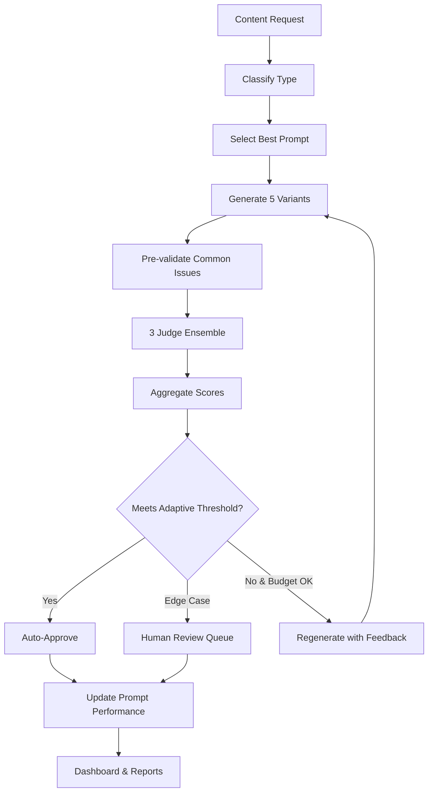

# Challenge Tasks

{: .no_toc }

## Table of contents

{: .no_toc .text-delta }

1. TOC
{:toc}

---

## Overview

Ready to take your LLM as a Judge workflow to the next level? These challenge tasks introduce advanced patterns used in production AI systems.

Each challenge builds on the core workflow you've created and introduces new concepts applicable across many AI automation scenarios.

---

## Challenge 1: Multi-Variant Generation with Best-of-N Selection

**Difficulty**: Intermediate | **Time**: 30 minutes

### The Pattern

Instead of iterating on a single piece of content, generate multiple variants in parallel and have the judge select the best one.

### Real-World Application

- **A/B Testing**: Generate 3-5 email subject lines, pick the most engaging
- **Content Optimization**: Create multiple blog intros, select the most compelling
- **Ad Copy**: Generate variants with different angles, choose highest-scoring

### Implementation Steps

1. **Modify Generator**:
   - Add a **Loop** node before Generator
   - Set loop count to 3-5 variants
   - Generate unique content each iteration (add randomness prompt)

2. **Collect All Variants**:
   - Use **Aggregate** node to collect all generated variants
   - Each variant passes through Judge individually

3. **Select Winner**:
   - Add **Code** node to compare all scores
   - Return variant with highest overall score
   - Log all variants and scores for analysis

4. **Enhanced Logging**:
   - Track which variant won
   - Log scores for all variants
   - Identify patterns in winning content

### Success Criteria

- ✅ Generate 5 variants for same topic
- ✅ Judge evaluates each independently
- ✅ System selects highest-scoring variant
- ✅ Google Sheets shows all variants and winner

### Bonus

Add diversity check: Ensure variants are meaningfully different (not just minor wording changes).

---

## Challenge 2: Ensemble Judging with Multiple Evaluators

**Difficulty**: Advanced | **Time**: 45 minutes

### The Pattern

Use multiple judge LLMs with different perspectives, then aggregate their scores for more robust evaluation.

### Real-World Application

- **Balanced Evaluation**: Reduce bias by using multiple models with different perspectives, increasing reliability and consistency
- **Multi-Stakeholder Review**: Different judges represent different stakeholders (technical for accuracy, marketing for brand guidelines and tone of voice, legal for compliance)
- **Confidence Scoring**: High agreement = high confidence, disagreement = needs human review

### Implementation Steps

1. **Create Multiple Judge Branches**:
   - Add 3 parallel Judge LLM nodes
   - Judge 1: **Technical Accuracy** (Claude 3.5 Sonnet)
   - Judge 2: **Creative Appeal** (GPT-4o)
   - Judge 3: **Brand Alignment** (Gemini Pro)

2. **Different Evaluation Criteria**:
   - Each judge uses specialized criteria
   - Technical: Accuracy, clarity, completeness
   - Creative: Engagement, originality, emotional appeal
   - Brand: Tone of voice, brand guidelines, messaging consistency, company standards compliance

3. **Aggregate Scores**:
   - Collect all judge outputs
   - Calculate weighted average
   - Measure inter-judge agreement (variance)

4. **Confidence Threshold**:
   - If judges agree (variance < 10): High confidence, auto-approve
   - If judges disagree (variance > 20): Flag for human review

### Success Criteria

- ✅ Three judges evaluate same content independently
- ✅ Scores aggregated with confidence metric
- ✅ Low-confidence results flagged
- ✅ Log includes per-judge breakdown

### Bonus

Add a "meta-judge" that reviews cases where judges strongly disagree and makes final call.

---

## Challenge 3: Adaptive Quality Thresholds

**Difficulty**: Intermediate | **Time**: 30 minutes

### The Pattern

Dynamically adjust quality thresholds based on content type, iteration count, or historical performance.

### Real-World Application

- **Content Urgency**: Lower thresholds for time-sensitive content
- **Learning System**: Start strict, relax as system learns what works
- **Progressive Enhancement**: First pass for "good enough", second pass for "excellent"

### Implementation Steps

1. **Add Content Type Classifier**:
   - Add field to Manual Trigger: `content_type` (marketing, technical, internal, external)
   - Add field: `urgency` (low, medium, high, critical)

2. **Dynamic Threshold Logic**:

```javascript
// Calculate adaptive threshold
const baseThreshold = 80;

// Adjust for content type
const contentAdjustment = {
  'marketing': 5,      // Higher standards for customer-facing
  'technical': 0,      // Standard for technical docs
  'internal': -5,      // Lower for internal use
  'external': 10       // Highest for external communications
};

// Adjust for urgency
const urgencyAdjustment = {
  'low': 5,           // More time to perfect
  'medium': 0,        // Standard
  'high': -5,         // Accept good enough
  'critical': -10     // Ship quickly
};

const adjustedThreshold = baseThreshold
  + (contentAdjustment[content_type] || 0)
  + (urgencyAdjustment[urgency] || 0);

return { threshold: Math.max(70, Math.min(95, adjustedThreshold)) };
```

3. **Progressive Standards**:
   - Iteration 1-2: Use adjusted threshold
   - Iteration 3-4: Relax by 5 points
   - Iteration 5: Accept best attempt

4. **Log Threshold Decisions**:
   - Track which thresholds were applied
   - Analyze success rates by content type

### Success Criteria

- ✅ Threshold adjusts based on input parameters
- ✅ Progressive relaxation prevents infinite loops
- ✅ All threshold decisions logged
- ✅ Analysis shows impact on success rates

---

## Challenge 4: Self-Optimizing Prompts

**Difficulty**: Expert | **Time**: 60 minutes

### The Pattern

Automatically improve generator prompts based on what produces high-scoring outputs.

### Real-World Application

- **Prompt Engineering at Scale**: Test dozens of prompt variations
- **Continuous Improvement**: System learns what works over time
- **Personalization**: Adapt prompts to specific use cases or audiences

### Implementation Steps

1. **Create Prompt Variants Table**:
   - Google Sheet: `Prompt Performance Tracker`
   - Columns: prompt_id, prompt_text, avg_score, success_rate, usage_count

2. **A/B Test Prompts**:
   - Load 3-5 prompt variants from sheet
   - Randomly select which to use for each run
   - Track performance per prompt

3. **Performance Analysis**:
   - After 20 runs per prompt, calculate:
     - Average score
     - Success rate (% passing threshold)
     - Iteration efficiency (avg iterations to pass)

4. **Automatic Promotion**:
   - Top-performing prompt becomes default
   - Low performers retired or refined
   - New variants generated by meta-LLM based on what works

5. **Meta-Prompt Generator**:
   - Analyze successful prompts
   - Generate new variants to test
   - Continuous experimentation loop

### Success Criteria

- ✅ System tests multiple prompt variants
- ✅ Performance metrics tracked per prompt
- ✅ Best prompt auto-selected
- ✅ New variants generated automatically

### Bonus

Implement "multi-armed bandit" algorithm for exploration vs exploitation balance.

---

## Challenge 5: Multi-Criteria Conditional Evaluation

**Difficulty**: Advanced | **Time**: 45 minutes

### The Pattern

Different content types require different evaluation criteria. Route to specialized judges based on content characteristics.

### Real-World Application

- **Content Hub**: Blog posts, social media, emails each judged differently
- **Industry Compliance**: Legal, medical, financial content has mandatory criteria
- **Audience Segmentation**: B2B vs B2C content evaluated with different priorities

### Implementation Steps

1. **Content Type Detection**:
   - Add LLM node to classify content type
   - Output: blog_post, social_media, email, technical_doc, marketing_copy

2. **Specialized Judge Routing**:

```javascript
// Define criteria sets per content type
const criteriaByType = {
  blog_post: {
    criteria: ['SEO_optimization', 'readability', 'engagement', 'structure'],
    threshold: 80,
    max_length: 1500
  },
  social_media: {
    criteria: ['virality', 'clarity', 'cta_strength', 'hashtag_quality'],
    threshold: 75,
    max_length: 280
  },
  email: {
    criteria: ['subject_line', 'personalization', 'clarity', 'cta'],
    threshold: 85,
    max_length: 300
  },
  technical_doc: {
    criteria: ['accuracy', 'completeness', 'code_examples', 'clarity'],
    threshold: 90,
    max_length: 2000
  }
};
```

3. **Dynamic Judge Prompts**:
   - Load appropriate criteria for detected type
   - Adjust weights and thresholds
   - Use type-specific examples in judge prompt

4. **Type-Specific Validations**:
   - Blog posts: Check for headers, bullet points, conclusion
   - Social media: Validate character count, hashtag usage
   - Emails: Verify subject line, personalization tokens
   - Technical docs: Check for code blocks, error handling

### Success Criteria

- ✅ Content type auto-detected
- ✅ Appropriate judge criteria applied
- ✅ Type-specific validations pass
- ✅ Logging shows which criteria set used

---

## Challenge 6: Human-in-the-Loop Review Queue

**Difficulty**: Intermediate | **Time**: 40 minutes

### The Pattern

Edge cases that fail quality checks go to human review queue instead of being discarded.

### Real-World Application

- **Quality Assurance**: Humans review AI edge cases
- **Training Data**: Failed attempts become examples for improvement
- **Escalation**: Complex requests route to appropriate human expert

### Implementation Steps

1. **Add Review Queue Sheet**:
   - New Google Sheet: `Human Review Queue`
   - Columns: id, timestamp, content, score, feedback, status, reviewer_notes

2. **Escalation Logic**:

```javascript
// Determine if needs human review
const needsReview =
  (final_score >= 70 && final_score < 80) ||  // Close but not quite
  (iteration >= 5 && !passed) ||               // Max iterations reached
  (variance_between_judges > 20);              // Judges disagree

if (needsReview) {
  // Route to review queue
  sendToReviewQueue({
    content: final_content,
    score: final_score,
    feedback: all_feedback,
    status: 'PENDING_REVIEW',
    priority: final_score < 70 ? 'HIGH' : 'LOW'
  });
} else if (passed) {
  // Auto-approve
  sendToProductionQueue();
} else {
  // Reject
  sendToFailedLog();
}
```

3. **Reviewer Interface**:
   - Create simple form (Google Forms or Airtable)
   - Reviewer can: Approve, Reject, Edit, Request Regeneration
   - Approved items move to production
   - Rejected items logged as training examples

4. **Feedback Loop**:
   - Collect reviewer edits
   - Analyze what humans change most often
   - Update judge criteria to catch these issues

### Success Criteria

- ✅ Edge cases routed to review queue
- ✅ Clear review interface for humans
- ✅ Reviewer actions logged
- ✅ Feedback improves future generations

---

## Challenge 7: Cost-Aware Iteration Strategy

**Difficulty**: Advanced | **Time**: 45 minutes

### The Pattern

Optimize for quality vs cost trade-off by using cheaper models initially and premium models only when needed.

### Real-World Application

- **Budget Management**: Control API spend per content piece
- **Tiered Quality**: Different quality levels for different use cases
- **Smart Escalation**: Use expensive models only for difficult content

### Implementation Steps

1. **Model Tier Strategy**:

```javascript
// Model selection based on iteration and budget
function selectModel(iteration, budget_remaining, content_value) {
  const tiers = {
    cheap: { model: 'gpt-4o-mini', cost_per_1k: 0.0015, quality: 70 },
    medium: { model: 'gpt-4o', cost_per_1k: 0.03, quality: 85 },
    premium: { model: 'claude-3-opus', cost_per_1k: 0.075, quality: 95 }
  };

  // Iteration 1-2: Try cheap model
  if (iteration <= 2) return tiers.cheap;

  // Iteration 3-4: Upgrade if budget allows
  if (iteration <= 4 && budget_remaining > 0.10) return tiers.medium;

  // Final iteration: Use best model for high-value content
  if (content_value === 'high' && budget_remaining > 0.20) return tiers.premium;

  return tiers.medium;
}
```

2. **Cost Tracking**:
   - Calculate token usage per iteration
   - Track running cost
   - Stop if cost exceeds budget

3. **Quality-Cost Analysis**:
   - Log cost per content piece
   - Analyze ROI: Does premium model justify 5x cost?
   - Find sweet spot for each content type

4. **Adaptive Budgeting**:
   - High-value content: Higher budget
   - Bulk content: Strict budget caps
   - Experimental: Medium budget with aggressive cutoffs

### Success Criteria

- ✅ Model selection adapts per iteration
- ✅ Cost tracked and logged
- ✅ Budget constraints enforced
- ✅ Analysis shows cost vs quality trade-offs

---

## Challenge 8: Learning from Feedback Patterns

**Difficulty**: Expert | **Time**: 60 minutes

### The Pattern

Analyze historical feedback to proactively avoid common issues in future generations.

### Real-World Application

- **Continuous Improvement**: Learn from past mistakes
- **Personalization**: Adapt to specific user preferences
- **Quality Prediction**: Predict likely issues before judging

### Implementation Steps

1. **Feedback Analysis Pipeline**:

```javascript
// Analyze all historical feedback
const commonIssues = analyzeHistoricalFeedback({
  lookback_days: 7,
  min_occurrences: 3
});

// Example output:
// [
//   { issue: 'missing call-to-action', frequency: 12, avg_iteration: 2 },
//   { issue: 'tone too formal', frequency: 8, avg_iteration: 1 },
//   { issue: 'lacks specific examples', frequency: 15, avg_iteration: 3 }
// ]
```

2. **Proactive Prompt Enhancement**:

```javascript
// Add common issues to generator prompt
const enhancedPrompt = `
${basePrompt}

IMPORTANT - Avoid these common issues:
${commonIssues.map(i => `- ${i.issue} (seen in ${i.frequency} recent runs)`).join('\n')}
`;
```

3. **Pre-Judge Validation**:
   - Before sending to judge, run quick checks for known issues
   - If detected, auto-regenerate without wasting judge API call

4. **Issue Trending**:
   - Track which issues are increasing/decreasing
   - Alert if new issue pattern emerges
   - Celebrate when chronic issue is resolved

5. **Visualization Dashboard**:
   - Google Sheets pivot table showing:
     - Most common issues by content type
     - Issues by iteration (which get caught early vs late)
     - Issue resolution trends over time

### Success Criteria

- ✅ Historical feedback analyzed automatically
- ✅ Common issues incorporated into prompts
- ✅ Pre-validation catches known issues
- ✅ Dashboard shows improvement trends

---

## Putting It All Together: Production-Grade System

### The Ultimate Challenge

Combine all challenges into a production-ready content generation system:

1. **Multi-Variant Generation** (Challenge 1)
2. **Ensemble Judging** (Challenge 2)
3. **Adaptive Thresholds** (Challenge 3)
4. **Self-Optimizing Prompts** (Challenge 4)
5. **Smart Routing** (Challenge 5)
6. **Human Review Queue** (Challenge 6)
7. **Cost Optimization** (Challenge 7)
8. **Learning System** (Challenge 8)

### Architecture



### Metrics to Track

- **Quality**: Average scores, pass rates
- **Efficiency**: Iterations to success, time per piece
- **Cost**: API spend per content, cost per quality point
- **Learning**: Prompt improvement, issue reduction
- **Human Load**: % needing review, review time

---

## Additional Ideas

### Challenge 9: Multi-Language Support

Generate and judge content in multiple languages with language-specific criteria.

### Challenge 10: Tone Adaptation

Dynamically adjust tone (formal, casual, technical, friendly) based on audience detection.

### Challenge 11: SEO Optimization

Add specialized judge for SEO criteria (keywords, readability, structure, meta descriptions).

### Challenge 12: Version Control

Track content versions, allow rollback, compare iterations side-by-side.

### Challenge 13: Collaborative Judging

Multiple human reviewers vote on edge cases, ML model learns from consensus.

---

## Resources

### Learning Materials

- [Constitutional AI Paper](https://arxiv.org/abs/2212.08073) - Foundation for LLM as a Judge
- [RLAIF: Reinforcement Learning from AI Feedback](https://arxiv.org/abs/2309.00267)
- [Prompt Engineering Guide](https://www.promptingguide.ai/)

### Tools

- **n8n Community**: [community.n8n.io](https://community.n8n.io)
- **Prompt Testing**: [PromptFoo](https://promptfoo.dev/)
- **LLM Observability**: [Langfuse](https://langfuse.com/)

---

## Saving Your Work

After completing any challenge:

1. **Export Workflow**: In n8n, click ⋯ menu → Download → Save as JSON
2. **Commit to GitHub**: Save your workflow JSON files to your repository
3. **Document Changes**: Add notes explaining your approach and learnings

---

[← Back to Part B](./part-b-workflow){: .btn .mr-2 }
[Back to Exercise Overview](./index){: .btn }
