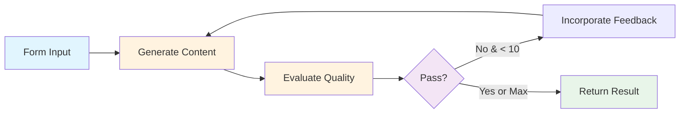

# Exercise 3: LLM as a Judge System

{: .fs-9 }

Build an AI quality control system where one LLM generates content and another LLM evaluates it, providing feedback and iterating until quality standards are met.
{: .fs-6 .fw-300 }

---

## 60-Minute Hands-On Exercise

This exercise teaches you **loops and quality control** - building AI systems that check their own work and improve automatically. This is how you get consistent, reliable AI output without manual review.

**The Problem:** AI-generated content is inconsistent—the same prompt can produce brilliant results or complete rubbish. Manual review doesn't scale, and there's no built-in quality control. You need an automated system where one AI generates content and another AI judges it, providing feedback until quality standards are met.

**Why Loops + Quality Control Matter:**

You'll learn to make AI reliable by having it check and improve its own work automatically:

- ✅ **Consistent quality**: Only get output that meets your standards
- ✅ **No manual review**: AI judges AI, you set the criteria
- ✅ **Self-improving**: Failed attempts get feedback and try again
- ✅ **Scalable quality**: Review 1000 pieces as easily as 1
- ✅ **Peace of mind**: Nothing leaves the system unless it passes

This is how professional AI systems ensure quality at scale.

### What You'll Build

A complete AI quality control workflow featuring:

- **Web form interface** for task submission with custom quality criteria
- **Generator AI** that creates content based on instructions
- **Judge AI** that evaluates output against your specific criteria
- **Feedback loop** with iterative improvement (up to 10 attempts)
- **Structured evaluation** with pass/fail status and actionable feedback
- **Loop control logic** preventing infinite iterations

### Skills You'll Demonstrate

By completing this exercise, you will have demonstrated:

- **Loop Logic Design**: Building iterative workflows with exit conditions
- **Dual AI Agent Setup**: Configuring two AI models for different roles (creation vs evaluation)
- **Structured Output Parsing**: Extracting consistent JSON from AI responses
- **Quality Gate Implementation**: Creating pass/fail criteria and feedback mechanisms
- **Variable Management**: Tracking state across loop iterations (counters, previous feedback)

### The Pattern You'll Master

The **AI Quality Control & Iteration** pattern you'll learn applies to:

- **Content Marketing**: Generate brand-aligned copy that consistently meets tone and style guidelines
- **Code Generation**: Create code that passes security, performance, and style standards
- **Customer Service**: Produce empathetic, accurate responses before sending
- **Product Descriptions**: Generate compelling copy that includes all required information
- **Email Campaigns**: Create messages that pass compliance and brand guidelines
- **Educational Content**: Produce learning materials that meet pedagogical standards

### Exercise Structure

  

    

      <h4>⚙️ Part A: Setup</h4>
      
Environment & prerequisites (15 min)

      <a href="./part-a-setup">Start here →</a>
    

  

  

    

      <h4>🔧 Part B: Build & Test</h4>
      
Create, test, and activate (40 min)

      <a href="./part-b-workflow">Build →</a>
    

  

  

    

      <h4>🏆 Challenges</h4>
      
Advanced extensions (optional)

      <a href="./challenge-tasks">Level up →</a>
    

  

---

## Quick Navigation

| Section | Description | Duration |
|---------|-------------|----------|
| [Part A: Setup](./part-a-setup) | Prerequisites check, Google Sheets setup | 15 min |
| [Part B: Build & Test](./part-b-workflow) | Build generator, judge, loop logic, and test | 40 min |
| [Challenges](./challenge-tasks) | Multi-criteria evaluation, A/B testing, prompt optimisation | Optional |

---

