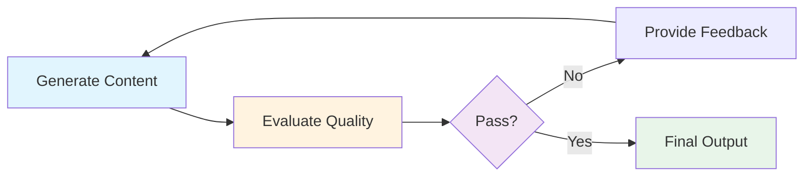
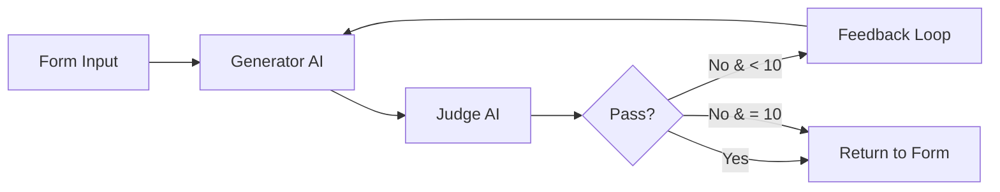
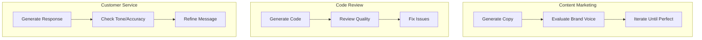

# Exercise 3: LLM as a Judge System

{: .fs-9 }

Build an AI quality control system where one LLM generates content and another LLM evaluates it, providing feedback and iterating until quality standards are met.
{: .fs-6 .fw-300 }

[Start Exercise](./overview){: .btn .btn-primary .fs-5 .mb-4 .mb-md-0 .mr-2 }
[Download Workflow](./downloads/llm-judge-workflow.json){: .btn .fs-5 .mb-4 .mb-md-0 }

---

## 60-Minute Hands-On Exercise

This exercise teaches you to build a self-improving content generation system using the "LLM as a Judge" pattern. Learn how to create AI workflows that evaluate and iterate on their own output until quality standards are met.

### What You'll Build

- **Web form interface** for task submission
- **Content generation** with Google Gemini AI
- **Quality evaluation** using a strict judge AI
- **Iterative improvement** with feedback loops (up to 10 retries)
- **Form-based output** with immediate results
- **Loop control** with pass/fail criteria

### The Universal Pattern

You're learning the **AI Quality Control & Iteration** pattern:

**Today's Implementation:**

**Tomorrow's Applications:**

### Exercise Structure

  

    

      <h4>📚 Overview</h4>
      
Understanding the why and how

      <a href="./overview">Start here →</a>
    

  

  

    

      <h4>⚙️ Part A: Setup</h4>
      
Environment & prerequisites (15 min)

      <a href="./part-a-setup">Configure →</a>
    

  

  

    

      <h4>🔧 Part B: Build & Test</h4>
      
Create, test, and activate (40 min)

      <a href="./part-b-workflow">Build →</a>
    

  

  

    

      <h4>🏆 Challenges</h4>
      
Advanced extensions (optional)

      <a href="./challenge-tasks">Level up →</a>
    

  

---

## Quick Navigation

| Section | Description | Duration |
|---------|-------------|----------|
| [Overview](./overview) | Why this matters, learning outcomes, architecture | 5 min |
| [Part A: Setup](./part-a-setup) | Prerequisites check, Google Sheets setup | 15 min |
| [Part B: Build & Test](./part-b-workflow) | Build generator, judge, loop logic, and test | 40 min |
| [Challenges](./challenge-tasks) | Multi-criteria evaluation, A/B testing, prompt optimization | Optional |

---

