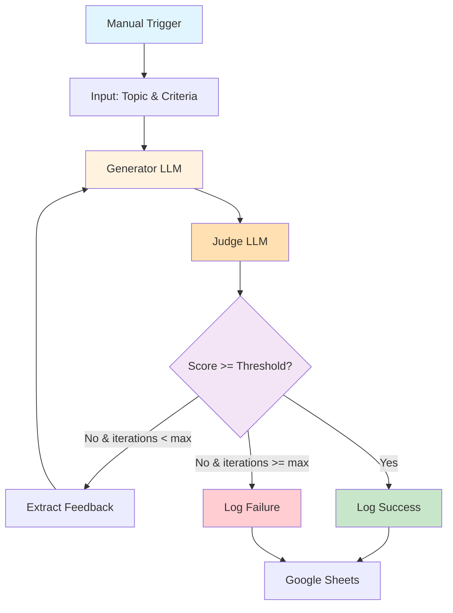

# LLM as a Judge Exercise Overview

## What You'll Build

In this hands-on exercise, you'll create an **AI-powered quality control system** that uses the "LLM as a Judge" pattern. This workflow generates content using one AI model, evaluates it with another AI model acting as a judge, and iteratively improves the content based on feedback until it meets quality standards.

By the end of this 60-minute session, you'll have a working system that can:

- Generate content based on custom prompts (e.g., blog posts, product descriptions, email copy)
- Evaluate content quality against specific criteria using a judge LLM
- Provide detailed feedback on what needs improvement
- Automatically iterate and regenerate until quality standards are met
- Track all iterations and scores in a Google Sheets dashboard
- Control maximum iterations to prevent infinite loops

## Why This Exercise Matters

### The Problem We're Solving

AI-generated content is powerful but inconsistent. A single prompt can produce brilliant results or complete garbage. Manual review of AI outputs is time-consuming and doesn't scale. You need an automated way to ensure quality before content reaches humans or customers.

### The "LLM as a Judge" Pattern

This is one of the most powerful patterns in modern AI automation:

1. **Generator LLM**: Creates content based on requirements
2. **Judge LLM**: Evaluates quality objectively against criteria
3. **Feedback Loop**: Provides specific improvement suggestions
4. **Iteration**: Regenerates content incorporating feedback
5. **Quality Gate**: Only outputs content that passes standards

### Real-World Applications

- **Content Marketing**: Generate on-brand copy that matches tone, style, and messaging guidelines
- **Customer Service**: Ensure AI responses are empathetic, accurate, and helpful before sending
- **Code Generation**: Validate generated code meets security, performance, and style standards
- **Product Descriptions**: Create compelling copy that includes all required information
- **Email Campaigns**: Generate personalized emails that pass brand and compliance checks
- **Educational Content**: Produce learning materials that meet pedagogical standards
- **Legal/Compliance**: Ensure AI-generated documents meet regulatory requirements

## Learning Outcomes

By completing this exercise, you will:

### Technical Skills

- Build iterative workflows with loop logic in n8n
- Implement the LLM as a Judge pattern with two AI models
- Design effective evaluation criteria and scoring rubrics
- Use structured output for consistent AI responses
- Implement loop counters and exit conditions
- Track iteration history and quality metrics

### AI/ML Skills

- Understand the difference between generator and evaluator prompts
- Design objective evaluation criteria for subjective tasks
- Recognize when to use different AI models for different roles
- Apply prompt engineering for consistent quality evaluation
- Balance quality standards with iteration limits

### Business Skills

- Define measurable quality standards for AI outputs
- Create scalable quality control processes
- Design feedback mechanisms that improve results
- Build trust in AI systems through verification layers
- Optimize AI workflows for cost and quality trade-offs

## System Architecture

### High-Level Overview



### Detailed Data Flow

1. **Manual Trigger**: Start workflow with topic input
2. **Generate Content**: Creator LLM produces first draft
3. **Evaluate Quality**: Judge LLM scores against criteria (0-100)
4. **Decision Point**:
   - If score >= 80 AND all criteria pass → Success path
   - If score < 80 AND iterations < 5 → Feedback loop
   - If iterations >= 5 → Failure path (log best attempt)
5. **Feedback Loop**: Extract specific improvement suggestions, pass to generator
6. **Regenerate**: Creator LLM produces improved version incorporating feedback
7. **Log Results**: Record all attempts, scores, and final content in Google Sheets

### Node Breakdown

| Node Type | Purpose | Configuration |
|-----------|---------|---------------|
| **Manual Trigger** | Start workflow with input data | Topic, criteria, target audience |
| **Generator LLM** | Create/improve content | OpenRouter with GPT-4 or Claude |
| **Judge LLM** | Evaluate content quality | Structured output with scoring |
| **IF Node** | Quality gate decision | Score threshold check |
| **Loop Node** | Iteration control | Max iterations = 5 |
| **Code Node** | Data transformation | Extract feedback, format results |
| **Google Sheets** | Logging & analytics | Track iterations, scores, final output |

### Why We Built It This Way

#### Design Decisions Explained

**Why Two Different LLMs?**

- **Separation of Concerns**: Generator focuses on creativity, judge focuses on evaluation
- **Better Results**: Specialized roles produce better outcomes than single "do everything" prompt
- **Objective Evaluation**: Judge isn't biased by its own output
- **Cost Optimization**: Can use cheaper models for judging, premium for generation

**Why Structured Output for Judge?**

- **Consistent Format**: Always get score, pass/fail, and feedback in same structure
- **Easy Decision Logic**: Can programmatically check scores and criteria
- **Better Tracking**: Log structured data for analytics
- **Reduced Errors**: JSON schema validation prevents malformed responses

**Why Loop with Max Iterations?**

- **Prevents Infinite Loops**: Safety mechanism if quality never reached
- **Cost Control**: Don't spend unlimited API credits trying to perfect
- **Practical Limits**: Diminishing returns after 3-5 iterations
- **Fail Gracefully**: Still log best attempt even if never passes

**Why Google Sheets for Logging?**

- **Easy Analysis**: Spreadsheet format perfect for reviewing results
- **Visual Tracking**: See improvement across iterations
- **Historical Data**: Build dataset of what works/doesn't work
- **Accessible**: Non-technical stakeholders can review results

## Quality Evaluation Framework

### Scoring Rubric

The judge LLM evaluates on these dimensions:

| Criterion | Weight | Description | Examples |
|-----------|--------|-------------|----------|
| **Accuracy** | 25% | Factually correct, no hallucinations | Claims are verifiable, data is real |
| **Clarity** | 25% | Easy to understand, well-structured | Clear sentences, logical flow |
| **Completeness** | 20% | Covers all required points | Includes all requested elements |
| **Tone** | 15% | Matches target audience and brand | Professional, friendly, technical, etc. |
| **Creativity** | 15% | Engaging and original | Fresh angles, vivid examples |

**Overall Score**: Weighted average of all criteria (0-100)

**Pass Threshold**: 80/100 minimum

### Structured Judge Output

```json
{
  "overall_score": 85,
  "pass": true,
  "criteria_scores": {
    "accuracy": 90,
    "clarity": 85,
    "completeness": 80,
    "tone": 85,
    "creativity": 85
  },
  "feedback": "Strong draft! Clarity could improve in paragraph 2. Consider adding specific example for point #3.",
  "specific_improvements": [
    "Break up long sentence in paragraph 2",
    "Add concrete example to support claim about ROI",
    "Strengthen call-to-action in conclusion"
  ]
}
```

## Example Use Case

### Scenario: Product Description Generator

**Goal**: Generate compelling product descriptions for e-commerce

**Input**:
- Product: "Wireless Noise-Cancelling Headphones"
- Target Audience: "Remote workers, 25-45 years old"
- Required Elements: "Features, benefits, use cases, call-to-action"
- Tone: "Professional but approachable"

**Iteration 1**:
- Generator creates first draft
- Judge scores 65/100 - fails on completeness (missing battery life) and tone (too technical)
- Feedback: "Add battery life specs, simplify technical jargon, emphasize work-from-home benefits"

**Iteration 2**:
- Generator incorporates feedback
- Judge scores 82/100 - passes!
- Content saved to Google Sheets with all iteration data

**Business Value**:
- Consistent quality across 1000s of product descriptions
- No manual review needed for 80%+ of outputs
- Automatic escalation (to humans) for difficult products
- Continuous improvement through logged feedback patterns

## What Makes This Exercise Powerful

### Beyond Simple Prompting

Most people use AI like this:
```
User → AI → Output → Hope it's good
```

This exercise teaches you:
```
User → AI Generator → AI Judge → Feedback Loop → Verified Quality Output
```

### Transferable Pattern

Once you master this pattern, you can apply it to:

- **Multi-step workflows**: Each step has its own quality gate
- **A/B testing**: Generate multiple variants, judge picks best
- **Progressive refinement**: Start broad, iteratively narrow focus
- **Ensemble methods**: Multiple generators, one judge picks winner
- **Human-in-the-loop**: AI pre-filters, humans only see best attempts

### Production-Ready Concepts

This exercise introduces enterprise patterns:

- **Quality gates**: Nothing proceeds without passing standards
- **Audit trails**: Every decision logged for review
- **Graceful degradation**: System handles failure cases
- **Cost controls**: Maximum iteration limits prevent runaway costs
- **Metrics tracking**: Quantitative measurement of AI performance

## Prerequisites

Before starting this exercise, you should have:

### Required Setup (from Common Prerequisites)

- ✅ OpenRouter API account and key ([Setup Guide](../../common-prerequisites/ai-services))
- ✅ n8n platform installed and configured ([Setup Guide](../../common-prerequisites/n8n-setup))
- ✅ Google account with Sheets access ([Setup Guide](../../common-prerequisites/google-setup))
- ✅ Basic familiarity with n8n interface

### Recommended Background

- Completed Exercise 1 or equivalent n8n experience
- Basic understanding of AI/LLM capabilities
- Familiarity with JSON data structures (helpful but not required)

### Time Commitment

- **Total Time**: 60 minutes
- **Part A (Setup)**: 15 minutes - Create Google Sheet, verify credentials
- **Part B (Build)**: 40 minutes - Build nodes, configure prompts, test iterations
- **Testing**: 5 minutes - Run full workflow, verify logging

## Success Criteria

You'll know you've succeeded when:

- ✅ Workflow generates content on any topic
- ✅ Judge evaluates with structured feedback
- ✅ Loop iterates until quality threshold met
- ✅ Maximum iterations prevent infinite loops
- ✅ All iterations logged to Google Sheets
- ✅ You can see quality improvement across iterations
- ✅ System handles both success and failure cases gracefully

## What's Next?

After completing this exercise:

1. **Test Different Topics**: Try various content types (emails, social posts, technical docs)
2. **Tune Quality Criteria**: Adjust scoring weights for your use case
3. **Try Different Models**: Experiment with model combinations (GPT-4, Claude, Llama)
4. **Add Human Review**: Integrate approval step for edge cases
5. **Move to Challenge Tasks**: Implement multi-criteria judging, A/B testing, prompt optimization

---

Ready to build your first AI quality control system?

[Continue to Part A: Setup →](./part-a-setup){: .btn .btn-primary }
