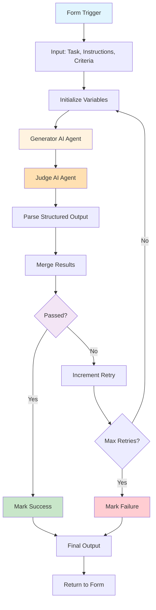

# LLM as a Judge Exercise Overview

## What You'll Build

In this hands-on exercise, you'll create an **AI-powered quality control system** that uses the "LLM as a Judge" pattern. This workflow generates content using one AI model, evaluates it with another AI model acting as a judge, and iteratively improves the content based on feedback until it meets quality standards.

By the end of this 60-minute session, you'll have a working system that can:

- Generate content based on custom prompts (e.g., blog posts, product descriptions, email copy)
- Evaluate content quality against specific criteria using a judge LLM
- Provide detailed feedback on what needs improvement
- Automatically iterate and regenerate until quality standards are met
- Track all iterations and scores in a Google Sheets dashboard
- Control maximum iterations to prevent infinite loops

## Why This Exercise Matters

### The Problem We're Solving

AI-generated content is powerful but inconsistent. A single prompt can produce brilliant results or complete garbage. Manual review of AI outputs is time-consuming and doesn't scale. You need an automated way to ensure quality before content reaches humans or customers.

### The "LLM as a Judge" Pattern

This is one of the most powerful patterns in modern AI automation:

1. **Generator LLM**: Creates content based on requirements
2. **Judge LLM**: Evaluates quality objectively against criteria
3. **Feedback Loop**: Provides specific improvement suggestions
4. **Iteration**: Regenerates content incorporating feedback
5. **Quality Gate**: Only outputs content that passes standards

### Real-World Applications

- **Content Marketing**: Generate on-brand copy that matches tone, style, and messaging guidelines
- **Customer Service**: Ensure AI responses are empathetic, accurate, and helpful before sending
- **Code Generation**: Validate generated code meets security, performance, and style standards
- **Product Descriptions**: Create compelling copy that includes all required information
- **Email Campaigns**: Generate personalized emails that pass brand and compliance checks
- **Educational Content**: Produce learning materials that meet pedagogical standards
- **Legal/Compliance**: Ensure AI-generated documents meet regulatory requirements

## Learning Outcomes

By completing this exercise, you will:

### Technical Skills

- Build iterative workflows with loop logic in n8n
- Implement the LLM as a Judge pattern with two AI models
- Design effective evaluation criteria and scoring rubrics
- Use structured output for consistent AI responses
- Implement loop counters and exit conditions
- Track iteration history and quality metrics

### AI/ML Skills

- Understand the difference between generator and evaluator prompts
- Design objective evaluation criteria for subjective tasks
- Recognize when to use different AI models for different roles
- Apply prompt engineering for consistent quality evaluation
- Balance quality standards with iteration limits

### Business Skills

- Define measurable quality standards for AI outputs
- Create scalable quality control processes
- Design feedback mechanisms that improve results
- Build trust in AI systems through verification layers
- Optimize AI workflows for cost and quality trade-offs

## System Architecture

### High-Level Overview



### Detailed Data Flow

1. **Form Trigger**: User submits web form with task, instructions, and success criteria
2. **Initialize Variables**: Set up retry counter (max 10), feedback tracking
3. **Generate Content**: Generator AI creates content based on task and instructions
4. **Evaluate Quality**: Judge AI evaluates against success criteria with strict scrutiny
5. **Parse Output**: Extract structured JSON (`passed: boolean, feedback: string`)
6. **Merge Results**: Combine evaluation with generated content and counters
7. **Decision Point**:
   - If `passed = true` → Success path
   - If `passed = false` AND retries < 10 → Feedback loop
   - If retries >= 10 → Failure path (return best attempt)
8. **Feedback Loop**: Increment counter, save feedback, loop back to generator
9. **Regenerate**: Generator AI produces improved version incorporating feedback
10. **Return Results**: Output final status, content, feedback, and retry count to form

### Node Breakdown

| Node Type | Purpose | Configuration |
|-----------|---------|---------------|
| **Form Trigger** | Collect user input via web form | Task, instructions, success criteria |
| **Initialize Variables (Set)** | Set up loop counters and tracking | retry_count, max_retries (10), previous_feedback |
| **Generator AI Agent** | Create/improve content | Google Gemini with dynamic prompt |
| **Judge AI Agent** | Evaluate content quality | Google Gemini with structured output parser |
| **Structured Output Parser** | Parse judge evaluation | JSON schema: {passed, feedback} |
| **Merge Results (Set)** | Combine evaluation and content | Merge judge output with generator output |
| **Check Pass/Fail (IF)** | Quality gate decision | If evaluation_result = true |
| **Increment Retry (Set)** | Update loop variables | retry_count++, store previous_feedback |
| **Max Retries Check (IF)** | Loop control | If retry_count >= max_retries |
| **Mark Success/Failure (Set)** | Set final status | status: "success" or "failed" |
| **Final Output (Set)** | Format results for form | Return status, content, feedback, retry_count |

### Why We Built It This Way

#### Design Decisions Explained

**Why Two Different AI Agents?**

- **Separation of Concerns**: Generator focuses on creation, judge focuses on evaluation
- **Better Results**: Specialized roles produce better outcomes than single "do everything" prompt
- **Objective Evaluation**: Judge isn't biased by its own output
- **Same Model, Different Roles**: Both use Google Gemini but with different system prompts

**Why Structured Output for Judge?**

- **Consistent Format**: Always get `passed` boolean and `feedback` string in same structure
- **Easy Decision Logic**: Can programmatically check if passed = true/false
- **Better Feedback Loop**: Structured feedback feeds directly back to generator
- **Reduced Errors**: JSON schema validation prevents malformed responses

**Why Loop with Max Iterations (10)?**

- **Prevents Infinite Loops**: Safety mechanism if quality criteria impossible to meet
- **Cost Control**: Don't spend unlimited API credits trying to perfect
- **Practical Limits**: Most tasks pass in 2-4 iterations; 10 is generous
- **Fail Gracefully**: Still return best attempt even if never passes

**Why Form Trigger Instead of Manual Trigger?**

- **Better UX**: Clean web form interface for users to submit tasks
- **Immediate Feedback**: Results returned directly to form after processing
- **No Sheets Required**: Simplified architecture, fewer dependencies
- **Easy Testing**: Just visit form URL to test workflow

## Quality Evaluation Framework

### User-Defined Success Criteria

Unlike traditional scoring rubrics, this workflow lets users define their own success criteria for each task. The judge evaluates based on what YOU specify in the form.

**Example Success Criteria**:
```
The email must:
1. Have proper greeting ("Dear [Name]")
2. Mention at least 2 specific contributions
3. Include lunch invitation with date, time, and location
4. Be 100-150 words
5. Have no grammatical errors
6. Maintain professional yet warm tone
```

**Flexibility**: Change criteria for each task based on content type, audience, and goals.

### Structured Judge Output

The judge returns simple, actionable JSON:

```json
{
  "passed": false,
  "feedback": "Missing specific lunch location. Word count is 175 but should be 100-150. Only 1 specific contribution mentioned, need at least 2."
}
```

**Success Output**:
```json
{
  "passed": true,
  "feedback": "Excellent! Meets all criteria. Specific contributions mentioned (database work, UI design). Clear lunch details (Friday, noon, Cafe Roma). Perfect word count (142). Professional yet warm tone throughout."
}
```

## Example Use Case

### Scenario: Thank You Email Generator

**Goal**: Generate professional thank you emails for team members

**Form Input**:

**Task Description:**
```
Draft an email thanking Sarah for her work on the Q4 marketing campaign.
```

**Instructions:**
```
Write a professional yet friendly email that:
1. Opens with warm greeting
2. Thanks Sarah for specific contributions
3. Mentions campaign success metrics
4. Invites her to celebration lunch
5. 100-150 words
```

**Success Criteria:**
```
Must have:
- Greeting: "Dear Sarah"
- At least 2 specific contributions
- Campaign results mentioned (e.g., "30% increase")
- Lunch invite with date, time, place
- 100-150 words
- Grammatically perfect
```

**Iteration 1**:
- Generator creates first draft
- Judge evaluates: `passed: false`
- Feedback: "Only mentions 'great work' - needs specific contributions. No lunch location specified. 175 words exceeds 150 limit."

**Iteration 2**:
- Generator incorporates feedback
- Judge evaluates: `passed: true`
- Feedback: "Perfect! Mentions ad campaign design and social media strategy. Clear lunch details (Friday, noon, Bistro Cafe). 145 words. Professional and warm."

**Final Output Returned to Form**:
```json
{
  "status": "success",
  "evaluation_result": true,
  "retry_count": 2,
  "output": "Dear Sarah,\n\nI wanted to personally thank you...",
  "feedback": "Perfect! Meets all criteria..."
}
```

**Business Value**:
- Consistent quality for all team communications
- No manual drafting needed
- Personalized content at scale
- Time saved: 10 min per email → 30 seconds

## What Makes This Exercise Powerful

### Beyond Simple Prompting

Most people use AI like this:
```
User → AI → Output → Hope it's good
```

This exercise teaches you:
```
User → AI Generator → AI Judge → Feedback Loop → Verified Quality Output
```

### Transferable Pattern

Once you master this pattern, you can apply it to:

- **Multi-step workflows**: Each step has its own quality gate
- **A/B testing**: Generate multiple variants, judge picks best
- **Progressive refinement**: Start broad, iteratively narrow focus
- **Ensemble methods**: Multiple generators, one judge picks winner
- **Human-in-the-loop**: AI pre-filters, humans only see best attempts

### Production-Ready Concepts

This exercise introduces enterprise patterns:

- **Quality gates**: Nothing proceeds without passing standards
- **Audit trails**: Every decision logged for review
- **Graceful degradation**: System handles failure cases
- **Cost controls**: Maximum iteration limits prevent runaway costs
- **Metrics tracking**: Quantitative measurement of AI performance

## Prerequisites

Before starting this exercise, you should have:

### Required Setup

- ✅ Google account (for Gemini API)
- ✅ n8n platform installed and configured ([Setup Guide](../../common-prerequisites/n8n-setup))
- ✅ Basic familiarity with n8n interface

### Recommended Background

- Completed Exercise 1 or 2 (or equivalent n8n experience)
- Basic understanding of AI/LLM capabilities
- Familiarity with web forms and JSON (helpful but not required)

### Time Commitment

- **Total Time**: 60 minutes
- **Part A (Setup)**: 15 minutes - Set up Gemini API, understand architecture
- **Part B (Build)**: 40 minutes - Build nodes, configure prompts, test iterations
- **Testing**: 5 minutes - Submit form, verify output

## Success Criteria

You'll know you've succeeded when:

- ✅ Form accepts user input (task, instructions, success criteria)
- ✅ Generator AI creates content based on input
- ✅ Judge AI evaluates with structured feedback (passed: boolean, feedback: string)
- ✅ Loop iterates until quality criteria met (or max 10 retries)
- ✅ Maximum iterations prevent infinite loops
- ✅ Results returned to form showing status, content, feedback, and retry count
- ✅ You can see quality improvement across iterations
- ✅ System handles both success and failure cases gracefully

## What's Next?

After completing this exercise:

1. **Test Different Topics**: Try various content types (emails, social posts, technical docs)
2. **Tune Quality Criteria**: Adjust scoring weights for your use case
3. **Try Different Models**: Experiment with model combinations (GPT-4, Claude, Llama)
4. **Add Human Review**: Integrate approval step for edge cases
5. **Move to Challenge Tasks**: Implement multi-criteria judging, A/B testing, prompt optimization

---

Ready to build your first AI quality control system?

[Continue to Part A: Setup →](./part-a-setup){: .btn .btn-primary }
