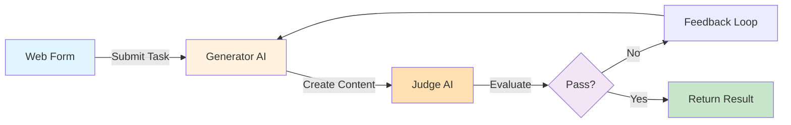

# Part A: Environment Setup

{: .no_toc }

## Table of contents

{: .no_toc .text-delta }

1. TOC
{:toc}

---

## Overview

In this section, you'll prepare your environment for the LLM as a Judge workflow. This includes setting up Google Gemini API credentials and understanding the quality control framework.

**Time Required**: 15 minutes

---

## Step 1: Set Up Google Gemini API

### Why Google Gemini?

For this exercise, we'll use Google Gemini for both the generator and judge AI models because:
- **Free tier available**: Generous free quota for learning and testing
- **Fast responses**: Quick iteration cycles
- **Good quality**: Reliable content generation and evaluation
- **Easy setup**: Simple API key authentication

### Get Your Gemini API Key

1. **Go to Google AI Studio**
   - Visit [ai.google.dev](https://ai.google.dev/)
   - Click **Get API key** in the top-right corner
   - Sign in with your Google account if prompted

2. **Create API Key**
   - Click **Create API key**
   - Select an existing Google Cloud project or create a new one
   - Copy the API key (starts with `AI...`)

   {: .warning }
   > **Important**: Save this API key securely. You won't be able to view it again.

3. **Test Your API Key (Optional)**

   You can test your key using curl:
   ```bash
   curl -H 'Content-Type: application/json' \
        -d '{"contents":[{"parts":[{"text":"Hello!"}]}]}' \
        -X POST 'https://generativelanguage.googleapis.com/v1beta/models/gemini-pro:generateContent?key=YOUR_API_KEY'
   ```

   Replace `YOUR_API_KEY` with your actual key. You should see a JSON response with generated text.

### Add Gemini Credentials to n8n

1. **Open n8n**
   - Launch your n8n instance
   - Log in if required

2. **Add Gemini Credential**
   - Click **Settings** (gear icon, bottom-left)
   - Select **Credentials**
   - Click **Add Credential**
   - Search for **Google Palm API** (used for Gemini)
   - Click to select

3. **Configure Credential**
   - **Name**: `Main Gemini` (or any name you prefer)
   - **API Key**: Paste your Gemini API key
   - Click **Save**

4. **Test Connection** (Optional)
   - In n8n, create a test workflow
   - Add an AI Agent node
   - Add Google Gemini Model sub-node
   - Select your credential
   - Test with a simple prompt

{: .highlight }
> **Credential Saved**: You can now use this credential in any n8n workflow that needs Google Gemini.

---

## Step 2: Understand the Workflow Architecture

### What You're Building



### How It Works

1. **User submits a web form** with:
   - Task description (what to generate)
   - Instructions (how to do it)
   - Success criteria (how to measure quality)

2. **Generator AI** creates content based on task and instructions

3. **Judge AI** evaluates content against success criteria:
   - Returns `passed: true` if quality standards met
   - Returns `passed: false` with detailed feedback if not

4. **Decision Logic**:
   - If **passed**: Return approved content to user via form
   - If **not passed**: Feed feedback back to generator, retry (up to 10 times)
   - If **max retries reached**: Return best attempt with failure status

### Key Benefits

- **No manual review needed**: Judge AI automates quality control
- **Self-improving**: Each iteration incorporates feedback
- **Transparent**: Returns status, feedback, and iteration count
- **Cost-controlled**: Maximum 10 iterations prevents runaway costs

---

## Step 3: Understanding Quality Evaluation

### The Judge's Role

The judge AI uses an "EXTREMELY STRICT" evaluation approach:

```
"You are an EXTREMELY STRICT quality judge with ZERO tolerance for mediocrity.
Evaluate the following output with RUTHLESS scrutiny."
```

This ensures high-quality outputs by:
- **Failing mediocre content**: Forces generator to improve
- **Providing specific feedback**: Tells exactly what's wrong
- **Being consistent**: Uses structured output (passed: boolean, feedback: string)

### Evaluation Output Format

The judge returns structured JSON:

```json
{
  "passed": false,
  "feedback": "Missing specific lunch location. Word count is 175 but should be 100-150. Greeting should be 'Dear' not 'Hi'."
}
```

### Example Evaluation Scenarios

**Scenario 1: First attempt fails**
```json
{
  "passed": false,
  "feedback": "Email lacks specific date and time for lunch invitation. Needs at least 2 specific contributions mentioned. Currently only mentions 'great work' generically."
}
```

**Scenario 2: Second attempt passes**
```json
{
  "passed": true,
  "feedback": "Excellent! Meets all criteria. Specific contributions mentioned (database optimization, UI redesign). Clear lunch details (Friday, 12:30 PM, Cafe Roma). Word count perfect (145 words). Professional yet warm tone maintained."
}
```

---

## Step 4: Planning Your Success Criteria

### Writing Effective Success Criteria

The quality of your results depends heavily on how you define success criteria. Here's how to write them effectively:

#### ❌ Too Vague

```
The email should be good and professional.
```

**Problem**: "Good" is subjective. Judge won't know what to look for.

#### ✅ Specific and Measurable

```
The email must:
1. Have proper greeting ("Dear [Name]")
2. Mention at least 2 specific contributions
3. Include lunch invitation with date, time, and location
4. Be 100-150 words
5. Have no grammatical errors
6. Maintain professional yet warm tone
```

**Better**: Each criterion is specific, measurable, and verifiable.

### Success Criteria Template

Use this template for any content type:

```
The [content type] must:
1. [Structural requirement] - e.g., "Include title and introduction"
2. [Content requirement] - e.g., "Mention X, Y, and Z"
3. [Length requirement] - e.g., "Be exactly 280 characters"
4. [Quality requirement] - e.g., "Use active voice throughout"
5. [Tone requirement] - e.g., "Maintain casual, friendly tone"
6. [Format requirement] - e.g., "End with call-to-action"
7. [Technical requirement] - e.g., "Zero spelling/grammar errors"
```

### Examples for Different Content Types

**Product Description**
```
Must include:
- At least 3 key features
- 1-2 emotional benefits
- Target audience pain point addressed
- Subtle call-to-action
- 150-200 words
- Professional but approachable tone
```

**Social Media Post**
```
Must include:
- Hook in first sentence
- Clear value proposition
- 1-2 relevant hashtags
- Call-to-action or question
- Under 280 characters
- Conversational tone
```

**Email Subject Line**
```
Must be:
- 5-10 words maximum
- Include benefit or curiosity gap
- No clickbait language
- Personalized if possible
- Action-oriented
```

---

## Step 5: Understanding Iteration Limits

### Why Max 10 Retries?

The workflow has a maximum of 10 iterations to:

1. **Control Costs**: Each API call costs money (even on free tier, quota is limited)
2. **Prevent Infinite Loops**: If criteria are impossible, workflow should fail gracefully
3. **Force Better Prompts**: Repeated failures indicate criteria or instructions need improvement
4. **Practical Limits**: If 10 attempts fail, manual intervention is needed

### Typical Iteration Patterns

**Most tasks**: 2-4 iterations
```
Iteration 1: Failed - Missing details
Iteration 2: Failed - Wrong tone
Iteration 3: Passed ✅
```

**Complex tasks**: 5-7 iterations
```
Iteration 1-3: Missing various criteria
Iteration 4-5: Improvements but still failing
Iteration 6: Passed ✅
```

**Impossible tasks**: All 10 iterations fail ⚠️
```
Iteration 1-10: Never passes
→ Indicates criteria too strict or instructions unclear
→ Manual review needed
```

### Adjusting Max Retries

You can modify the `max_retries` value in the workflow:

- **Lower (5)**: Faster failure, less cost, forces better inputs
- **Higher (15-20)**: More chances to pass, higher cost, useful for very complex tasks

---

## Step 6: Prepare Your First Test Task

### Recommended First Test

For your first workflow run, use this example task:

**Task Description:**
```
Draft an email to a colleague thanking them for their help on a project and inviting them to a celebration lunch.
```

**How to Do It (Instructions):**
```
Write a professional yet friendly email that:
1. Opens with a warm greeting
2. Expresses genuine appreciation for their specific contributions
3. Mentions the project success
4. Extends a lunch invitation with details
5. Closes politely
6. Keep it 100-150 words
```

**Success Criteria (How to Measure):**
```
The email must:
1. Have proper greeting and closing
2. Mention at least 2 specific contributions
3. Include clear lunch invitation with date/time/place
4. Be 100-150 words
5. Be grammatically perfect
6. Maintain a warm but professional tone
```

### Why This Example Works

- **Simple structure**: Email is familiar format
- **Clear criteria**: Easy to verify success
- **Specific requirements**: Judge can evaluate objectively
- **Moderate difficulty**: Should pass in 2-4 iterations
- **Real-world applicable**: Practical use case

---

## Step 7: Setup Checklist

Before moving to Part B, verify you have:

- ✅ Google Gemini API key obtained
- ✅ Gemini credential added to n8n
- ✅ Understand workflow architecture (form → generate → judge → loop/return)
- ✅ Understand quality evaluation approach (strict judge, structured output)
- ✅ Prepared test task with clear success criteria
- ✅ n8n instance is open and ready

---

## Troubleshooting

### "Can't get Gemini API key"

**Solutions**:
1. Ensure you're signed in to a Google account
2. Try visiting [makersuite.google.com/app/apikey](https://makersuite.google.com/app/apikey) directly
3. Check if Google AI is available in your region
4. Create a Google Cloud project first if required

### "Credential test fails in n8n"

**Solutions**:
1. Verify API key is copied correctly (no extra spaces)
2. Ensure API key starts with `AI`
3. Check your Gemini API quota hasn't been exhausted
4. Try generating a new API key
5. Verify Google Generative AI API is enabled in your Google Cloud project

### "Can I use a different AI provider?"

**Yes!** You can substitute:
- **OpenRouter** - Provides access to multiple models (GPT-4, Claude, etc.)
- **Anthropic Claude** - Direct API
- **OpenAI GPT-4** - Direct API
- **Local models** - Ollama with compatible models

You'll need to:
1. Update the AI model nodes in the workflow
2. Configure appropriate credentials
3. Adjust prompts if needed for the specific model

### "Do I need Google Sheets?"

**No!** The new workflow uses **Form Trigger** with `responseMode: lastNode`, which means:
- Results are returned directly to the web form
- No external storage needed
- Users see output immediately in browser
- Simpler setup, fewer dependencies

If you want to log results for analytics, you can add a Google Sheets node at the end (optional).

---

## What You've Accomplished

✅ Set up Google Gemini API credentials
✅ Understood the quality control workflow architecture
✅ Learned how to write effective success criteria
✅ Prepared a test task for your first run
✅ Ready to build the workflow in n8n

---

## Next Steps

Now that your environment is ready, let's build the workflow!

[Continue to Part B: Build Workflow →](./part-b-workflow){: .btn .btn-primary }
