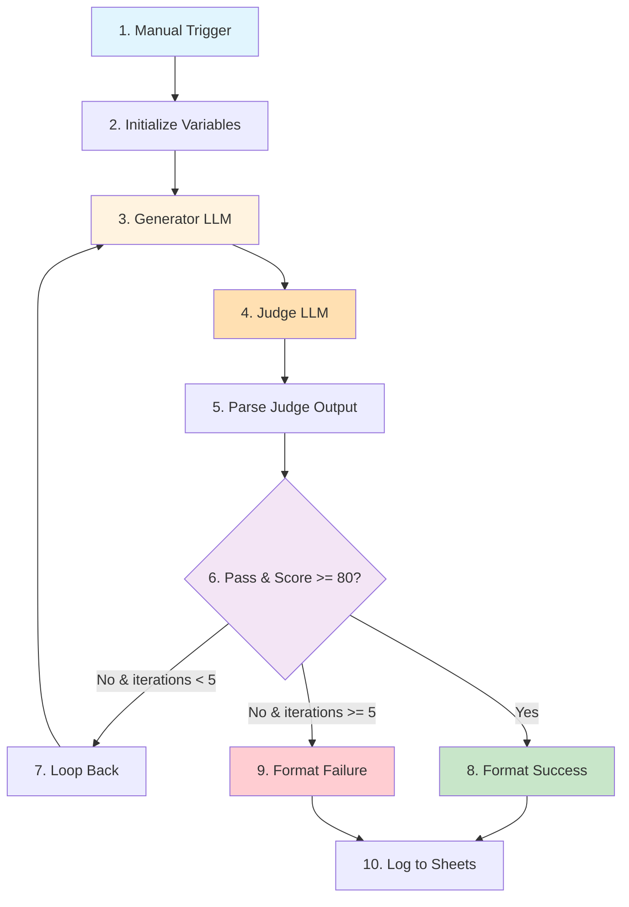

# Part B: Build the LLM Judge Workflow

{: .no_toc }

## Table of contents

{: .no_toc .text-delta }

1. TOC
{:toc}

---

## Overview

In this section, you'll build the complete LLM as a Judge workflow from scratch. We'll create a system where one AI generates content, another AI evaluates it, and the system iterates until quality standards are met.

**Time Required**: 40 minutes

---

## Workflow Architecture

### What We're Building



### Node Summary

| # | Node Name | Type | Purpose |
|---|-----------|------|---------|
| 1 | Manual Trigger | Trigger | Start workflow with input data |
| 2 | Initialize Variables | Code | Set up loop counter, score history |
| 3 | Generator LLM | LLM Chain | Create/improve content based on feedback |
| 4 | Judge LLM | LLM Chain | Evaluate content quality |
| 5 | Parse Judge Output | Code | Extract score, feedback, pass/fail |
| 6 | Quality Check | IF | Decide whether to iterate or finish |
| 7 | Loop Controller | Code | Increment counter, prepare next iteration |
| 8 | Format Success | Code | Package final approved content |
| 9 | Format Failure | Code | Package best attempt after max iterations |
| 10 | Log Results | Google Sheets | Save all data for analysis |

---

## Step 1: Create New Workflow

1. Open n8n
2. Click **+ Create new workflow**
3. Name it: `LLM as a Judge - Quality Control`
4. Click **Save**

---

## Step 2: Add Manual Trigger

### Purpose

The Manual Trigger lets you start the workflow with custom input (topic, audience, criteria).

### Configuration

1. Click **+ Add node** or press `Tab`
2. Search for **Manual Trigger**
3. Click to add

4. **Configure Fields**:
   - Click **Add Field**
   - Add these fields:

   | Field Name | Type | Description | Example Value |
   |------------|------|-------------|---------------|
   | `topic` | String | What content to generate | `Write a product description for wireless headphones` |
   | `target_audience` | String | Who the content is for | `Remote workers, 25-45 years old` |
   | `required_length` | Number | Target word count | `150` |
   | `pass_threshold` | Number | Minimum score to pass (0-100) | `80` |

5. Click **Execute Node** to test with sample values

{: .highlight }
> **Pro Tip**: These fields make your workflow reusable for any content type!

---

## Step 3: Add Initialize Variables Node

### Purpose

Set up tracking variables for the iteration loop (counter, scores, feedback history).

### Configuration

1. Add **Code** node (connect to Manual Trigger)
2. Rename to: `Initialize Variables`

3. **Paste this code**:

```javascript
// Initialize tracking variables for iteration loop
const inputData = $input.first().json;

return [{
  json: {
    // User inputs
    topic: inputData.topic,
    target_audience: inputData.target_audience,
    required_length: inputData.required_length || 150,
    pass_threshold: inputData.pass_threshold || 80,

    // Iteration tracking
    iteration: 0,
    max_iterations: 5,

    // Content tracking
    current_content: "",
    previous_feedback: "",

    // Scoring history
    score_history: [],
    feedback_history: [],

    // Status
    passed: false,
    final_score: 0
  }
}];
```

4. Click **Test step**

**Expected Output**: JSON object with all variables initialized.

---

## Step 4: Add Generator LLM Chain

### Purpose

The Generator LLM creates content based on the topic. On first iteration, it generates fresh content. On subsequent iterations, it improves based on judge feedback.

### Configuration

1. Add **LLM Chain** node
2. Rename to: `Generator LLM`

3. **Configure Model**:
   - Add sub-node: **OpenRouter Chat Model**
   - Model: `anthropic/claude-3.5-sonnet` (or `openai/gpt-4o`)
   - Credential: Select your OpenRouter credential

4. **Configure Prompt**:

Click on the LLM Chain node and set **Prompt** to:

```
You are an expert content creator. Generate high-quality content based on these requirements:

TOPIC: {{ $json.topic }}
TARGET AUDIENCE: {{ $json.target_audience }}
REQUIRED LENGTH: {{ $json.required_length }} words

{{ $json.iteration === 0 ?
  "Create compelling, original content that meets all requirements."
  :
  "PREVIOUS ATTEMPT HAD ISSUES. Improve based on this feedback:\n\n" + $json.previous_feedback
}}

Generate ONLY the content itself, no meta-commentary.
```

**How it works**:
- **First iteration** (`iteration === 0`): Fresh generation
- **Later iterations**: Incorporates feedback from judge

5. Click **Test step**

**Expected Output**: Generated content text.

---

## Step 5: Add Judge LLM Chain

### Purpose

The Judge LLM evaluates content quality against criteria and provides structured feedback.

### Configuration

1. Add **LLM Chain** node (after Generator)
2. Rename to: `Judge LLM`

3. **Configure Model**:
   - Add sub-node: **OpenRouter Chat Model**
   - Model: `openai/gpt-4o-mini` (cheaper model is fine for judging)
   - Credential: Select your OpenRouter credential

4. **Add Structured Output Parser**:
   - Add sub-node: **Structured Output Parser**
   - Schema Type: **From JSON Schema**
   - Paste this schema:

```json
{
  "$schema": "http://json-schema.org/draft-07/schema#",
  "type": "object",
  "properties": {
    "overall_score": {
      "type": "number",
      "description": "Overall quality score from 0-100"
    },
    "pass": {
      "type": "boolean",
      "description": "Whether content meets quality standards"
    },
    "criteria_scores": {
      "type": "object",
      "properties": {
        "accuracy": {"type": "number"},
        "clarity": {"type": "number"},
        "completeness": {"type": "number"},
        "tone": {"type": "number"},
        "creativity": {"type": "number"}
      }
    },
    "feedback": {
      "type": "string",
      "description": "Summary of strengths and weaknesses"
    },
    "specific_improvements": {
      "type": "array",
      "items": {"type": "string"},
      "description": "List of specific improvements needed"
    }
  },
  "required": ["overall_score", "pass", "criteria_scores", "feedback", "specific_improvements"]
}
```

5. **Configure Judge Prompt**:

```
You are a strict quality evaluator. Evaluate this content objectively against the criteria below.

CONTENT TO EVALUATE:
{{ $('Generator LLM').item.json.output }}

REQUIREMENTS:
- Topic: {{ $('Initialize Variables').item.json.topic }}
- Target Audience: {{ $('Initialize Variables').item.json.target_audience }}
- Required Length: {{ $('Initialize Variables').item.json.required_length }} words

EVALUATION CRITERIA (score each 0-100):

1. ACCURACY (25% weight):
   - Factually correct information
   - No hallucinations or false claims
   - Verifiable statements

2. CLARITY (25% weight):
   - Easy to understand
   - Well-structured sentences
   - Logical flow
   - Appropriate vocabulary

3. COMPLETENESS (20% weight):
   - Covers all required points
   - Includes necessary details
   - Meets length requirement
   - Addresses full topic

4. TONE (15% weight):
   - Matches target audience
   - Appropriate formality
   - Consistent voice

5. CREATIVITY (15% weight):
   - Engaging and interesting
   - Original angles
   - Vivid examples

SCORING:
- Calculate weighted average for overall_score
- Set pass = true if overall_score >= {{ $('Initialize Variables').item.json.pass_threshold }}
- Provide specific, actionable improvements
- Be strict but fair

Evaluate now and return structured JSON.
```

6. Click **Test step**

**Expected Output**: Structured JSON with scores, pass/fail, and feedback.

---

## Step 6: Add Parse Judge Output Node

### Purpose

Extract the judge's evaluation into clean variables for decision logic.

### Configuration

1. Add **Code** node (after Judge LLM)
2. Rename to: `Parse Judge Output`

3. **Paste this code**:

```javascript
// Parse judge output and merge with existing data
const previousData = $('Initialize Variables').item.json;
const generatorOutput = $('Generator LLM').item.json.output;
const judgeOutput = $input.first().json.output;

// Increment iteration counter
const currentIteration = previousData.iteration + 1;

// Update score and feedback history
const scoreHistory = [...previousData.score_history, judgeOutput.overall_score];
const feedbackHistory = [...previousData.feedback_history, judgeOutput.feedback];

return [{
  json: {
    // Preserve original inputs
    topic: previousData.topic,
    target_audience: previousData.target_audience,
    required_length: previousData.required_length,
    pass_threshold: previousData.pass_threshold,
    max_iterations: previousData.max_iterations,

    // Update iteration state
    iteration: currentIteration,

    // Current content and feedback
    current_content: generatorOutput,
    previous_feedback: judgeOutput.specific_improvements.join(". "),

    // Latest judge evaluation
    final_score: judgeOutput.overall_score,
    passed: judgeOutput.pass,
    criteria_scores: judgeOutput.criteria_scores,
    current_feedback: judgeOutput.feedback,

    // History tracking
    score_history: scoreHistory,
    feedback_history: feedbackHistory,

    // For logging
    all_scores: scoreHistory.join(", "),
    all_feedback: feedbackHistory.join(" | ")
  }
}];
```

4. Click **Test step**

**Expected Output**: Combined object with iteration tracking and judge results.

---

## Step 7: Add Quality Check (IF Node)

### Purpose

Decision point: Should we accept the content, iterate again, or give up after max iterations?

### Configuration

1. Add **IF** node (after Parse Judge Output)
2. Rename to: `Quality Check`

3. **Configure Conditions**:

   **Condition 1 - Content Passed**:
   - Value 1: `{{ $json.passed }}`
   - Operation: `equals`
   - Value 2: `true`

   **AND**

   - Value 1: `{{ $json.final_score }}`
   - Operation: `>= (greater than or equal)`
   - Value 2: `{{ $json.pass_threshold }}`

   **Condition 2 - Max Iterations Reached**:
   - Value 1: `{{ $json.iteration }}`
   - Operation: `>= (greater than or equal)`
   - Value 2: `{{ $json.max_iterations }}`

4. **Output Routing**:
   - **True** branch: Content passed OR max iterations reached (stop iterating)
   - **False** branch: Content failed AND under max iterations (loop again)

---

## Step 8: Add Loop Controller Node

### Purpose

When quality check fails, prepare variables for next iteration and loop back to Generator.

### Configuration

1. Connect **IF (false)** output to new **Code** node
2. Rename to: `Loop Controller`

3. **Paste this code**:

```javascript
// Prepare for next iteration
const data = $input.first().json;

return [{
  json: {
    // Pass through everything
    ...data,

    // Update iteration state for next loop
    iteration: data.iteration,  // Already incremented in Parse node

    // Log current attempt
    loop_reason: `Iteration ${data.iteration}: Score ${data.final_score} < ${data.pass_threshold}. Feedback: ${data.current_feedback}`
  }
}];
```

4. **Create Loop Connection**:
   - Drag connection from **Loop Controller** output back to **Generator LLM** input
   - This creates the iteration loop!

---

## Step 9: Add Split for Success/Failure

After the **IF (true)** output, we need to handle two cases:
1. Content passed quality check
2. Max iterations reached (failure)

### Configuration

1. Add another **IF** node after the first one (true branch)
2. Rename to: `Success or Max Iterations`

3. **Configure Condition**:
   - Value 1: `{{ $json.passed }}`
   - Operation: `equals`
   - Value 2: `true`

**Outputs**:
- **True**: Content passed - Success!
- **False**: Max iterations reached - Failure

---

## Step 10: Add Format Success Node

### Purpose

Package successful results for logging.

### Configuration

1. Connect **Success or Max Iterations (true)** to new **Code** node
2. Rename to: `Format Success`

3. **Paste this code**:

```javascript
// Format successful result for logging
const data = $input.first().json;

return [{
  json: {
    timestamp: new Date().toISOString(),
    topic: data.topic,
    target_audience: data.target_audience,
    iteration_count: data.iteration,
    final_score: data.final_score,
    passed: true,
    final_content: data.current_content,
    all_scores: data.all_scores,
    all_feedback: data.all_feedback,
    total_iterations: data.iteration,
    status: "SUCCESS",
    criteria_breakdown: JSON.stringify(data.criteria_scores)
  }
}];
```

---

## Step 11: Add Format Failure Node

### Purpose

Package failure results (max iterations reached but quality not met).

### Configuration

1. Connect **Success or Max Iterations (false)** to new **Code** node
2. Rename to: `Format Failure`

3. **Paste this code**:

```javascript
// Format failure result (best attempt after max iterations)
const data = $input.first().json;

return [{
  json: {
    timestamp: new Date().toISOString(),
    topic: data.topic,
    target_audience: data.target_audience,
    iteration_count: data.iteration,
    final_score: data.final_score,
    passed: false,
    final_content: data.current_content,
    all_scores: data.all_scores,
    all_feedback: data.all_feedback,
    total_iterations: data.iteration,
    status: "MAX_ITERATIONS_REACHED",
    criteria_breakdown: JSON.stringify(data.criteria_scores),
    note: `Best attempt after ${data.max_iterations} iterations. Final score: ${data.final_score}/${data.pass_threshold}`
  }
}];
```

---

## Step 12: Add Google Sheets Logger

### Purpose

Log all results (success and failure) to your tracking spreadsheet.

### Configuration

1. Add **Google Sheets** node
2. Connect BOTH **Format Success** and **Format Failure** to this node
3. Rename to: `Log to Quality Tracker`

4. **Configure Operation**:
   - Operation: `Append or Update`
   - Document: Select `LLM Judge Quality Log` (or paste your Spreadsheet ID)
   - Sheet: `Sheet1`

5. **Column Mapping**:
   - Mapping Mode: `Auto-map Input Data`
   - This automatically maps all fields from Format nodes to sheet columns

6. **Credential**: Select your Google Sheets OAuth2 credential

---

## Step 13: Test the Complete Workflow

### First Test Run

1. **Go back to Manual Trigger**
2. **Set test values**:
   ```
   topic: "Write a product description for wireless noise-cancelling headphones"
   target_audience: "Remote workers, ages 25-45"
   required_length: 150
   pass_threshold: 80
   ```

3. **Click "Execute Workflow"**

4. **Watch the execution**:
   - Generator creates first draft
   - Judge evaluates
   - If score < 80: Loop back for iteration 2
   - Repeat until pass or max iterations
   - Log final result to Google Sheets

5. **Check Google Sheets**:
   - Open your `LLM Judge Quality Log` sheet
   - Verify new row appeared
   - Check scores across iterations
   - Read final content

### Expected Behavior

**Scenario 1: Success in 2-3 iterations**
```
Iteration 1: Score 65 → Feedback: "Add battery life, improve tone"
Iteration 2: Score 78 → Feedback: "Strengthen call-to-action"
Iteration 3: Score 85 → PASS! ✅
```

**Scenario 2: Max iterations reached**
```
Iteration 1-5: Scores 60, 68, 72, 75, 78
Max iterations reached. Logged best attempt (78/100) ⚠️
```

---

## Step 14: Optimize and Tune

### Adjust Quality Threshold

If too many runs are failing:
- Lower `pass_threshold` from 80 to 75
- Or increase `max_iterations` from 5 to 7

### Improve Judge Prompts

Make evaluation criteria more specific:
- Add examples of good vs bad content
- Define exact requirements for each criterion
- Calibrate scoring (70-80 is good, 80-90 is great, 90+ is exceptional)

### Try Different Models

**For Generation**:
- **Creative content**: Claude 3.5 Sonnet, GPT-4o
- **Factual content**: GPT-4 Turbo, Gemini Pro
- **Fast iteration**: GPT-4o-mini, Gemini Flash

**For Judging**:
- **Strict evaluation**: GPT-4o, Claude 3.5 Sonnet
- **Cost-effective**: GPT-4o-mini, Gemini Flash
- **Balanced**: Claude 3 Haiku

---

## Step 15: Save and Activate

1. **Save Workflow**: Ctrl/Cmd + S
2. **Test Multiple Times**: Try different topics
3. **Review Results**: Check patterns in Google Sheets
4. **Fine-tune**: Adjust thresholds and prompts based on results

---

## Understanding the Flow

### Visual Execution Path

**Success Path**:
```
Manual Trigger → Initialize → Generator → Judge → Parse
→ Quality Check (PASS) → Success Split (TRUE)
→ Format Success → Log to Sheets ✅
```

**Iteration Path**:
```
Manual Trigger → Initialize → Generator → Judge → Parse
→ Quality Check (FAIL & <5 iterations) → Loop Controller
→ [back to Generator with feedback] → ... → Eventually Success or Max Iterations
```

**Failure Path**:
```
... 5 iterations ... → Quality Check (iteration >= 5)
→ Success Split (FALSE) → Format Failure → Log to Sheets ⚠️
```

### Key Variables Tracked

| Variable | Purpose | Example |
|----------|---------|---------|
| `iteration` | Current attempt number | `3` |
| `score_history` | All scores | `[65, 78, 85]` |
| `feedback_history` | All feedback | `["Add details", "Good!", "Perfect"]` |
| `current_content` | Latest generated content | `"Experience premium sound..."` |
| `previous_feedback` | Fed back to generator | `"Strengthen conclusion. Add CTA."` |
| `passed` | Quality gate status | `true` |

---

## Troubleshooting

### Workflow keeps looping infinitely

**Cause**: Quality Check condition might be wrong

**Fix**:
- Check IF node has TWO conditions with OR logic
- Ensure `iteration >= max_iterations` stops the loop

### Generator doesn't improve on iterations

**Cause**: Feedback not being passed correctly

**Fix**:
- Verify Loop Controller connects to Generator LLM input
- Check `previous_feedback` is populated in Parse node
- Ensure Generator prompt uses `{{ $json.previous_feedback }}`

### Judge always gives same score

**Cause**: Not enough variation in evaluation or prompt too vague

**Fix**:
- Make judge prompt more specific with examples
- Use different model for judge vs generator
- Add more detailed criteria descriptions

### Google Sheets not logging

**Cause**: Credential or sheet ID issue

**Fix**:
- Verify OAuth2 credential is authenticated
- Check Spreadsheet ID is correct
- Ensure sheet name matches ("Sheet1")
- Test credential with simple append operation

---

## What You've Accomplished

✅ Built complete LLM as a Judge workflow
✅ Implemented iterative quality improvement loop
✅ Created structured evaluation system
✅ Added loop controls and exit conditions
✅ Logged results to Google Sheets for analysis
✅ Tested with real content generation

---

## Next Steps

Now that your workflow is working:

1. **Test Different Content Types**: Blog posts, emails, social media
2. **Analyze Patterns**: Review Google Sheets to see common feedback
3. **Optimize Prompts**: Refine generator and judge based on results
4. **Try Challenge Tasks**: Multi-criteria evaluation, A/B testing, automatic optimization

[Continue to Challenge Tasks →](./challenge-tasks){: .btn .btn-primary }
