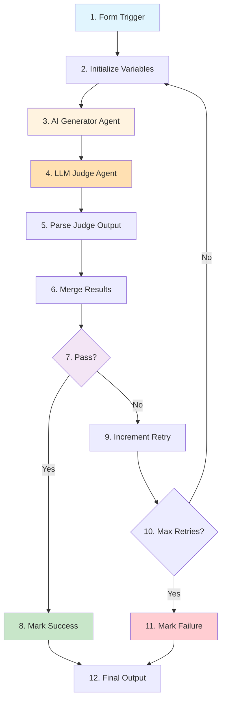

# Part B: Build the LLM Judge Workflow

{: .no_toc }

## Table of contents

{: .no_toc .text-delta }

1. TOC
{:toc}

---

## Overview

In this section, you'll build the complete LLM as a Judge workflow from scratch. We'll create a system where one AI generates content, another AI evaluates it, and the system iterates until quality standards are met.

**Time Required**: 40 minutes

---

## Workflow Architecture

### What We're Building



### Node Summary

| # | Node Name | Type | Purpose |
|---|-----------|------|---------|
| 1 | Form Trigger | Form Trigger | Collect task, instructions, and success criteria |
| 2 | Initialize Variables | Edit Fields (Set) | Set up loop counter and tracking variables |
| 3 | AI Generator Agent | AI Agent | Create/improve content based on instructions |
| 4 | LLM Judge Agent | AI Agent | Evaluate content against success criteria |
| 5 | Parse Judge Output | Structured Output Parser | Extract passed/failed status and feedback |
| 6 | Merge Results | Edit Fields (Set) | Combine evaluation with generated output |
| 7 | Check Pass/Fail | IF | Decide whether content passes quality check |
| 8 | Mark Success | Edit Fields (Set) | Set status to "success" |
| 9 | Increment Retry | Edit Fields (Set) | Increment counter and update feedback |
| 10 | Max Retries Check | IF | Check if max retries reached |
| 11 | Mark Failure | Edit Fields (Set) | Set status to "failed" |
| 12 | Final Output | Edit Fields (Set) | Format and return final results |

---

## Quick Start: Import the Workflow

### Option 1: Import Pre-built Workflow (Recommended)

The fastest way to complete this exercise is to import the pre-built workflow:

1. **Download** the workflow file: [llm-judge-workflow.json](./downloads/llm-judge-workflow.json)
2. Open n8n and click **Import from File**
3. Select the downloaded JSON file
4. **Update credentials**:
   - Configure Google Gemini API credentials (see [Part A: Setup](./part-a-setup))
5. **Test the workflow** by clicking the Form Trigger URL

{: .highlight }
> **Note**: You'll still need to set up Google Gemini credentials as described in Part A.

### Option 2: Build from Scratch

Follow the detailed instructions below to build the workflow step-by-step and learn how each component works.

---

## Step 1: Create New Workflow

1. Open n8n
2. Click **+ Create new workflow**
3. Name it: `LLM as a Judge - Quality Control`
4. Click **Save**

---

## Step 2: Add Form Trigger

### Purpose

The Form Trigger creates a web form where users can submit tasks for AI generation with quality control.

### Configuration

1. Click **+ Add node** or press `Tab`
2. Search for **Form Trigger**
3. Click to add

4. **Configure the form**:
   - **Form Title**: `Task Submission Form`
   - **Form Description**: `Submit a task for AI generation with quality control`

5. **Add Form Fields**:
   Click **Add Field** three times and configure:

   | Field Label | Field Type | Required |
   |-------------|------------|----------|
   | Task Description | Textarea | Yes |
   | How to Do It (Instructions) | Textarea | Yes |
   | Success Criteria (How to Measure) | Textarea | Yes |

6. **Response Mode**: Set to `Last Node` (returns the final output to the form)

7. Click **Test step** to get the form URL

{: .highlight }
> **Pro Tip**: Copy the form URL - you'll use this to submit test tasks!

### Example Form Input

**Task Description:**
```
Draft an email to a colleague thanking them for their help on a project and inviting them to a celebration lunch.
```

**How to Do It (Instructions):**
```
Write a professional yet friendly email that:
1. Opens with a warm greeting
2. Expresses genuine appreciation for their specific contributions
3. Mentions the project success
4. Extends a lunch invitation with details
5. Closes politely
6. Keep it 100-150 words
```

**Success Criteria (How to Measure):**
```
The email must:
1. Have proper greeting and closing
2. Mention at least 2 specific contributions
3. Include clear lunch invitation with date/time/place
4. Be 100-150 words
5. Be grammatically perfect
6. Maintain a warm but professional tone
```

---

## Step 3: Add Initialize Variables Node

### Purpose

Set up tracking variables for the iteration loop (retry counter, max retries, feedback).

### Configuration

1. Add **Edit Fields (Set)** node (connect to Form Trigger)
2. Rename to: `Initialize Variables`

3. **Configure Assignments**:

   | Field Name | Type | Value | Purpose |
   |------------|------|-------|---------|
   | retry_count | Number | `={{ $json.retry_count \|\| 0 }}` | Current attempt number |
   | max_retries | Number | `=10` | Maximum allowed attempts |
   | previous_feedback | String | `={{ $json.previous_feedback \|\| null }}` | Feedback from judge |
   | ai_output | String | `={{ $json.ai_output \|\| null }}` | Generated content |

4. Click **Test step**

**Expected Output**: JSON object with initialized variables.

---

## Step 4: Add AI Generator Agent

### Purpose

The Generator creates content based on the task and instructions. On subsequent iterations, it improves based on judge feedback.

### Configuration

1. Add **AI Agent** node (after Initialize Variables)
2. Rename to: `AI Agent - Generator`

3. **Configure Model Sub-node**:
   - Click on the node to open configuration
   - Add a **Google Gemini Model** sub-node
   - Connect it to the AI Agent
   - Select your Google Gemini credential

4. **Configure Prompt**:

```
=Task: {{ $('Form Trigger').item.json['Task Description'] }}

Instructions: {{ $('Form Trigger').item.json['How to Do It (Instructions)'] }}

{{ $json.previous_feedback ? 'Previous Feedback: ' + $json.previous_feedback : '' }}

Please generate the output according to the task description and instructions. Ensure it meets the success criteria{{ $json.previous_feedback ? ' and addresses the feedback provided' : '' }}.
```

**How it works**:
- **First iteration**: Generates fresh content based on task and instructions
- **Later iterations**: Incorporates previous feedback from the judge

5. Click **Test step**

**Expected Output**: Generated content text in the `output` field.

---

## Step 5: Add LLM Judge Agent

### Purpose

The Judge evaluates content quality against success criteria and provides strict, structured feedback.

### Configuration

1. Add **AI Agent** node (after AI Generator)
2. Rename to: `LLM Judge`

3. **Configure Model Sub-node**:
   - Add a **Google Gemini Judge Model** sub-node
   - Connect it to the LLM Judge
   - Select your Google Gemini credential
   - **Enable Output Parser**: Check the box

4. **Add Structured Output Parser**:
   - Add sub-node: **Structured Output Parser**
   - **Schema Type**: `Manual`
   - **Input Schema**:

```json
{
  "type": "object",
  "properties": {
    "passed": {
      "type": "boolean",
      "description": "Whether the output meets the success criteria"
    },
    "feedback": {
      "type": "string",
      "description": "Detailed feedback on what needs improvement"
    }
  },
  "required": ["passed", "feedback"]
}
```

   - **Auto-Fix**: Enable

5. **Configure Judge Prompt**:

```
=You are an EXTREMELY STRICT quality judge with ZERO tolerance for mediocrity. Evaluate the following output with RUTHLESS scrutiny.

Task: {{ $('Form Trigger').item.json['Task Description'] }}

Success Criteria: {{ $('Form Trigger').item.json['Success Criteria (How to Measure)'] }}

Generated Output: {{ $json.output }}
```

**Why this prompt works**:
- **Extremely strict**: Ensures high-quality output
- **Zero tolerance**: Prevents accepting mediocre results
- **Ruthless scrutiny**: Forces careful evaluation
- **Structured output**: Returns consistent JSON format

6. Click **Test step**

**Expected Output**: Structured JSON with `passed` (boolean) and `feedback` (string).

---

## Step 6: Add Merge Results Node

### Purpose

Combine the judge's evaluation with the generator's output and tracking variables.

### Configuration

1. Add **Edit Fields (Set)** node (after LLM Judge)
2. Rename to: `Merge Results`

3. **Configure Assignments**:

   | Field Name | Type | Value |
   |------------|------|-------|
   | evaluation_result | Boolean | `={{ $json.output.passed }}` |
   | feedback | String | `={{ $json.output.feedback }}` |
   | output | String | `={{ $('AI Agent - Generator').item.json.output }}` |
   | max_retries | Number | `={{ $('Initialize Variables').item.json.max_retries }}` |
   | retry_count | Number | `={{ $('Initialize Variables').item.json.retry_count }}` |

4. Click **Test step**

**Expected Output**: Combined object with evaluation results and generated content.

---

## Step 7: Add Check Pass/Fail Node

### Purpose

Decision point: Did the content pass the quality check?

### Configuration

1. Add **IF** node (after Merge Results)
2. Rename to: `Check Pass/Fail`

3. **Configure Condition**:
   - **Left Value**: `={{ $json.evaluation_result }}`
   - **Operation**: `equals`
   - **Right Value**: `true`

**Output Routing**:
- **True** branch: Content passed - go to success path
- **False** branch: Content failed - go to retry path

---

## Step 8: Add Mark Success Node

### Purpose

When content passes, set status to "success".

### Configuration

1. Connect **Check Pass/Fail (true)** to new **Edit Fields (Set)** node
2. Rename to: `Mark Success`

3. **Configure Assignments**:
   - **Field Name**: `status`
   - **Type**: String
   - **Value**: `success`

4. **Enable**: `Include Other Fields` (passes all previous data through)

---

## Step 9: Add Increment Retry Node

### Purpose

When content fails, increment the retry counter and save feedback for the next attempt.

### Configuration

1. Connect **Check Pass/Fail (false)** to new **Edit Fields (Set)** node
2. Rename to: `Increment Retry`

3. **Configure Assignments**:

   | Field Name | Type | Value |
   |------------|------|-------|
   | retry_count | Number | `={{ ($json.retry_count \|\| 0) + 1 }}` |
   | previous_feedback | String | `={{ $json.feedback }}` |

4. **Enable**: `Include Other Fields`

---

## Step 10: Add Max Retries Check Node

### Purpose

After incrementing retry count, check if we've hit the maximum allowed retries.

### Configuration

1. Add **IF** node (after Increment Retry)
2. Rename to: `Max Retries Check`

3. **Configure Condition**:
   - **Left Value**: `={{ $json.retry_count >= $json.max_retries }}`
   - **Operation**: `is true`

**Output Routing**:
- **True** branch: Max retries reached - go to failure path
- **False** branch: Can retry - loop back to Initialize Variables

4. **Create Loop Connection**:
   - Drag connection from **Max Retries Check (false)** output back to **Initialize Variables** input
   - This creates the iteration loop!

---

## Step 11: Add Mark Failure Node

### Purpose

When max retries reached without passing, set status to "failed".

### Configuration

1. Connect **Max Retries Check (true)** to new **Edit Fields (Set)** node
2. Rename to: `Mark Failure`

3. **Configure Assignments**:
   - **Field Name**: `status`
   - **Type**: String
   - **Value**: `failed`

4. **Enable**: `Include Other Fields`

---

## Step 12: Add Final Output Node

### Purpose

Format and return the final results (success or failure) back to the form.

### Configuration

1. Add **Edit Fields (Set)** node
2. Connect BOTH **Mark Success** and **Mark Failure** to this node
3. Rename to: `Final Output`

4. **Configure Assignments**:

   | Field Name | Type | Value |
   |------------|------|-------|
   | status | String | `={{ $json.status }}` |
   | evaluation_result | Boolean | `={{ $json.evaluation_result }}` |
   | feedback | String | `={{ $json.feedback }}` |
   | output | String | `={{ $json.output }}` |
   | retry_count | Number | `={{ $json.retry_count }}` |

**Expected Output**: Final formatted results showing status, output, feedback, and retry count.

---

## Step 13: Test the Complete Workflow

### Activate the Workflow

1. Click **Activate** toggle in the top-right corner
2. Copy the **Form URL** from the Form Trigger node

### First Test Run

1. **Open the form URL** in a new browser tab
2. **Fill in the form** with the example task (see Step 2)
3. **Submit the form**

4. **Watch the execution** in n8n:
   - Generator creates first draft
   - Judge evaluates
   - If failed: Loop back for iteration 2
   - Repeat until pass or max retries (10)
   - Return final result to form

5. **Check the results**:
   - You should see the final output in the form
   - Check the status (success/failed)
   - Read the generated content
   - Review feedback and retry count

### Expected Behavior

**Scenario 1: Success in 2-3 iterations**
```
Iteration 1: Failed → Feedback: "Missing specific lunch details"
Iteration 2: Failed → Feedback: "Word count too high (175 words)"
Iteration 3: Passed! ✅
Status: success
Retry Count: 3
```

**Scenario 2: Max iterations reached**
```
Iteration 1-10: All failed for various reasons
Status: failed
Retry Count: 10
Final feedback: "Best attempt after 10 iterations"
```

---

## Understanding the Flow

### Visual Execution Path

**Success Path**:
```
Form → Initialize → Generator → Judge → Merge → Check (PASS)
→ Mark Success → Final Output → Return to Form ✅
```

**Iteration Path**:
```
Form → Initialize → Generator → Judge → Merge → Check (FAIL)
→ Increment Retry → Max Check (< 10)
→ [Loop back to Initialize with feedback]
→ ... → Eventually Success or Failure
```

**Failure Path**:
```
... 10 iterations ... → Max Check (≥ 10)
→ Mark Failure → Final Output → Return to Form ⚠️
```

### Key Variables Tracked

| Variable | Purpose | Example |
|----------|---------|---------|
| `retry_count` | Current attempt number | `3` |
| `max_retries` | Maximum allowed attempts | `10` |
| `previous_feedback` | Fed back to generator | `"Add lunch location details"` |
| `evaluation_result` | Pass/fail status | `true` |
| `output` | Latest generated content | `"Dear Sarah, ..."` |
| `feedback` | Judge's feedback | `"Excellent! Meets all criteria."` |
| `status` | Final workflow status | `"success"` or `"failed"` |

---

## Step 14: Optimize and Tune

### Adjust Retry Limit

If too many runs are failing:
- Increase `max_retries` from 10 to 15 or 20
- Or make success criteria less strict

### Improve Judge Prompts

Make evaluation criteria more specific:
- Add examples of passing vs failing content
- Define exact requirements
- Provide scoring rubrics
- Use comparative language ("must have X AND Y")

### Test Different Scenarios

Try various task types:
- **Short content**: Social media posts (50 words)
- **Medium content**: Emails (150 words)
- **Long content**: Blog posts (500 words)
- **Technical**: Code explanations
- **Creative**: Story introductions
- **Professional**: Business proposals

---

## Troubleshooting

### Workflow keeps looping infinitely

**Cause**: Max retries check might be wrong

**Fix**:
- Verify Max Retries Check condition: `retry_count >= max_retries`
- Ensure the true branch goes to Mark Failure
- Check that Initialize Variables increments properly

### Generator doesn't improve on iterations

**Cause**: Feedback not being passed correctly

**Fix**:
- Verify Increment Retry sets `previous_feedback` correctly
- Check that Initialize Variables preserves `previous_feedback`
- Ensure Generator prompt uses `$json.previous_feedback`

### Judge always passes or always fails

**Cause**: Judge prompt too lenient or too strict

**Fix**:
- Adjust judge prompt severity
- Make success criteria more specific
- Add examples of passing/failing content
- Test with different Gemini model versions

### Form doesn't return results

**Cause**: Response mode not set correctly

**Fix**:
- Verify Form Trigger **Response Mode** is set to `Last Node`
- Ensure Final Output node is connected properly
- Check that workflow is activated

---

## What You've Accomplished

✅ Built complete LLM as a Judge workflow with form interface
✅ Implemented iterative quality improvement loop (up to 10 retries)
✅ Created structured evaluation system with pass/fail logic
✅ Added loop controls and exit conditions
✅ Tested with real content generation tasks
✅ Learned how to tune quality thresholds and prompts

---

## Next Steps

Now that your workflow is working:

1. **Test Different Content Types**: Try emails, blog posts, code, documentation
2. **Analyze Patterns**: Track common failure reasons
3. **Optimize Prompts**: Refine generator and judge based on results
4. **Adjust Strictness**: Balance quality vs iteration count
5. **Try Challenge Tasks**: Multi-criteria evaluation, A/B testing, automatic optimization

---

## Push Your Workflow to GitHub

### Export and Save Your Work

Now that you've built your workflow, it's important to save it to your GitHub repository. This creates a backup and allows you to track changes over time.

#### Step 1: Export Your Workflow from n8n

1. In your n8n workflow canvas, click the **three-dot menu** (⋮) in the top-right corner
2. Select **"Download"** or **"Export workflow"**
3. Save the JSON file to your computer with a descriptive name:
   - Example: `llm-judge-workflow.json`

{: .note }
> **Tip**: The exported file contains your entire workflow structure, but credentials are not included for security reasons.

#### Step 2: Upload to GitHub via UI

1. **Navigate to your GitHub repository** in your web browser
2. **Go to the workflows folder** (or create one if it doesn't exist):
   - Click **"Add file"** → **"Create new file"**
   - Type `workflows/` in the filename field to create the folder
3. **Upload your workflow**:
   - Click **"Add file"** → **"Upload files"**
   - Drag and drop your exported JSON file, or click to browse
   - Alternatively, click **"Create new file"** and paste the JSON content
4. **Commit your changes**:
   - Add a commit message: `Add LLM as a Judge workflow`
   - Choose **"Commit directly to the main branch"** or create a new branch
   - Click **"Commit changes"**

{: .highlight }
> **Success!** Your workflow is now safely stored in GitHub and can be shared with others or imported into a different n8n instance.

---

[Continue to Challenge Tasks →](./challenge-tasks){: .btn .btn-primary }
