# Part B: Build the LLM Judge Workflow

{: .no_toc }

## Table of contents

{: .no_toc .text-delta }

1. TOC
{:toc}

---

## Overview

In this section, you'll build the complete LLM as a Judge workflow from scratch. We'll create a system where one AI generates content, another AI evaluates it, and the system iterates until quality standards are met.

**Time Required**: 40 minutes

---

## Workflow Architecture

### What We're Building

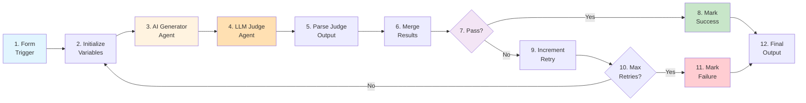

### Workflow Nodes Reference

Quick reference of all the nodes you'll build in this exercise:

| # | Node Name | Type | Purpose | Key Configuration |
|---|-----------|------|---------|-------------------|
| 1 | Form Trigger | Form Trigger | Collect task, instructions, and success criteria | 3 textarea fields, Response Mode: Last Node |
| 2 | Set Loop Variable | Edit Fields (Set) | Set up loop counter and tracking variables | retry_count, max_retries (10), previous_feedback, ai_output |
| 3 | AI Agent - Generator | AI Agent | Create/improve content based on instructions | Dynamic prompt with conditional feedback, NO structured output |
| 4 | LLM Judge | AI Agent | Evaluate content against success criteria | Strict evaluation prompt, YES structured output |
| 5 | Parse Judge Output | Structured Output Parser | Extract passed/failed status and feedback | Schema: {passed: boolean, feedback: string} |
| 6 | Update Loop Variables | Edit Fields (Set) | Combine evaluation with generated output | evaluation_result, feedback, output, retry_count, max_retries |
| 7 | Check Pass/Fail | IF | Decide whether content passes quality check | If evaluation_result = true |
| 8 | Set Status to Success | Edit Fields (Set) | Set status to "success" | status: "success", Include All Other Fields: ON |
| 9 | Update Retry Count | Edit Fields (Set) | Increment counter and update feedback | retry_count + 1, store previous_feedback |
| 10 | Max Retries Check | IF | Check if max retries reached | If retry_count === max_retries (10) |
| 11 | Set Status to Failed | Edit Fields (Set) | Set status to "failed" | status: "failed", Include All Other Fields: ON |
| 12 | Final Response | Edit Fields (Set) | Format and return final results | status, evaluation_result, feedback, output, retry_count |

---

## Step 1: Create New Workflow

1. Open n8n
2. Click **+ Create new workflow**
3. Name it: `LLM as a Judge - Quality Control`
4. Click **Save**

---

## Step 2: Add Form Trigger

### Purpose

The Form Trigger creates a web form where users can submit tasks for AI generation with quality control.

### Configuration

1. Click **+ Add node** or press `Tab`
2. Search for **Form Trigger**
3. Click to add

4. **Configure the form**:
   - **Form Title**: `Task Submission Form`
   - **Form Description**: `Submit a task for AI generation with quality control`

5. **Add Form Fields**:
   Click **Add Field** three times and configure:

   | Field Label | Field Type | Required |
   |-------------|------------|----------|
   | Task Description | Textarea | Yes |
   | How to Do It (Instructions) | Textarea | Yes |
   | Success Criteria (How to Measure) | Textarea | Yes |

6. **Response Mode**: Set to `Last Node` (returns the final output to the form)

7. Click **Test step** to get the form URL

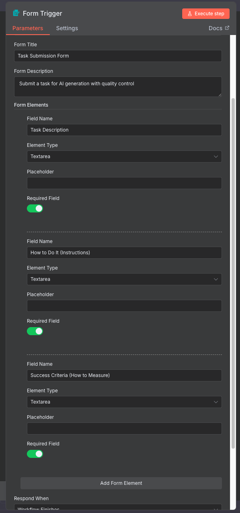

{: .highlight }
> **Pro Tip**: Copy the form URL - you'll use this to submit test tasks!

### Example Form Input

**Task Description:**

```
Draft an email to a colleague thanking them for their help on a project and inviting them to a celebration lunch.
```

**How to Do It (Instructions):**

```
Write a professional yet friendly email that:
1. Opens with a warm greeting
2. Expresses genuine appreciation for their specific contributions
3. Mentions the project success
4. Extends a lunch invitation with details
5. Closes politely
6. Keep it 100-150 words
```

**Success Criteria (How to Measure):**

```
The email must:
1. Have proper greeting and closing
2. Mention at least 2 specific contributions
3. Include clear lunch invitation with date/time/place
4. Be 100-150 words
5. Be grammatically perfect
6. Maintain a warm but professional tone
```

{: .highlight }
> **Pro Tip**: Use success criteria to enforce **brand guidelines**, **tone of voice requirements**, and **company standards**. The judge will consistently apply these criteria to every piece of content, reducing bias and increasing reliability. Examples: "Must match our friendly, approachable brand voice", "Use our standard email signature format", "Follow AP style guide rules".

---

## Step 3: Add Initialize Variables Node

### Add and Connect the Node

{: .note }
> **Why initialize variables?** The workflow loops back when content needs improvement. We need to track the retry count, store feedback, and set a maximum retry limit to prevent infinite loops.

1. Add **Edit Fields (Set)** node to your canvas
2. **Connect it**: Drag a connection line from **Form Trigger** to this new node
3. Rename to: `Set Loop Variable`

### Understanding Loops: The Start Condition

{: .important }
> **Think of this as a loop in programming**: Every loop has three key parts:
>
> 1. **Start condition** (this step): Set up your tracking variables
> 2. **Check condition** (Step 7): Test if we should continue or exit
> 3. **End condition** (Step 10): Decide if we loop back or stop
>
> This node is the **start condition** - it sets up everything we need to track as we loop through attempts.

### What is a Loop Variable?

In simple terms, **loop variables** are like sticky notes that remember information as the workflow goes round and round. Think of it like a scoreboard that tracks:

- How many attempts we've made
- What the judge said last time
- What's the maximum number of tries allowed

Without these sticky notes, the workflow would forget everything each time and never improve!

### Configure the Variables

Set up tracking for the iteration loop:



| Field Name | Type | Value | Purpose |
|------------|------|-------|---------|
| retry_count | Number | `={{ $json.retry_count \|\| 0 }}` | Current attempt number |
| max_retries | Number | `10` | Maximum allowed attempts |
| previous_feedback | String | `={{ $json.previous_feedback \|\| null }}` | Feedback from judge |
| ai_output | String | `={{ $json.ai_output \|\| null }}` | Generated content |



{: .warning }
> **Important**: Make sure "Include Other Input Fields" is **OFF** (unchecked) for this node. We're starting fresh and only want these specific variables.

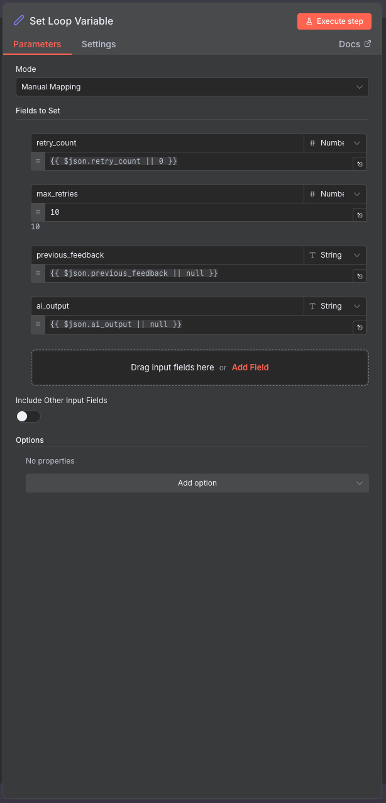

Click **Test step**

**Expected Output**: JSON object with initialized variables.

---

## Step 4: Add AI Generator Agent

### Add and Connect the Node

{: .note }
> **Two-phase generation**: On the first try, the generator creates content from scratch. If the judge rejects it, the generator tries again using the judge's feedback to improve. This creates a self-improving loop.

1. Add **AI Agent** node to your canvas
2. **Connect it**: Drag a connection line from **Set Loop Variable** to this new node
3. Rename to: `AI Agent - Generator`

### Configure the Model

Set up the AI model for content generation:

- Click on the node to open configuration
- Add a **Google Gemini Model** sub-node
- Connect it to the AI Agent
- Select your Google Gemini credential
- **Model**: "gemini-2.5-flash"

### Why NO Structured Output Here?

{: .important }
> **Structured Output: When to use it**:
>
> - **YES** when you need specific actions or decisions (like pass/fail)
> - **NO** when you want free creative expression
>
> The Generator should express freely - we want natural language, not rigid formats. Think of it like asking someone to write you an email vs asking them to fill out a form with checkboxes.

**For this node**: Keep "Require Specific Output Format" **OFF** (unchecked). We want the AI to generate freely without constraints.

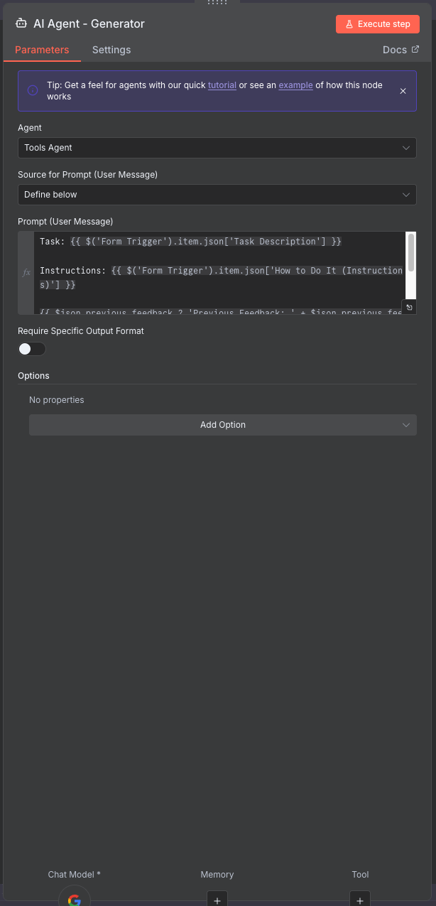

### Configure the Prompt

The prompt dynamically adapts based on whether this is the first attempt or a retry:



```
Task: {{ $('Form Trigger').item.json['Task Description'] }}

Instructions: {{ $('Form Trigger').item.json['How to Do It (Instructions)'] }}

{{ $json.previous_feedback ? 'Previous Feedback: ' + $json.previous_feedback : '' }}

Please generate the output according to the task description and instructions. Ensure it meets the success criteria{{ $json.previous_feedback ? ' and addresses the feedback provided' : '' }}.
```



{: .tip }
> **Conditional feedback injection**: The expression only includes feedback on retries. First attempts start fresh without any previous context.

Click **Test step** to verify. **Expected output**: Generated content text in the `output` field.

---

## Step 5: Add LLM Judge Agent

### Add and Connect the Node

{: .note }
> **Extremely strict evaluation**: The judge uses "ZERO tolerance for mediocrity" to ensure high-quality outputs. It either approves content that truly meets all criteria, or provides specific, actionable feedback for improvement.

1. Add **AI Agent** node to your canvas
2. **Connect it**: Drag a connection line from **AI Agent - Generator** to this new node
3. Rename to: `LLM Judge`

### Configure the Model

Set up the AI model for quality evaluation:

- Add a **Google Gemini Model** sub-node
- Connect it to the LLM Judge
- Select your Google Gemini credential
- **Model**: "gemini-2.5-flash"

### Why YES Structured Output Here?

{: .important }
> **The Judge needs structured output because**:
>
> - We need a clear **yes/no decision** (passed: true or false)
> - We need **specific feedback** to improve next time
> - The workflow needs to make an automatic decision based on this
>
> Without structured output, the Judge might say "This is pretty good" - how would we know if that's a pass or fail? With structured output, we get `{passed: true}` or `{passed: false}` - crystal clear!

**For this node**: Turn **"Require Specific Output Format" ON** (checked). You'll see a warning to connect an output parser - that's what we'll do next!

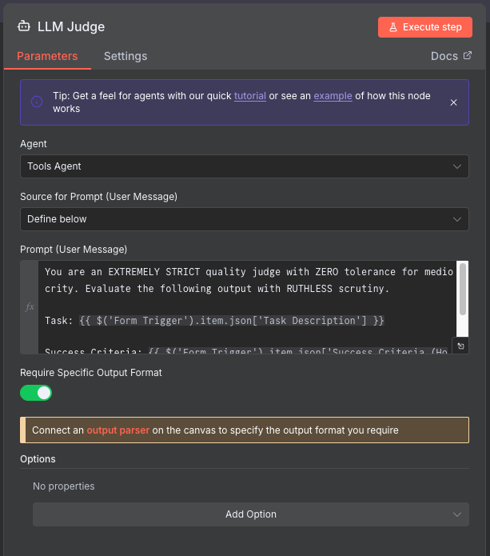

### Add Structured Output Parser

**Add Structured Output Parser**:

- Click "Connect an output parser" or add sub-node: **Structured Output Parser**
- **Schema Type**: `Define using JSON Schema`
- **Input Schema**:

```json
{
  "type": "object",
  "properties": {
    "passed": {
      "type": "boolean",
      "description": "Whether the output meets the success criteria"
    },
    "feedback": {
      "type": "string",
      "description": "Detailed feedback on what needs improvement"
    }
  },
  "required": ["passed", "feedback"]
}
```

- **Auto-Fix Format**: Enable (checked)

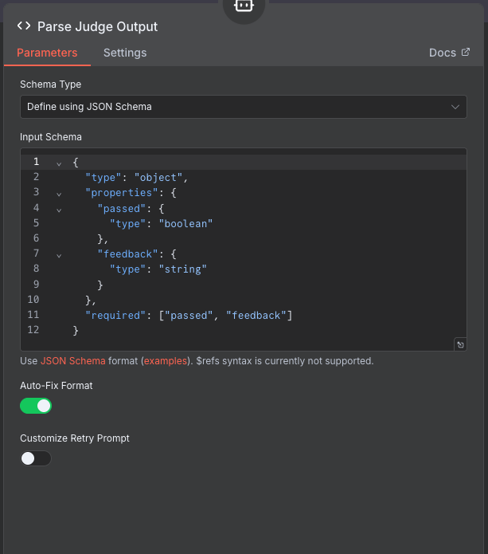

{: .tip }
> **What does this schema do?** It forces the AI to respond in exactly this format: `{passed: true/false, feedback: "text"}`. This makes it easy for the workflow to decide what to do next automatically.

### Configure Judge Prompt

**Configure Judge Prompt**:



```
You are an EXTREMELY STRICT quality judge with ZERO tolerance for mediocrity. Evaluate the following output with RUTHLESS scrutiny.

Task: {{ $('Form Trigger').item.json['Task Description'] }}

Success Criteria: {{ $('Form Trigger').item.json['Success Criteria (How to Measure)'] }}

Generated Output: {{ $json.output }}
```



**Why this prompt works**:

- **Extremely strict**: Ensures high-quality output
- **Zero tolerance**: Prevents accepting mediocre results
- **Ruthless scrutiny**: Forces careful evaluation
- **Structured output**: Returns consistent JSON format

Click **Test step**

**Expected Output**: Structured JSON with `passed` (boolean) and `feedback` (string).

---

## Step 6: Add Update Loop Variables Node

### Add and Connect the Node

1. Add **Edit Fields (Set)** node to your canvas
2. **Connect it**: Drag a connection line from **LLM Judge** to this new node
3. Rename to: `Update Loop Variables`

{: .highlight }
> **Data consolidation**: This node pulls together the judge's verdict, the generated content, and the tracking variables into one object for easy decision-making in the next steps.

### Understanding "Include All Other Fields"

{: .important }
> **The Memory Carrying Concept**:
>
> Think of data flowing through nodes like passing notes in class:
>
> - **"Include All Other Fields" CHECKED**: You're **adding** a new sticky note to the pile (keeping all previous notes)
> - **"Include All Other Fields" UNCHECKED**: You're **replacing** the entire pile with just your new note (everything else is lost)
>
> **When to check it?**
>
> - ✅ Check it when you want to **add or update** fields while keeping everything else
> - ❌ Uncheck it when you want to **start fresh** with only specific fields
>
> For this node: We want to **add** the judge's evaluation while **keeping** everything from previous nodes (the task description, instructions, generated output, etc.). So we'll check the box!

### Configure the Update

Combine all the information we need:



| Field Name | Type | Value |
|------------|------|-------|
| evaluation_result | Boolean | `={{ $json.output.passed }}` |
| feedback | String | `={{ $json.output.feedback }}` |
| output | String | `={{ $('AI Agent - Generator').item.json.output }}` |
| max_retries | Number | `={{ $('Set Loop Variable').item.json.max_retries }}` |
| retry_count | Number | `={{ $('Set Loop Variable').item.json.retry_count }}` |



**Enable**: `Include Other Input Fields` ✅ (checked)

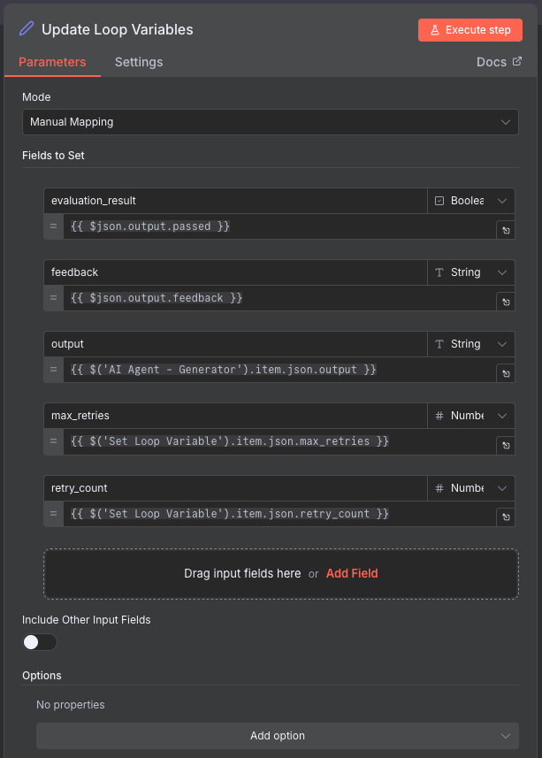

{: .tip }
> **Why this matters**: By checking "Include Other Input Fields", we carry forward ALL the data from previous steps. This ensures the Final Output node will have access to everything - the task, the output, the feedback, the status - without us having to manually reference each field.

Click **Test step**

**Expected Output**: Combined object with evaluation results and generated content.

---

## Step 7: Add Check Pass/Fail Node

### Add and Connect the Node

{: .note }
> **The decision point** (Loop Check Condition): This is where the workflow splits into two paths - success (content passed) or retry (content needs improvement). This is the **first check condition** in our loop - did the content pass quality standards?

1. Add **IF** node to your canvas
2. **Connect it**: Drag a connection line from **Update Loop Variables** to this new node
3. Rename to: `Check Pass/Fail`

### Configure the Condition

Set up the pass/fail logic:



- **Condition**: `={{ $json.evaluation_result }}`
- **Operation**: `is equal to`
- **Value**: `true`



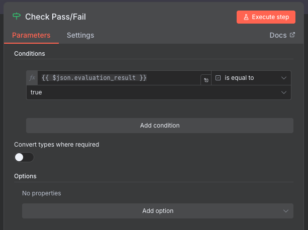

**Output Routing**:

- **True** branch: Content passed - go to success path
- **False** branch: Content failed - go to retry path

---

## Step 8: Add Mark Success Node

### Add and Connect the Node

1. Add **Edit Fields (Set)** node to your canvas
2. **Connect it**: Drag a connection line from **Check Pass/Fail (true)** output to this new node
3. Rename to: `Set Status to Success`

### Configure Success Status

Mark this execution as successful:

- **Field Name**: `status`
- **Type**: String
- **Value**: `success`

**Enable**: `Include Other Input Fields` ✅ (checked)

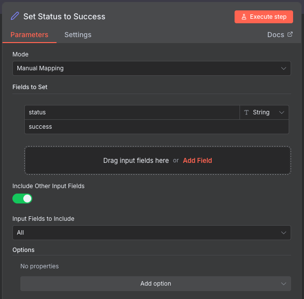

{: .tip }
> **Memory carrying again**: We check "Include Other Input Fields" to keep all the data (task, output, feedback, retry count) flowing forward to the Final Output node. We're just **adding** the status field, not replacing everything!

---

## Step 9: Add Increment Retry Node

### Add and Connect the Node

{: .note }
> **Preparing for retry**: When content doesn't pass, we increment the counter and save the judge's feedback so the generator can improve on the next attempt.

1. Add **Edit Fields (Set)** node to your canvas
2. **Connect it**: Drag a connection line from **Check Pass/Fail (false)** output to this new node
3. Rename to: `Update Retry Count`

### Configure Retry Logic

Track attempts and store feedback:



| Field Name | Type | Value |
|------------|------|-------|
| retry_count | Number | `={{ ($json.retry_count \|\| 0) + 1 }}` |
| previous_feedback | String | `={{ $json.feedback }}` |



**Enable**: `Include Other Input Fields` ✅ (checked)

{: .tip }
> **Memory carrying**: We're updating the retry_count and previous_feedback, but keeping everything else. This ensures the loop preserves all data as it goes back to try again.

---

## Step 10: Add Max Retries Check Node

### Add and Connect the Node

{: .warning }
> **Danger: Infinite Loops!**
>
> Imagine a loop that never stops: the generator keeps creating, the judge keeps rejecting, and the workflow runs forever, racking up massive API costs and never finishing. This is called an **infinite loop** - a loop that never ends.
>
> **That's why we need TWO exit conditions**:
>
> 1. ✅ **Quality passes** (Check Pass/Fail node) - we got what we wanted!
> 2. ✅ **Max retries reached** (this node) - we tried enough times, let's stop
>
> Without exit condition #2, if the content never passes, the loop would run forever. The max_retries limit (10 attempts) protects us from this disaster!

1. Add **IF** node to your canvas
2. **Connect it**: Drag a connection line from **Update Retry Count** to this new node
3. Rename to: `Max Retries Check`

### Understanding the Loop End Condition

{: .important }
> **Loop anatomy - the END condition**:
>
> - **Start condition** (Step 3): Set up variables
> - **Check condition** (Step 7): Did quality pass?
> - **End condition** (THIS STEP): Have we tried too many times?
>
> This is the **second end condition** - the safety net that catches us before we loop forever.

### Configure the Condition

Check if we've exhausted our retries:



- **Condition**: `={{ $json.retry_count === $json.max_retries }}`
- **Operation**: `is true`



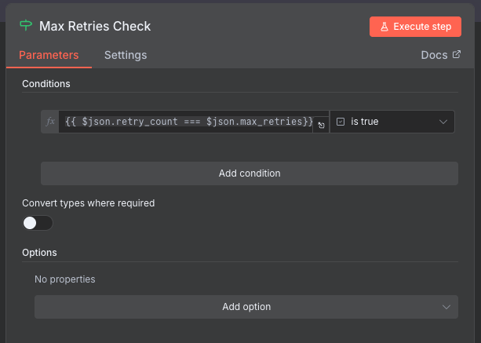

**Output Routing**:

- **True** branch: Max retries reached (tried 10 times) - go to failure path
- **False** branch: Can still retry (less than 10 times) - loop back to Set Loop Variable

### Create the Iteration Loop

{: .highlight }
> **The magic connection**: This loop-back is what makes the workflow self-improving. Failed content goes back through the generator with feedback, creating an iterative refinement process.

Drag a connection from **Max Retries Check (false)** output back to **Set Loop Variable** input. This creates the retry loop!

{: .note }
> **Two ways out**: The loop can exit in two ways: (1) Content passes quality check → Success path, or (2) Max retries reached → Failure path. This ensures the workflow ALWAYS finishes eventually!

---

## Step 11: Add Mark Failure Node

### Add and Connect the Node

1. Add **Edit Fields (Set)** node to your canvas
2. **Connect it**: Drag a connection line from **Max Retries Check (true)** output to this new node
3. Rename to: `Set Status to Failed`

### Configure Failure Status

Mark that we exhausted retries without success:

- **Field Name**: `status`
- **Type**: String
- **Value**: `failed`

**Enable**: `Include Other Input Fields` ✅ (checked)

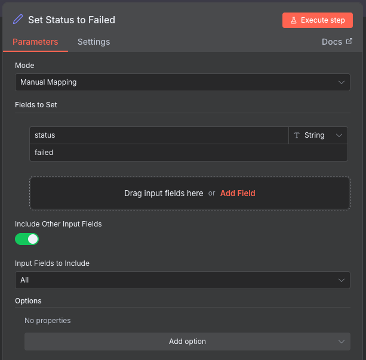

{: .tip }
> **Memory carrying**: Same concept - we're adding the status field while keeping all other data (the best attempt's output, feedback, retry count of 10).

---

## Step 12: Add Final Output Node

### Add and Connect the Node

{: .note }
> **Merge point**: Both the success and failure paths converge here. This node formats the final response that gets returned to the user via the form.

1. Add **Edit Fields (Set)** node to your canvas
2. **Connect it**: Drag connections from BOTH **Set Status to Success** and **Set Status to Failed** to this new node
3. Rename to: `Final Response`

### Configure Output Format

Structure the final response:



| Field Name | Type | Value |
|------------|------|-------|
| status | String | `={{ $json.status }}` |
| evaluation_result | Boolean | `={{ $json.evaluation_result }}` |
| feedback | String | `={{ $json.feedback }}` |
| output | String | `={{ $json.output }}` |
| retry_count | Number | `={{ $json.retry_count }}` |



**Disable**: `Include Other Input Fields` ❌ (unchecked)

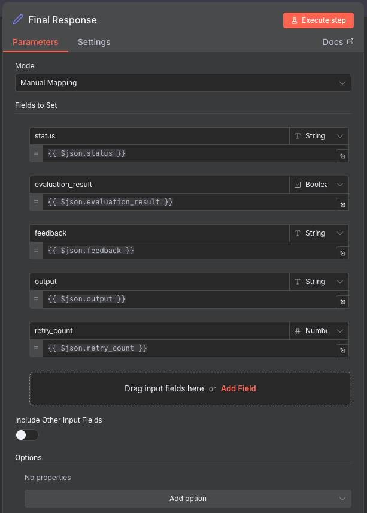

{: .important }
> **When NOT to carry memory**: In this final node, we uncheck "Include Other Input Fields" because we want to return ONLY these specific fields to the user. We don't want to flood them with all the internal workflow data (loop variables, intermediate values, etc.). We're being selective about what goes back to the form!

**Expected Output**: Clean, formatted results showing only status, output, feedback, and retry count.

---

## Step 13: Test the Complete Workflow

### Activate the Workflow

1. Click **Activate** toggle in the top-right corner
2. Copy the **Form URL** from the Form Trigger node

### First Test Run

1. **Open the form URL** in a new browser tab
2. **Fill in the form** with the example task (see Step 2)
3. **Submit the form**

4. **Watch the execution** in n8n:
   - Generator creates first draft
   - Judge evaluates
   - If failed: Loop back for iteration 2
   - Repeat until pass or max retries (10)
   - Return final result to form

5. **Check the results**:
   - You should see the final output in the form
   - Check the status (success/failed)
   - Read the generated content
   - Review feedback and retry count

### Expected Behavior

**Scenario 1: Success in 2-3 iterations**

```
Iteration 1: Failed → Feedback: "Missing specific lunch details"
Iteration 2: Failed → Feedback: "Word count too high (175 words)"
Iteration 3: Passed! ✅
Status: success
Retry Count: 3
```

**Scenario 2: Max iterations reached**

```
Iteration 1-10: All failed for various reasons
Status: failed
Retry Count: 10
Final feedback: "Best attempt after 10 iterations"
```

---

## Understanding the Flow

### Visual Execution Path

**Success Path**:

```
Form → Initialize → Generator → Judge → Merge → Check (PASS)
→ Mark Success → Final Output → Return to Form ✅
```

**Iteration Path**:

```
Form → Initialize → Generator → Judge → Merge → Check (FAIL)
→ Increment Retry → Max Check (< 10)
→ [Loop back to Initialize with feedback]
→ ... → Eventually Success or Failure
```

**Failure Path**:

```
... 10 iterations ... → Max Check (≥ 10)
→ Mark Failure → Final Output → Return to Form ⚠️
```

### Key Variables Tracked

| Variable | Purpose | Example |
|----------|---------|---------|
| `retry_count` | Current attempt number | `3` |
| `max_retries` | Maximum allowed attempts | `10` |
| `previous_feedback` | Fed back to generator | `"Add lunch location details"` |
| `evaluation_result` | Pass/fail status | `true` |
| `output` | Latest generated content | `"Dear Sarah, ..."` |
| `feedback` | Judge's feedback | `"Excellent! Meets all criteria."` |
| `status` | Final workflow status | `"success"` or `"failed"` |

---

## Step 14: Optimize and Tune

### Adjust Retry Limit

If too many runs are failing:

- Increase `max_retries` from 10 to 15 or 20
- Or make success criteria less strict

### Improve Judge Prompts

Make evaluation criteria more specific:

- Add examples of passing vs failing content
- Define exact requirements
- Provide scoring rubrics
- Use comparative language ("must have X AND Y")

### Test Different Scenarios

Try various task types:

- **Short content**: Social media posts (50 words)
- **Medium content**: Emails (150 words)
- **Long content**: Blog posts (500 words)
- **Technical**: Code explanations
- **Creative**: Story introductions
- **Professional**: Business proposals

---

## Troubleshooting

### Workflow keeps looping infinitely

**Cause**: Max retries check might be wrong

**Fix**:

- Verify Max Retries Check condition: `retry_count >= max_retries`
- Ensure the true branch goes to Mark Failure
- Check that Initialize Variables increments properly

### Generator doesn't improve on iterations

**Cause**: Feedback not being passed correctly

**Fix**:

- Verify Increment Retry sets `previous_feedback` correctly
- Check that Initialize Variables preserves `previous_feedback`
- Ensure Generator prompt uses `$json.previous_feedback`

### Judge always passes or always fails

**Cause**: Judge prompt too lenient or too strict

**Fix**:

- Adjust judge prompt severity
- Make success criteria more specific
- Add examples of passing/failing content
- Test with different Gemini model versions

### Form doesn't return results

**Cause**: Response mode not set correctly

**Fix**:

- Verify Form Trigger **Response Mode** is set to `Last Node`
- Ensure Final Output node is connected properly
- Check that workflow is activated

---

## What You've Accomplished

- ✅ Built complete LLM as a Judge workflow with form interface
- ✅ Implemented iterative quality improvement loop (up to 10 retries)
- ✅ Created structured evaluation system with pass/fail logic
- ✅ Added loop controls and exit conditions
- ✅ Tested with real content generation tasks
- ✅ Learned how to tune quality thresholds and prompts

---

## Next Steps

Now that your workflow is working:

1. **Test Different Content Types**: Try emails, blog posts, code, documentation
2. **Analyze Patterns**: Track common failure reasons
3. **Optimize Prompts**: Refine generator and judge based on results
4. **Adjust Strictness**: Balance quality vs iteration count
5. **Try Challenge Tasks**: Multi-criteria evaluation, A/B testing, automatic optimization

---

## Compare Your Solution

Want to check your work or troubleshoot issues? Download our model answer:

[Download Model Answer: llm-judge-workflow.json](./downloads/llm-judge-workflow.json)

{: .note }
> **Using the Model Answer**: Import this into n8n to compare with your solution. You'll still need to configure Google Gemini credentials after importing.

---

## Push Your Workflow to GitHub

### Export and Save Your Work

Now that you've built your workflow, it's important to save it to your GitHub repository. This creates a backup and allows you to track changes over time.

#### Step 1: Export Your Workflow from n8n

1. In your n8n workflow canvas, click the **three-dot menu** (⋮) in the top-right corner
2. Select **"Download"** or **"Export workflow"**
3. Save the JSON file to your computer with a descriptive name:
   - Example: `llm-judge-workflow.json`

{: .note }
> **Tip**: The exported file contains your entire workflow structure, but credentials are not included for security reasons.

#### Step 2: Upload to GitHub via UI

1. **Navigate to your GitHub repository** in your web browser
2. **Go to the workflows folder** (or create one if it doesn't exist):
   - Click **"Add file"** → **"Create new file"**
   - Type `workflows/` in the filename field to create the folder
3. **Upload your workflow**:
   - Click **"Add file"** → **"Upload files"**
   - Drag and drop your exported JSON file, or click to browse
   - Alternatively, click **"Create new file"** and paste the JSON content
4. **Commit your changes**:
   - Add a commit message: `Add LLM as a Judge workflow`
   - Choose **"Commit directly to the main branch"** or create a new branch
   - Click **"Commit changes"**

{: .highlight }
> **Success!** Your workflow is now safely stored in GitHub and can be shared with others or imported into a different n8n instance.

---

[Continue to Challenge Tasks →](./challenge-tasks){: .btn .btn-primary }
