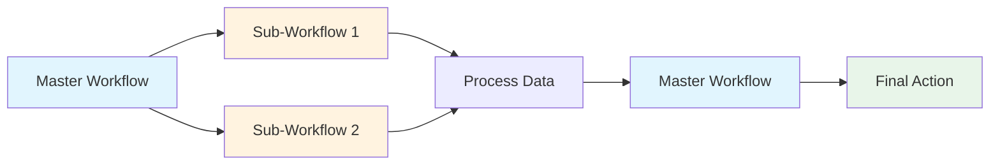
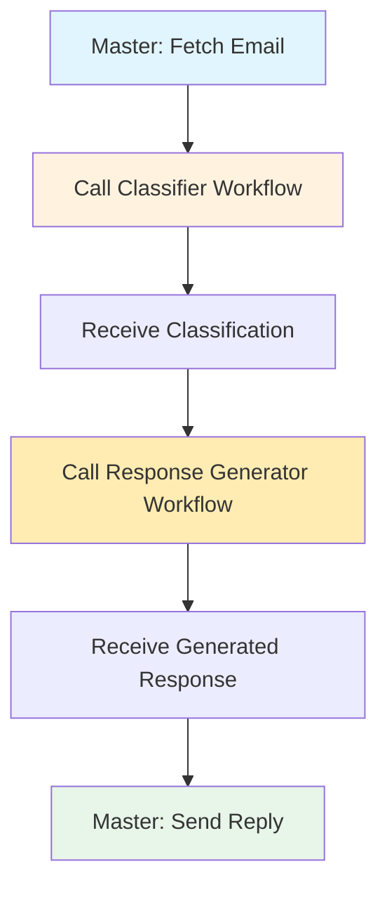

# Exercise 4: Connecting Multiple Workflows

{: .fs-9 }

Build an intelligent email response system by connecting three separate workflows together: a master orchestrator, an email classifier, and an LLM-as-a-judge response generator.
{: .fs-6 .fw-300 }

[Start Exercise](./overview){: .btn .btn-primary .fs-5 .mb-4 .mb-md-0 .mr-2 }
[Download Workflows](./downloads/){: .btn .fs-5 .mb-4 .mb-md-0 }

---

## 75-Minute Hands-On Exercise

This exercise teaches you to build complex automation systems by connecting multiple workflows together. Learn how to create modular, reusable workflows that can call each other, passing data between them to solve complex business problems.

### What You'll Build

- **Master orchestrator workflow** that fetches emails and coordinates other workflows
- **Email classification workflow** that categorizes incoming emails
- **LLM-as-a-judge response generator** that creates high-quality email replies
- **Workflow triggers** that allow workflows to call each other
- **Data passing** between workflows with structured inputs/outputs
- **End-to-end automation** that handles the entire email response process

### The Universal Pattern

You're learning the **Workflow Orchestration & Composition** pattern - think of it like a restaurant kitchen:

Just like a head chef (Master Workflow) coordinates with specialized stations (Sub-Workflows):
- The prep station chops vegetables (Classifier)
- The main kitchen cooks the dish (Response Generator)
- The head chef plates and serves (Final Action)

**Today's Implementation:**

**Tomorrow's Applications:**

```mermaid
graph TD
    subgraph "Customer Support"
        CS[Ticket Router] --> CT[Classify Ticket]
        CT --> CR[Generate Response]
        CR --> CS2[Send & Track]
    end

    subgraph "Content Pipeline"
        CP[Content Planner] --> CG[Generate Content]
        CG --> CQ[Quality Check]
        CQ --> CP2[Publish]
    end

    subgraph "Data Processing"
        DP[Data Ingest] --> DT[Transform Data]
        DT --> DV[Validate Data]
        DV --> DS[Store Data]
    end
```

### Exercise Structure

  

    

      <h4>📚 Overview</h4>
      
Understanding workflow composition

      <a href="./overview">Start here →</a>
    

  

  

    

      <h4>⚙️ Part A: Setup</h4>
      
Prerequisites & configuration (15 min)

      <a href="./part-a-setup">Configure →</a>
    

  

  

    

      <h4>🔧 Part B: Build & Test</h4>
      
Create workflows and connections (55 min)

      <a href="./part-b-workflow">Build →</a>
    

  

  

    

      <h4>🏆 Challenges</h4>
      
Advanced extensions (optional)

      <a href="./challenge-tasks">Level up →</a>
    

  

---

## Quick Navigation

| Section | Description | Duration |
|---------|-------------|----------|
| [Overview](./overview) | Why workflow composition matters, architecture | 5 min |
| [Part A: Setup](./part-a-setup) | Prerequisites, API setup | 15 min |
| [Part B: Build & Test](./part-b-workflow) | Build three workflows and connect them | 55 min |
| [Challenges](./challenge-tasks) | Error handling, parallel execution, monitoring | Optional |

---

