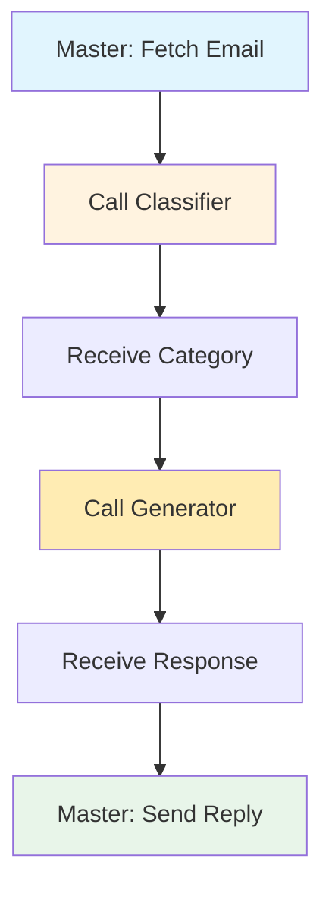

# Exercise 4: Connecting Multiple Workflows

{: .fs-9 }

Build an intelligent email response system by connecting three separate workflows together: a master orchestrator, an email classifier, and an LLM-as-a-judge response generator. By completing this exercise, you'll demonstrate your ability to design modular, scalable automation systems—a professional skill applicable to customer support, content pipelines, data processing, and any complex multi-step business process.
{: .fs-6 .fw-300 }

---

## 75-Minute Hands-On Exercise

This exercise teaches you to build complex automation systems by connecting multiple workflows together. Learn how to create modular, reusable workflows that can call each other, passing data between them to solve complex business problems. Think of it like conducting an orchestra—each workflow plays its part, and you're coordinating them into a harmonious system.

### What You'll Build

A complete multi-workflow orchestration system featuring:

- **Master orchestrator workflow** that fetches emails and coordinates sub-workflows
- **Email classifier sub-workflow** that categorises incoming messages
- **Response generator sub-workflow** that creates quality-controlled replies
- **Execute Workflow Triggers** enabling inter-workflow communication
- **Structured data passing** with defined inputs and outputs between workflows
- **Dual triggers** allowing standalone testing and production orchestration

**Restaurant Kitchen Analogy:**

Just like a head chef coordinates specialized stations:

- **Head Chef** (Master Workflow) receives orders and coordinates
- **Prep Station** (Classifier) categorises and prepares ingredients
- **Main Kitchen** (Generator) cooks the dish with quality checks
- **Head Chef** plates and serves the final product

### Skills You'll Demonstrate

By completing this exercise, you will have demonstrated:

- **Workflow Composition**: Breaking complex processes into reusable components
- **Inter-Workflow Communication**: Configuring Execute Workflow nodes and triggers
- **Data Contract Design**: Defining clear inputs/outputs between workflows
- **Dual-Trigger Architecture**: Supporting both standalone testing and production orchestration
- **Modular System Design**: Building maintainable, scalable automation architectures

### The Pattern You'll Master

The **Workflow Orchestration & Composition** pattern you'll learn applies to:

- **Customer Support**: Route tickets → Classify urgency → Generate response → Assign agent
- **Content Pipeline**: Plan content → Generate drafts → Review quality → Schedule publishing
- **Order Fulfilment**: Receive order → Check inventory → Process payment → Ship product
- **Data Processing**: Ingest data → Validate format → Transform structure → Load to database
- **Lead Management**: Capture lead → Score quality → Enrich data → Route to sales
- **Invoice Processing**: Extract data → Validate information → Approve payment → Update accounts

### Exercise Structure

  

    

      <h4>📚 Overview</h4>
      
Understanding workflow composition

      <a href="./overview">Start here →</a>
    

  

  

    

      <h4>⚙️ Part A: Setup</h4>
      
Prerequisites & configuration (15 min)

      <a href="./part-a-setup">Configure →</a>
    

  

  

    

      <h4>🔧 Part B: Build & Test</h4>
      
Create workflows and connections (55 min)

      <a href="./part-b-workflow">Build →</a>
    

  

  

    

      <h4>🏆 Challenges</h4>
      
Advanced extensions (optional)

      <a href="./challenge-tasks">Level up →</a>
    

  

---

## Quick Navigation

| Section | Description | Duration |
|---------|-------------|----------|
| [Overview](./overview) | Why workflow composition matters, architecture | 5 min |
| [Part A: Setup](./part-a-setup) | Prerequisites, API setup | 15 min |
| [Part B: Build & Test](./part-b-workflow) | Build three workflows and connect them | 55 min |
| [Challenges](./challenge-tasks) | Error handling, parallel execution, monitoring | Optional |

---

