# Connecting Workflows Exercise Overview

## What You'll Build

In this hands-on exercise, you'll create an **intelligent email response system** by connecting three separate workflows together. This demonstrates the power of workflow orchestration - building complex systems by composing simpler, reusable workflows.

By the end of this 75-minute session, you'll have a working system that can:

- Fetch incoming emails automatically
- Classify emails into categories (support, sales, general inquiry)
- Generate high-quality responses using an LLM-as-a-judge pattern
- Send replies back to the email sender
- Track the entire process with proper data flow

## Why This Exercise Matters

### The Problem We're Solving

As automation systems grow more complex, building everything in a single workflow becomes unmanageable. You end up with:

- **Spaghetti workflows**: Hundreds of nodes that are impossible to understand or maintain
- **No reusability**: Can't reuse logic across different automations
- **Difficult debugging**: When something breaks, you have to hunt through massive workflows
- **Poor collaboration**: Multiple people can't work on different parts simultaneously

### The Workflow Composition Pattern

Instead of monolithic workflows, we build modular systems:

1. **Master Workflow**: Orchestrates the overall process
2. **Sub-Workflows**: Handle specific tasks independently
3. **Clean Interfaces**: Workflows communicate through defined inputs/outputs
4. **Reusability**: Sub-workflows can be called by multiple master workflows
5. **Testability**: Each workflow can be tested in isolation

### Real-World Applications

- **Customer Support**: Route tickets → Classify urgency → Generate response → Assign agent
- **Content Pipeline**: Plan content → Generate drafts → Review quality → Schedule publishing
- **Data Processing**: Ingest data → Validate format → Transform structure → Load to database
- **Order Fulfillment**: Receive order → Check inventory → Process payment → Ship product
- **Lead Management**: Capture lead → Score lead → Enrich data → Route to sales
- **Invoice Processing**: Extract data → Validate information → Approve payment → Update accounting

## Learning Outcomes

By completing this exercise, you will:

### Technical Skills

- Build workflows that can call other workflows
- Configure "Execute Workflow Trigger" nodes for inter-workflow communication
- Pass data between workflows using workflow inputs and outputs
- Design clean workflow interfaces with structured data
- Implement orchestration patterns with master and sub-workflows
- Debug multi-workflow systems effectively

### AI/ML Skills

- Chain multiple AI operations together (classification + generation)
- Understand when to separate AI tasks into different workflows
- Apply the LLM-as-a-judge pattern in a larger system
- Design modular AI workflows that can be reused

### Business Skills

- Design scalable automation architectures
- Create reusable business logic components
- Build systems that can evolve over time
- Collaborate effectively on complex automations
- Reduce maintenance burden through modularization

## System Architecture

### High-Level Overview

```mermaid
graph TB
    Start[Email Trigger] --> Fetch[Fetch Email Content]
    Fetch --> CallClassifier[Execute Workflow: Classifier]
    CallClassifier --> ClassResult[Receive Classification]
    ClassResult --> CallGenerator[Execute Workflow: Response Generator]
    CallGenerator --> GenResult[Receive Generated Response]
    GenResult --> Send[Send Email Reply]
    Send --> End[Complete]

    subgraph "Master Workflow"
        Start
        Fetch
        CallClassifier
        ClassResult
        CallGenerator
        GenResult
        Send
        End
    end

    subgraph "Classifier Workflow"
        CT[Workflow Trigger] --> CL[Classify Email]
        CL --> CR[Return Classification]
    end

    subgraph "Response Generator Workflow"
        GT[Workflow Trigger] --> GEN[Generate Response]
        GEN --> JUDGE[Evaluate Quality]
        JUDGE --> LOOP{Pass?}
        LOOP -->|No| GEN
        LOOP -->|Yes| GR[Return Response]
    end

    style Start fill:#e1f5fe
    style CallClassifier fill:#fff3e0
    style CallGenerator fill:#ffecb3
    style Send fill:#e8f5e9
```



### Three Workflows Explained

#### 1. Master Workflow (Email Orchestrator)

**Purpose**: Coordinates the entire email response process

**Nodes**:

- Gmail Trigger: Monitors inbox for new emails
- Execute Workflow (Classifier): Calls the email classification workflow
- Execute Workflow (Response Generator): Calls the response generation workflow
- Gmail Send: Sends the generated reply

**Data Flow**:

```
Input: New email from Gmail
→ Pass to Classifier: { subject, body, sender }
← Receive: { category: "support", priority: "high" }
→ Pass to Generator: { category, original_email, task_description }
← Receive: { response_text, quality_passed, retry_count }
→ Send: response_text to original sender
```

**Node Breakdown:**

| Node Type | Purpose | Configuration |
|-----------|---------|---------------|
| **Gmail Trigger** | Monitor inbox for new emails | Event: New Email, Poll interval: every minute |
| **Set (Extract Data)** | Extract email fields | subject, body_plain, sender, message_id, thread_id |
| **Execute Workflow (Classifier)** | Call email classification workflow | Pass: email_subject, email_body, email_sender |
| **Code (Prepare Instructions)** | Build response instructions | Create task, instructions, criteria based on category |
| **Execute Workflow (Generator)** | Call response generation workflow | Pass: Task Description, Instructions, Success Criteria |
| **Set (Format Reply)** | Format final email reply | Extract: reply_text, subject, to, quality_status |
| **IF (Quality Check)** | Verify response passed quality gate | If quality_status = "success" |
| **Gmail (Send Reply)** | Send automated response | Send to original sender in same thread |
| **Notification Node** | Alert on failed quality check | Notify for manual review when quality fails |

#### 2. Email Classifier Workflow

**Purpose**: Categorizes emails into types (support, sales, general)

**Nodes**:

- Execute Workflow Trigger: Receives email data from master workflow
- AI Agent: Uses LLM to classify the email
- Set Variables: Formats classification result
- Return data to master workflow

**Data Flow**:

```
Input: { subject, body, sender }
→ AI Classification: Analyzes content
← Classification Result: { category, priority, suggested_response_type }
Output: Return to master workflow
```

**Why a Separate Workflow?**

- **Reusability**: Can be called by other workflows (ticket routing, analytics, etc.)
- **Testability**: Easy to test classification accuracy in isolation
- **Maintainability**: Update classification logic without touching email orchestration
- **Different Trigger Types**: Can be triggered by email, form submission, API call, etc.

**Node Breakdown:**

| Node Type | Purpose | Configuration |
|-----------|---------|---------------|
| **Form Trigger** | Test interface for standalone use | Fields: Email Subject, Email Body, Sender Email |
| **Execute Workflow Trigger** | Receives data from master workflow | Inputs: email_subject, email_body, email_sender |
| **AI Agent** | Classifies email into categories | Classification prompt, returns category/priority/sentiment |
| **Code (Parse Output)** | Extract structured classification | Parse JSON from AI output, handle errors gracefully |

#### 3. LLM-as-a-Judge Response Generator

**Purpose**: Generates high-quality email responses with iterative improvement

**Nodes**:

- Execute Workflow Trigger: Receives task from master workflow
- Initialize Variables: Set up retry counters
- AI Generator: Creates response based on email category and content
- AI Judge: Evaluates response quality
- Loop Logic: Iterates until quality criteria met (max 10 retries)
- Return final response to master workflow

**Data Flow**:

```
Input: { category, original_email, task_description, success_criteria }
→ Generate Response: AI creates first draft
→ Judge Evaluates: { passed: false, feedback: "..." }
→ Loop: Regenerate with feedback
→ Judge Evaluates: { passed: true, feedback: "Excellent!" }
← Output: { response_text, status: "success", retry_count: 3 }
```

**Why a Separate Workflow?**

- **Complex Logic**: The LLM-as-a-judge pattern is complex enough to deserve its own workflow
- **Reusability**: Can generate quality-controlled content for emails, social posts, reports, etc.
- **Independent Testing**: Test the generation + evaluation loop without email context
- **Performance Isolation**: Long-running generation doesn't block the master workflow

**Node Breakdown:**

| Node Type | Purpose | Configuration |
|-----------|---------|---------------|
| **Form Trigger** | Test interface for standalone use | Fields: Task Description, Instructions, Success Criteria |
| **Execute Workflow Trigger** | Receives task from master workflow | Inputs: Task Description, Instructions, Success Criteria |
| **Set (Initialize)** | Set up loop counters and tracking | retry_count, max_retries (10), previous_feedback |
| **AI Agent (Generator)** | Create response content | Dynamic prompt incorporating task and feedback |
| **AI Agent (Judge)** | Evaluate response quality | Structured output: {passed: boolean, feedback: string} |
| **IF (Check Pass)** | Quality gate decision | If evaluation_result = true |
| **Set (Increment Retry)** | Update loop variables | retry_count++, store previous_feedback |
| **IF (Max Retries)** | Loop control | If retry_count >= max_retries |
| **Set (Mark Status)** | Set final status | status: "success" or "failed" |

### The Critical Component: Execute Workflow Trigger

#### Why We Need TWO Triggers in Sub-Workflows

Each sub-workflow (Classifier and Response Generator) has **TWO triggers**:

1. **Form Trigger**: For standalone testing and manual use
2. **Execute Workflow Trigger**: For being called by other workflows

#### Why This Dual-Trigger Pattern?

**During Development:**

- Use Form Trigger to test the workflow in isolation
- Quickly iterate on prompts and logic without running the entire system
- Debug issues in a controlled environment with known inputs

**In Production:**

- Execute Workflow Trigger activates when master workflow calls it
- Master workflow passes data directly (no form needed)
- Faster execution without user interaction

**The Problem It Solves:**

Without Execute Workflow Trigger, you can't call a workflow from another workflow! The workflow would have no way to receive the "start execution" signal and input data from the calling workflow.

**Think of it like a restaurant kitchen:**

Imagine you're running a restaurant with specialized stations:

**Without Execute Workflow Trigger (doesn't work):**

- You're the head chef (master workflow)
- You need the dessert station to make a cake
- But the dessert station has no way to receive your order!
- You can't coordinate the meal

**With Execute Workflow Trigger (works!):**

- You're the head chef (master workflow)
- You send an order ticket to the dessert station (Execute Workflow Trigger)
- The dessert station receives your order with all the details (chocolate cake, 2 layers, vanilla frosting)
- They make the dessert and send it back to you
- You can now serve the complete meal

The **Form Trigger** is like the dessert station accepting walk-in customers for testing recipes. The **Execute Workflow Trigger** is like the dessert station accepting orders from the head chef during dinner service.

### Data Flow Between Workflows

#### Passing Data TO a Sub-Workflow

Use the **Execute Workflow** node in the master workflow:

```json
{
  "node": "Execute Workflow",
  "parameters": {
    "workflowId": "classifier_workflow_id",
    "workflowInputs": {
      "values": [
        { "name": "subject", "value": "={{ $json.subject }}" },
        { "name": "body", "value": "={{ $json.body }}" },
        { "name": "sender", "value": "={{ $json.from }}" }
      ]
    }
  }
}
```

#### Receiving Data IN a Sub-Workflow

Use the **Execute Workflow Trigger** node:

```json
{
  "node": "When Executed by Another Workflow",
  "parameters": {
    "workflowInputs": {
      "values": [
        { "name": "subject" },
        { "name": "body" },
        { "name": "sender" }
      ]
    }
  }
}
```

The trigger will receive these values and make them available as `$json.subject`, `$json.body`, `$json.sender`.

#### Returning Data FROM a Sub-Workflow

The last node's output is automatically returned to the calling workflow. No special configuration needed!

```
Sub-workflow last node output: { category: "support", priority: "high" }
→ Automatically returned
Master workflow receives: { category: "support", priority: "high" }
→ Available as $json.category, $json.priority
```

## Example Use Case

### Scenario: Customer Support Email Automation

**Goal**: Automatically respond to support emails with high-quality, categorized responses

**Email Received**:

```
From: customer@example.com
Subject: Login issue
Body: I can't log into my account. I've tried resetting my password but the email never arrives.
```

**Master Workflow Execution**:

1. **Fetch Email**: Gmail trigger receives the email
2. **Call Classifier**:
   - Passes email to classifier workflow
   - Receives: `{ category: "technical_support", priority: "high", issue_type: "authentication" }`
3. **Call Response Generator**:
   - Passes: `{ category: "technical_support", original_email: "...", task: "Generate helpful support response" }`
   - Receives: `{ response: "Dear Customer, I understand you're experiencing login issues...", status: "success" }`
4. **Send Reply**: Gmail sends the generated response to <customer@example.com>

**Business Value**:

- Response time: 2 hours → 30 seconds
- Consistent quality across all responses
- Proper categorization for analytics
- Support team focuses on complex issues only

## What Makes This Exercise Powerful

### Beyond Single Workflows

Most automation tutorials teach you to build one big workflow - like trying to cook an entire meal on one stove burner:

```
Email → Process Everything → Send Reply
```

This exercise teaches you professional organization - like a well-run restaurant kitchen:

```
Master Workflow (Head Chef):
  → Call Classifier Workflow (Prep Station)
  → Call Response Generator Workflow (Main Kitchen)
  → Send Reply (Service Station)

Each workflow is:
  ✓ Testable independently (each station can be checked separately)
  ✓ Reusable in other automations (same prep station for different dishes)
  ✓ Maintainable by different team members (each station has its own chef)
  ✓ Evolvable without breaking other parts (upgrade one station without redoing the whole kitchen)
```

### Transferable Pattern

Once you master workflow composition, you can apply it to:

- **Multi-stage pipelines**: Like an assembly line where each station does one task
- **Focused workflows**: Small, specialized workflows that do one thing really well (like a pastry chef)
- **Parallel processing**: Multiple workflows working at the same time (multiple chefs cooking different courses)
- **Conditional routing**: Send work to different workflows based on what's needed (appetizers go to one station, desserts to another)
- **Version management**: Test new methods without disrupting the existing process (try a new recipe without changing the main menu)

### Production-Ready Concepts

This exercise introduces enterprise patterns:

- **Separation of concerns**: Each workflow has a single responsibility
- **Interface design**: Clean input/output contracts between workflows
- **Composability**: Build complex systems from simple components
- **Modularity**: Change one part without breaking others
- **Scalability**: Add new workflows without rewriting existing ones

## Prerequisites

Before starting this exercise, you should have:

### Required Setup

- ✅ n8n platform installed and configured
- ✅ Gmail account and API access ([Setup Guide](../../common-prerequisites/gmail-setup))
- ✅ Google Gemini API key ([Setup Guide](../../common-prerequisites/gemini-setup))
- ✅ Completed Exercise 3 (LLM as a Judge) - you'll reuse concepts

### Recommended Background

- Understanding of workflow basics (Exercise 1 recommended)
- Familiarity with AI/LLM concepts
- Basic understanding of JSON data structures

### Time Commitment

- **Total Time**: 75 minutes
- **Part A (Setup)**: 15 minutes - API configuration, review Exercise 3 concepts
- **Part B (Build)**: 55 minutes - Build three workflows and connect them
- **Testing**: 5 minutes - Send test email, verify end-to-end flow

## Success Criteria

You'll know you've succeeded when:

- ✅ All three workflows are created and active
- ✅ Email classifier workflow can be called and returns category
- ✅ Response generator workflow can be called and returns quality-controlled response
- ✅ Master workflow successfully calls both sub-workflows
- ✅ End-to-end flow works: Receive email → Classify → Generate response → Send reply
- ✅ Data flows correctly between all workflows
- ✅ You can test each workflow independently
- ✅ System handles real emails with appropriate responses

## What's Next?

After completing this exercise:

1. **Add More Sub-Workflows**: Sentiment analysis, language detection, urgency scoring
2. **Parallel Execution**: Call multiple classifiers simultaneously and combine results
3. **Error Handling**: Add fallback workflows when sub-workflows fail
4. **Monitoring**: Log execution data to track system performance
5. **Advanced Routing**: Route to different response generators based on category
6. **Move to Challenge Tasks**: Implement these advanced patterns

---

Ready to build your first multi-workflow automation system?

[Continue to Part A: Setup →](./part-a-setup){: .btn .btn-primary }
